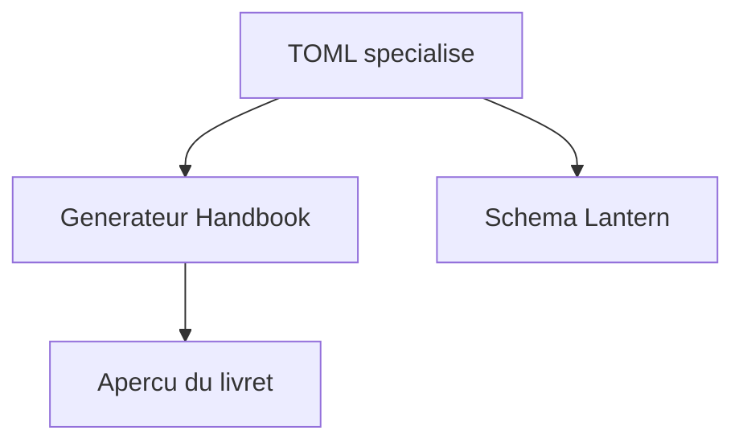
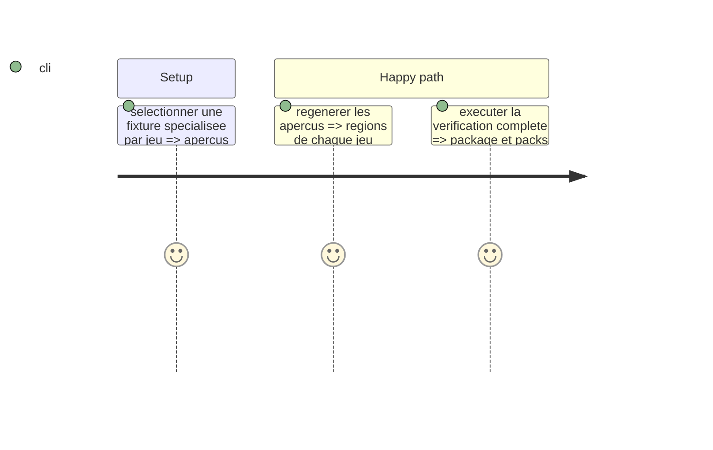

# Instruction: Aperçus Handbook et livraison

## Architecture projection

> Tree of the final files. ✅ create · ✏️ modify · ❌ delete

```txt
tools/render-handbook-preview.ts ✏️ Charge le type spécialisé choisi par chaque aperçu.
handbook/*/preview/preview.toml ✏️ Référence le livret spécialisé de son jeu.
handbook/*/preview/index.html ✏️ Dérivé régénéré.
handbook/*/styles/base.css ✏️ Dispose les régions propres au jeu.
tools/validate-handbook-packs.ts ✏️ Vérifie les régions spécialisées.
README.md, docs/compatibility.md, package.json ✏️ Documentent et distribuent v4.
```

## User Journey



## Test Scope



## Wireframe

```txt
┌─────────────────────────────────────────┐
│ (1) Identité et accroche                 │
├───────────────┬─────────────────────────┤
│ (2) Choix     │ (3) Actions et règles   │
├───────────────┼─────────────────────────┤
│ (4) État      │ (5) Progression          │
└───────────────┴─────────────────────────┘
```

## Tasks to do

### `1)` Rendre et livrer les livrets

> Faire consommer le même TOML spécialisé par les deux hôtes.

1. Adapter le générateur et les descripteurs d’aperçu.
2. Préserver les styles et ajouter les régions spécifiques.
3. Vérifier le package candidat et documenter v4 sans publication externe.

## Test acceptance criteria

| Task | Acceptance criteria |
| --- | --- |
| 1 | Chaque aperçu est généré depuis un TOML spécialisé et la chaîne complète passe. |
