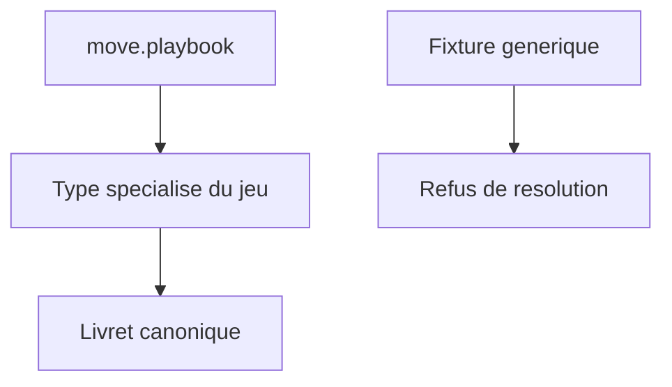
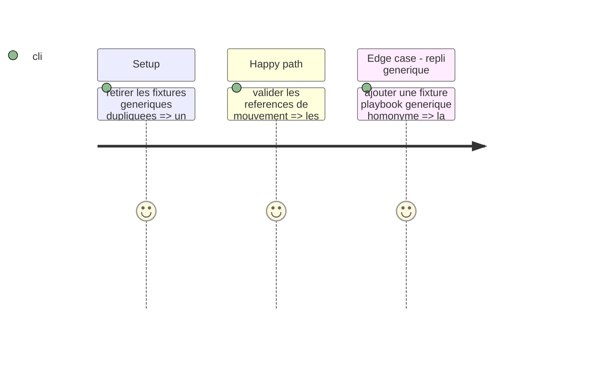

# Instruction: Références canoniques et retrait des doublons

## Architecture projection

> Tree of the final files. ✅ create · ✏️ modify · ❌ delete

```txt
src/zod/constants.ts ✏️ Associe chaque jeu cible à son unique type de livret canonique.
tools/validate-references.ts ✏️ Résout move.playbook dans le type spécialisé du jeu.
tools/validate-reference-fixtures.ts ✏️ Prouve qu'aucun repli vers playbook générique n'est permis.
examples/*/playbook/*.toml ❌ Retire les doublons canoniques génériques.
corpus/temoins, corpus/refus ✏️ Couvre les exemples Urban Shadows et les nouveaux types.
```

## User Journey



## Test Scope



## Tasks to do

### `1)` Rendre le lien de mouvement non ambigu

> Un mouvement qui porte `playbook` vise toujours le livret spécialisé du jeu.

1. Déclarer la correspondance jeu → type de livret spécialisé près des cibles de schéma et vérifier qu'elle couvre exactement une cible par jeu publié.
2. Faire résoudre `move.playbook` uniquement dans cette cible, avec un diagnostic qui nomme le dossier spécialisé attendu.
3. Compléter les fixtures de validation, notamment le cas où un homonyme générique ne doit pas satisfaire la référence.
4. Retirer les quatre fixtures génériques désormais redondantes et compléter le corpus d'audit Urban Shadows.

## Test acceptance criteria

| Task | Acceptance criteria |
| --- | --- |
| 1 | Chaque jeu publié possède exactement une cible canonique spécialisée ; chaque référence de mouvement la résout et échoue si seul un livret générique homonyme existe. |
