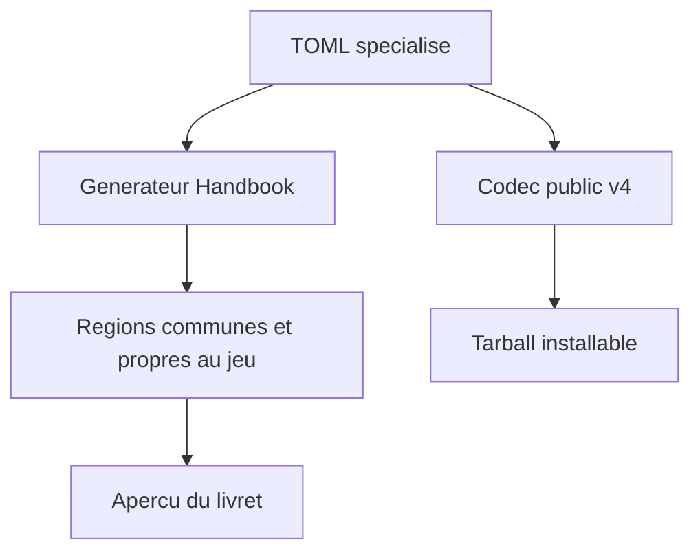
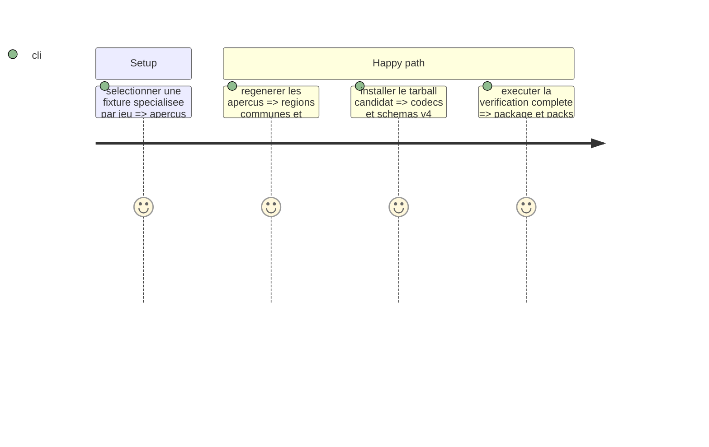

# Instruction: Aperçus Handbook et paquet v4

## Architecture projection

> Tree of the final files. ✅ create · ✏️ modify · ❌ delete

```txt
tools/render-handbook-preview.ts ✏️ Charge le type spécialisé choisi par chaque aperçu.
handbook/*/preview/preview.toml ✏️ Référence le livret spécialisé de son jeu.
handbook/*/preview/index.html ✏️ Dérivé régénéré.
tools/validate-handbook-packs.ts ✏️ Vérifie les régions éditoriales de tous les livrets spécialisés.
tools/validate-package.ts ✏️ Vérifie les exports, codecs et schéma v4 depuis un tarball installé.
README.md, docs/compatibility.md ✏️ Documentent la frontière canonique v4.
```

## User Journey



## Test Scope



## Wireframe

```txt
┌─────────────────────────────────────────┐
│ (1) Identité et accroche                 │
├───────────────┬─────────────────────────┤
│ (2) Choix     │ (3) Actions et règles   │
├───────────────┼─────────────────────────┤
│ (4) État      │ (5) Progression          │
└───────────────┴─────────────────────────┘
```

## Tasks to do

### `1)` Rendre et emballer les livrets

> Handbook et le paquet consommateur lisent les mêmes documents spécialisés.

1. Adapter le générateur, les descripteurs et les validations Handbook à chaque `playbookKind` spécialisé.
2. Rendre et vérifier les champs propres à Masks, Monster of the Week, The Sprawl, Urban Shadows et Monsterhearts, en plus des régions éditoriales communes.
3. Régénérer les aperçus sans modifier la composition visuelle existante.
4. Mettre à jour le contrôle du tarball, le README et la matrice de compatibilité pour v4.

## Test acceptance criteria

| Task | Acceptance criteria |
| --- | --- |
| 1 | Chaque aperçu est généré depuis son TOML spécialisé, affiche ses champs éditoriaux et propres au jeu, et le tarball v4 expose tous les codecs et schémas attendus. |
