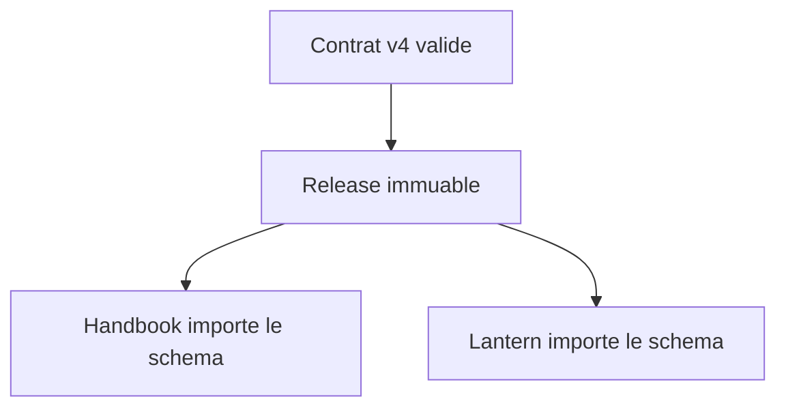
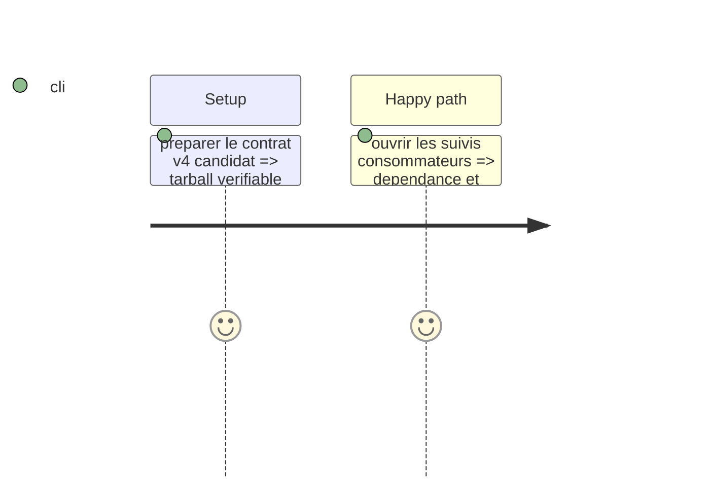

# Instruction: Intégration Lantern et publication

## Architecture projection

> Tree of the final files. ✅ create · ✏️ modify · ❌ delete

```txt
[Lantern #5](https://github.com/RebelliousSmile/lantern/issues/5) ✅ Suit l'intégration des nouvelles cibles dans Lantern.
[Obsidian Handbook #34](https://github.com/RebelliousSmile/obsidian-handbook/issues/34) ✅ Suit la consommation des cibles spécialisées par Handbook.
```

## User Journey



## Test Scope



## Tasks to do

### `1)` Livrer sans confondre les responsabilités

> Préparer le producteur et déléguer les preuves d'intégration aux deux consumers.

1. Préparer et vérifier la release v4 dans ce dépôt ; ne publier qu'avec une autorisation explicite.
2. Créer ou mettre à jour les issues Handbook et Lantern avec la version requise et les critères d'acceptation.
3. Ne modifier aucun dépôt consumer depuis cette tâche.

## Test acceptance criteria

| Task | Acceptance criteria |
| --- | --- |
| 1 | Les deux consumers ont un suivi explicite reliant leurs formulaires ou rendus aux cibles spécialisées v4. |
