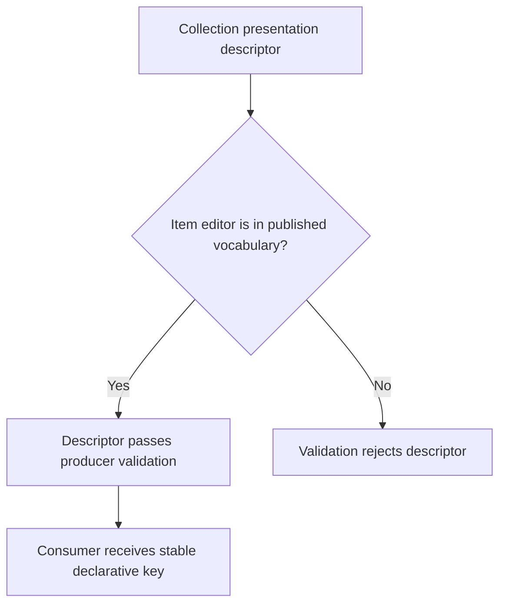
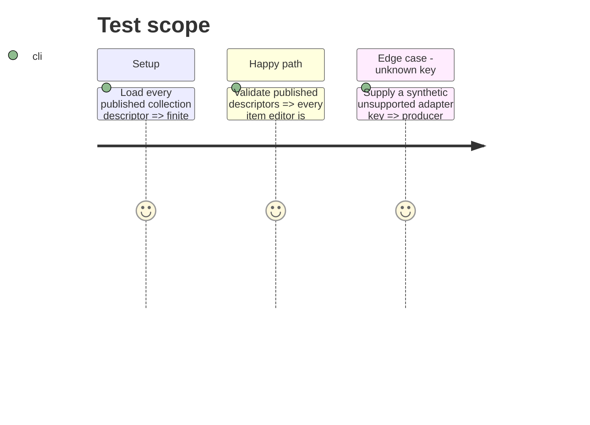

# Instruction: Validate the closed producer vocabulary

## Architecture projection

> Tree of the final files. ✅ create · ✏️ modify · ❌ delete

```txt
src/presentation/collections.ts ✏️ Makes the finite collection item-editor vocabulary and producer validation explicit.
tools/validate-presentation-contract.ts ✏️ Proves every published descriptor uses a known key and a synthetic unknown key is rejected.
corpus/presentation/invalid/unknown-item-editor.json ✅ Supplies a declarative invalid metadata fixture with no consumer code.
package.json ✏️ Includes and exports the presentation-fixture corpus when it is published.
README.md ✏️ Names adapter keys as declarative consumer capabilities, not implementation references.
```

## User Journey



## Test Scope



## Tasks to do

### `1)` Make adapter-key validation executable

> Treat the key vocabulary as a published contract boundary rather than a TypeScript-only convention.

1. Centralize runtime validation of collection presentation entries against `PBTA_COLLECTION_ITEM_EDITORS` without adding consumer implementation details.
2. Add an invalid presentation-corpus fixture for an unknown item-editor key, include it in the package surface, and extend the presentation contract harness to reject it while preserving validation of all published descriptors.
3. Document that `itemEditor` is the stable vocabulary for collection presentations only; React components, module paths, CSS, runtime availability, and fallback editing stay outside schema-pbta, while other descriptor families must declare a separate vocabulary.

## Test acceptance criteria

| Task | Acceptance criteria |
| --- | --- |
| 1 | Every exported collection presentation contains one vocabulary key, and an unknown key in the presentation corpus cannot pass producer validation. |
| 1 | Validation gives a specific failure for an unsupported adapter key while published descriptors continue to pass. |
| 1 | Public documentation distinguishes collection adapter keys from consumer-owned implementation and from any future descriptor-family vocabulary. |
