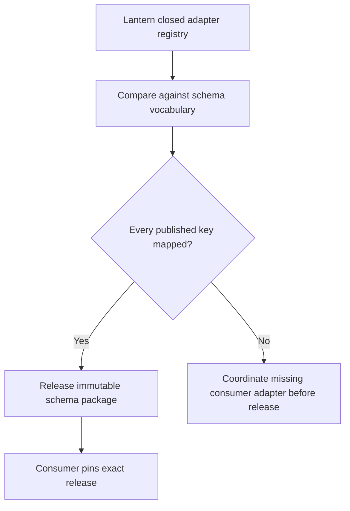
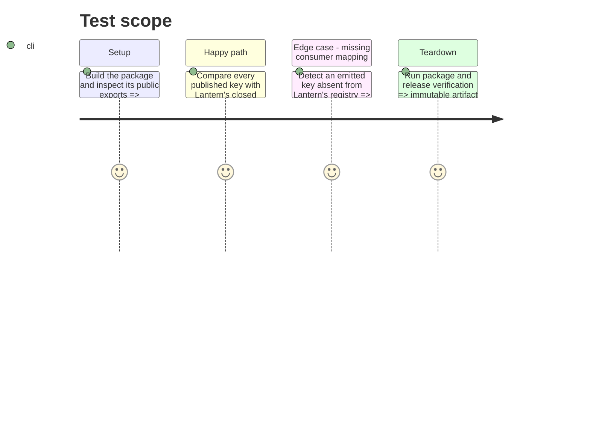

# Instruction: Publish the consumer boundary

## Architecture projection

> Tree of the final files. ✅ create · ✏️ modify · ❌ delete

```txt
package.json ✏️ Carries the next published schema-pbta version after the additive contract is validated.
package-lock.json ✏️ Records the matching package version.
README.md ✏️ Names the immutable release and closed-registry boundary for consumers.
CHANGELOG.md ✏️ Records the additive presentation-contract release.
dist/ ✅ Built package exports the vocabulary and presentation registry.
../lantern/src/templates/pbta/specialized/collectionAdapters.tsx ↗️ Consumer-owned closed mapping checked against the proposed vocabulary; never copied into schema-pbta.
../lantern/tools/assertContracts.harness.mts ↗️ Consumer assertion proving every published descriptor has a Lantern adapter and unknown keys fail closed.
```

## User Journey



## Test Scope



## Tasks to do

### `1)` Gate release on consumer exhaustiveness

> Publish only a vocabulary that Lantern has explicitly agreed to resolve.

1. Compare `PBTA_COLLECTION_ITEM_EDITORS` with Lantern's typed `PBTA_COLLECTION_ADAPTERS` mapping and its `assertPbtaCollectionAdapters` harness; record any mismatch as a release blocker rather than adding a schema-side fallback.
2. Run type, presentation, presentation-corpus, document-corpus, package, and release verification after the producer contract is complete.
3. Bump every package-version location, build the distributable artifact, document the release, and create the immutable package release; only then may Lantern pin that exact release and run its adapter assertion.

## Test acceptance criteria

| Task | Acceptance criteria |
| --- | --- |
| 1 | Every adapter key emitted by schema-pbta has one known `PBTA_COLLECTION_ADAPTERS` mapping and consumer harness assertion before publication. |
| 1 | A missing consumer mapping blocks release; schema-pbta never supplies a consumer-local fallback. |
| 1 | The released artifact exports the same validated vocabulary and registry that the consumer adopts by exact version. |
