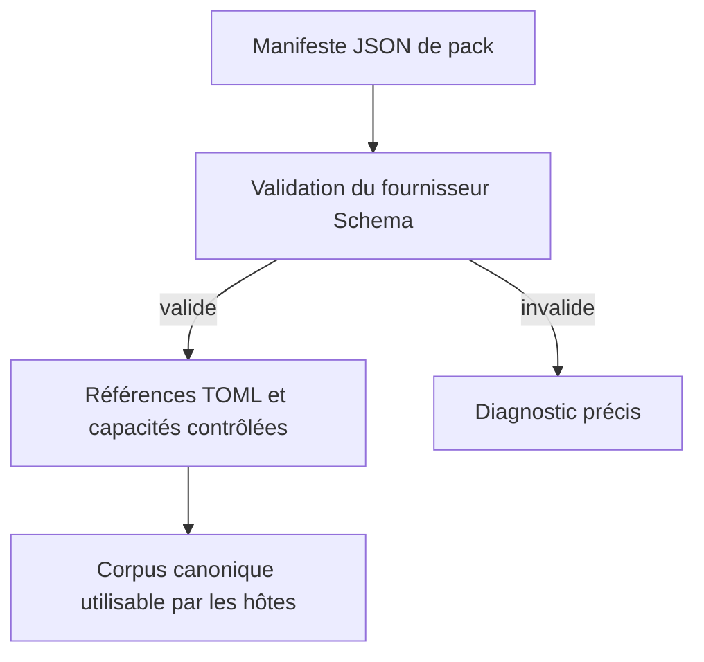
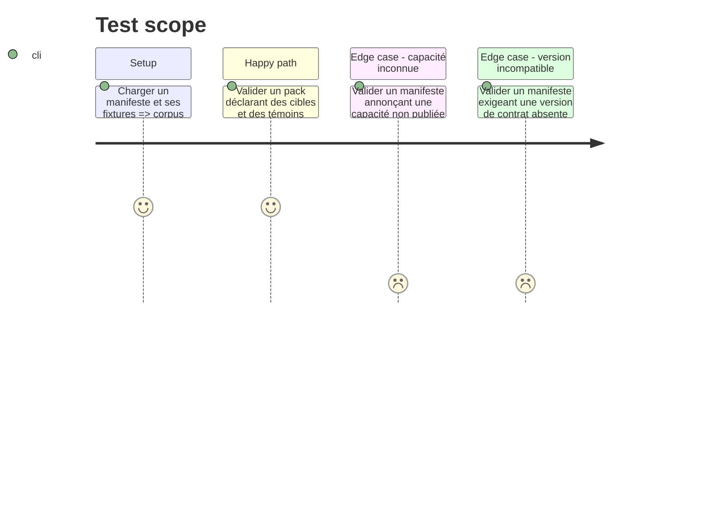

# Instruction: Contrat déclaratif et corpus de conformité

## Architecture projection

> Tree of the final files. ✅ create · ✏️ modify · ❌ delete

```txt
schema-pbta/
├── src/pack-manifest.ts                         ✅ contrat Zod du manifeste et invariants inter-dépôts
├── cross-tool-provider.json                     ✅ descripteur PbtA versionné à la racine du fournisseur
├── src/index.ts                                 ✏️ export public du contrat et de ses types
├── tools/validate-pack-manifest.ts              ✅ validation CLI d’un manifeste JSON et de ses références
├── corpus/contract/pack-cases.json              ✅ cas acceptés et refusés pour les manifestes
├── corpus/contract/pack-fixtures/               ✅ manifestes et documents TOML de référence
├── tools/validate-contract.ts                   ✏️ inclut les fixtures de pack dans le contrôle canonique
└── package.json                                 ✏️ expose la validation de manifeste dans les scripts
```

## User Journey



## Test Scope



## Tasks to do

### `1)` Formaliser le manifeste de pack

> Convertir les obligations aujourd’hui exprimées dans les règles LLM en données vérifiables sans y déplacer les responsabilités de rendu des hôtes.

1. Fixer `manifestVersion`, `provider`, `contractVersion`, `pack`, `documents` et `requirements` comme champs fermés du JSON v1.
2. Définir le protocole générique d’un fournisseur et son fichier racine `cross-tool-provider.json`, puis livrer celui de `schema-pbta` avec sa version publique et ses cibles ; chaque document porte `target`, `fixture` et une mutation nommée autorisée.
3. Définir `requirements.lantern` et `requirements.handbook` comme listes de capacités publiées ; les styles restent des capacités, jamais du CSS transporté.
4. Interdire les propriétés inconnues, fixtures hors corpus et combinaisons cible-capacité non publiées.
5. Exporter les types nécessaires au générateur et aux validateurs consommateurs.

### `2)` Constituer les témoins et les verdicts canoniques

> Donner au validateur une base objective pour l’équivalence métier, les versions et les échecs attendus, sans interprétation par un LLM.

1. Ajouter des fixtures TOML minimales et complètes pour chaque cible d’un pack pilote.
2. Déclarer les comparaisons sur objets normalisés, dont tableaux vides, booléens, nombres et champs optionnels présents ou absents.
3. Ajouter des manifestes refusés pour cible, capacité, référence et version invalides.

### `3)` Brancher le contrat dans les contrôles Schema

> Faire échouer les validations existantes dès qu’un pack ne respecte plus un invariant, son manifeste ou son corpus.

1. Ajouter le validateur CLI et son script npm dédié.
2. Faire participer les fixtures de pack au contrôle de contrat existant sans dupliquer les codecs TOML.

## Test acceptance criteria

| Task | Acceptance criteria |
| --- | --- |
| 1 | Un manifeste ne peut nommer qu’un fournisseur dont le protocole, la version, les cibles, les fixtures et les capacités sont explicitement publiés. |
| 2 | Chaque témoin déclare explicitement son verdict et son objet normalisé de référence. |
| 3 | Une référence absente ou un manifeste non conforme fait échouer la validation Schema. |
