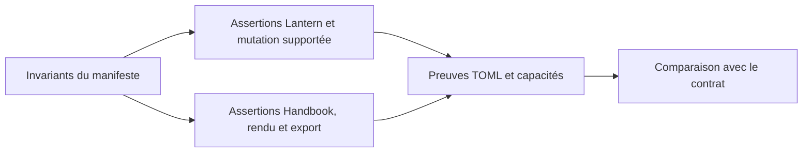
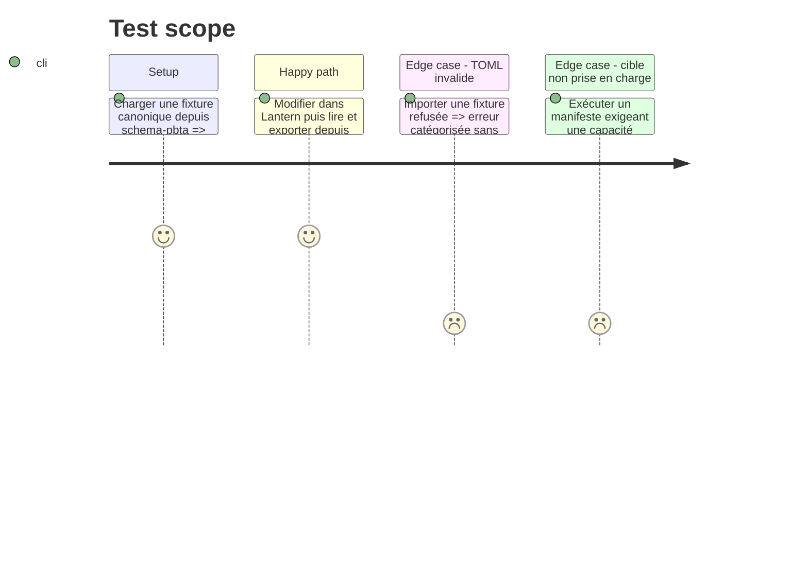

# Instruction: Preuves mécaniques dans Lantern et Handbook

## Architecture projection

> Tree of the final files. ✅ create · ✏️ modify · ❌ delete

```txt
lantern/
├── tools/assert-contracts.mjs                   ✏️ couvre chaque cible et invariant déclarés par un pack
├── tools/assert-cross-repo.mjs                  ✏️ généralise le corpus au-delà du seul contrat Mist
└── package.json                                 ✏️ expose une porte de conformité stable
handbook/
├── tools/assert-game-pack-contract.mjs          ✏️ vérifie manifests, capacités, assets et styles déclarés
├── tools/assert-*-contract.mjs                  ✏️ vérifie les cibles rendables et les codecs des contrats installés
└── package.json                                 ✏️ expose une porte de conformité stable
```

## User Journey



## Test Scope



## Tasks to do

### `1)` Définir la sortie d’adaptateur commune

> Faire correspondre chaque obligation déclarée à une assertion déterministe des hôtes.

1. Associer chaque cible, capacité et règle d’échange à une assertion existante ou à créer, avec un verdict exploitable par l’orchestrateur.
2. Garder les composants Lantern et les renderers Handbook propriétaires de leurs interfaces ; ne pas transporter leur CSS dans le TOML.

### `2)` Adapter Lantern au corpus de pack

> Rendre les garanties Lantern déjà attendues par les règles exécutables sur chaque cible déclarée.

1. Réutiliser les manifests normalisés et le mécanisme de round-trip déjà présent dans Lantern.
2. Ajouter une assertion qui utilise le chemin de mutation réellement supporté par le modèle ou l’éditeur, puis compare le TOML réimporté au résultat attendu.
3. Renvoyer les incompatibilités de cible ou de version comme des erreurs déterministes.

### `3)` Adapter Handbook au corpus de pack

> Rendre les garanties Handbook déjà attendues par les règles exécutables sur chaque cible déclarée.

1. Exécuter les codecs, manifests et registre de blocks sur les fixtures canoniques sans dépendre du DOM d’un coffre réel.
2. Vérifier qu’une cible déclarée est reconnue, rendue et exportée par Handbook ; l’édition reste explicitement un parcours Lantern.
3. Exposer les verdicts dans une forme stable pour l’orchestrateur.

## Test acceptance criteria

| Task | Acceptance criteria |
| --- | --- |
| 1 | Chaque invariant du manifeste est rattaché à une assertion Lantern ou Handbook déterministe. |
| 2 | Un champ modifié par le chemin d’édition Lantern réapparaît dans le TOML normalisé et satisfait le codec du fournisseur. |
| 3 | Handbook reconnaît, rend et exporte sans perte un document édité dans Lantern, ou refuse explicitement la cible ; aucun rendu silencieux ne compte comme succès. |
