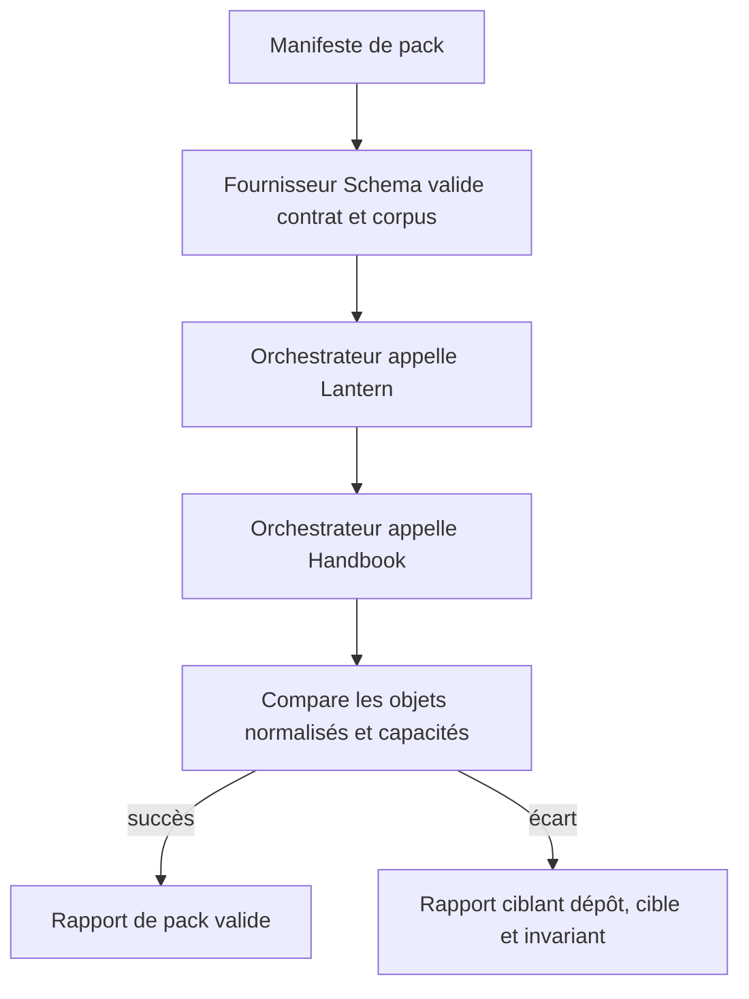
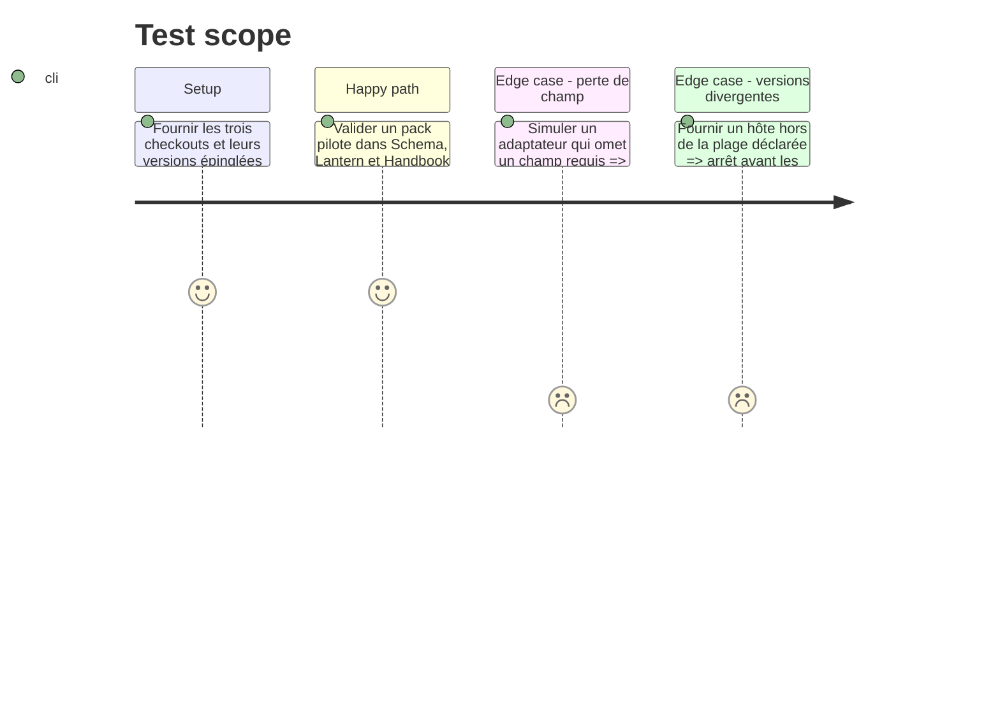

# Instruction: Orchestrateur multi-dépôts et intégration continue

## Architecture projection

> Tree of the final files. ✅ create · ✏️ modify · ❌ delete

```txt
schema-pbta/
├── tools/validate-cross-tool-contract.ts         ✅ orchestre Schema, Lantern et Handbook depuis des chemins fournis
├── tools/cross-tool-config.ts                    ✅ lit une table explicite de fournisseurs, emplacements, versions et rapports
├── tools/validate-version-compat.ts              ✏️ vérifie la compatibilité des versions déclarées par les hôtes
├── .github/workflows/ci.yml                      ✏️ exécute le contrôle avec checkouts épinglés
└── package.json                                  ✏️ expose la porte multi-dépôts
lantern/
├── tools/assert-cross-repo.mjs                   ✏️ reste une porte locale appelable par l’orchestrateur
└── package.json                                  ✏️ stabilise la commande de conformité
handbook/
├── tools/assert-cross-tool-contract.mjs          ✏️ reste une porte locale appelable par l’orchestrateur
└── package.json                                  ✏️ stabilise la commande de conformité
```

## User Journey



## Test Scope



## Tasks to do

### `1)` Construire l’orchestrateur indépendant des chemins locaux

> Composer les assertions mécaniques depuis des clones voisins, la CI ou des chemins explicitement fournis, sans supposer une arborescence personnelle ni recourir à un jugement LLM.

1. Charger une table explicite de fournisseurs, chacun avec son checkout, son manifeste de corpus et ses portes hôte ; exiger une entrée complète pour PbtA, Mist Engine et Adrenaline, puis refuser toute entrée incomplète.
2. Lancer le corpus Schema puis les assertions des hôtes, collecter leurs sorties JSON et comparer les objets normalisés aux attentes déclarées.
3. Produire des diagnostics stables par pack, cible, invariant, dépôt et version.

### `2)` Relier compatibilité et capacités publiées

> Refuser un pack avant l’exécution si ses cibles ou capacités dépassent la version installée d’un hôte.

1. Réutiliser les versions de contrat et `minimumHandbookVersion` déjà vérifiées dans les manifests, quelle que soit la famille de schéma.
2. Vérifier la compatibilité Lantern et Handbook avec chaque version du manifeste de pack.

### `3)` Installer une porte CI reproductible

> Faire du rapport multi-dépôts une condition de livraison, tout en conservant les contrôles locaux isolés et réexécutables hors LLM.

1. Épingler les trois sources dans le job de contrat et transmettre leurs chemins à l’orchestrateur.
2. Exécuter les corpus PbtA, Mist Engine et Adrenaline par le même flux de fournisseur, sans les reléguer à de simples non-régressions optionnelles.

## Test acceptance criteria

| Task | Acceptance criteria |
| --- | --- |
| 1 | Le même contrôle parcourt tous les packs PbtA, Mist Engine et Adrenaline avec des chemins explicites et ne dépend pas de checkouts frères implicites. |
| 2 | Une version ou une capacité incompatible échoue avant tout faux positif de rendu. |
| 3 | La CI échoue lorsqu’un hôte perd un champ, accepte un TOML invalide ou ne satisfait plus une capacité déclarée. |
