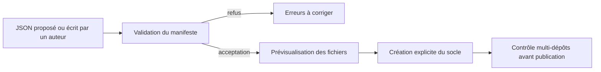
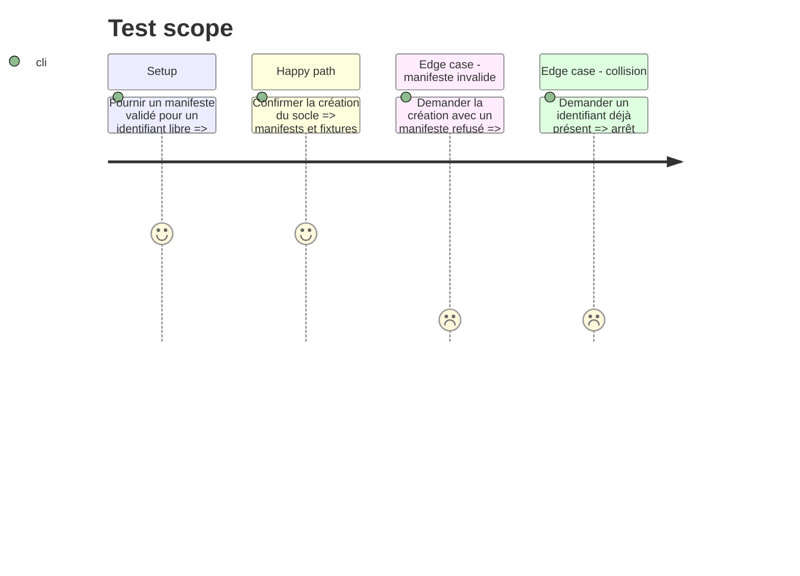

# Instruction: Génération guidée d’un nouveau pack

## Architecture projection

> Tree of the final files. ✅ create · ✏️ modify · ❌ delete

```txt
schema-pbta/
├── tools/create-pack.ts                          ✅ génère un socle depuis un manifeste déjà validé
├── tools/create-pack.test.ts                     ✅ couvre création, collisions et manifeste refusé
├── packs/<nouveau-pack>/pack-contract.json        ✅ manifeste versionné avec le schéma et ses données de pack
├── handbook.json                                 ✏️ reçoit une entrée de catalogue seulement après génération validée
├── handbook/<nouveau-pack>/pack.json             ✅ manifeste Handbook généré depuis la déclaration validée
├── corpus/contract/pack-fixtures/<nouveau-pack>/ ✅ témoins TOML générés et à compléter
├── aidd_docs/recipes/add-a-cross-tool-pbta-game.md ✏️ documente le parcours de création et les portes obligatoires
└── README.md                                     ✏️ documente le manifeste et la commande de génération
```

## User Journey



## Test Scope



## Tasks to do

### `1)` Générer uniquement depuis un manifeste validé

> Transformer une déclaration de pack en socle contrôlé sans confondre génération et prise en charge complète par les hôtes.

1. Exiger la validation du manifeste avant toute écriture et proposer une prévisualisation des fichiers ciblés.
2. Écrire le manifeste validé sous `packs/<nouveau-pack>/pack-contract.json`, puis générer les manifests, répertoires, fixtures et entrées de catalogue qu’il déclare sans inventer de contenu métier ; émettre le rapport de prise en charge sur la sortie standard ou un chemin explicitement fourni.
3. Refuser les collisions, les chemins hors dépôt et les capacités non publiées sans modifier l’existant.

### `2)` Rendre la prise en charge restante explicite

> Éviter qu’un pack généré soit annoncé comme fini avant que Lantern et Handbook aient leurs capacités réelles.

1. Marquer les cibles sans adaptateur, sans chemin de mutation ou sans capacité hôte comme incomplètes dans le rapport de génération.
2. Conserver le contrôle multi-dépôts comme porte avant l’activation ou la publication du pack.

### `3)` Documenter le parcours auteur

> Permettre à un auteur ou à un LLM de produire une proposition contrôlable et révisable.

1. Documenter la forme du JSON, les diagnostics attendus et le fait qu’une proposition LLM requiert revue.
2. Ajouter une recette qui enchaîne contrat, contribution hôte, génération et contrôle de conformité.

## Test acceptance criteria

| Task | Acceptance criteria |
| --- | --- |
| 1 | Un manifeste accepté crée seulement les fichiers annoncés ; un manifeste invalide ou collisionnel n’écrit rien. |
| 2 | Un pack avec capacité manquante ne peut pas être présenté comme compatible avec l’hôte concerné. |
| 3 | La documentation permet de relier chaque fichier généré à une règle du manifeste et à sa porte de conformité. |
