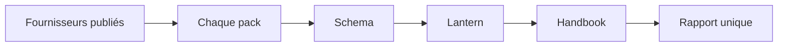
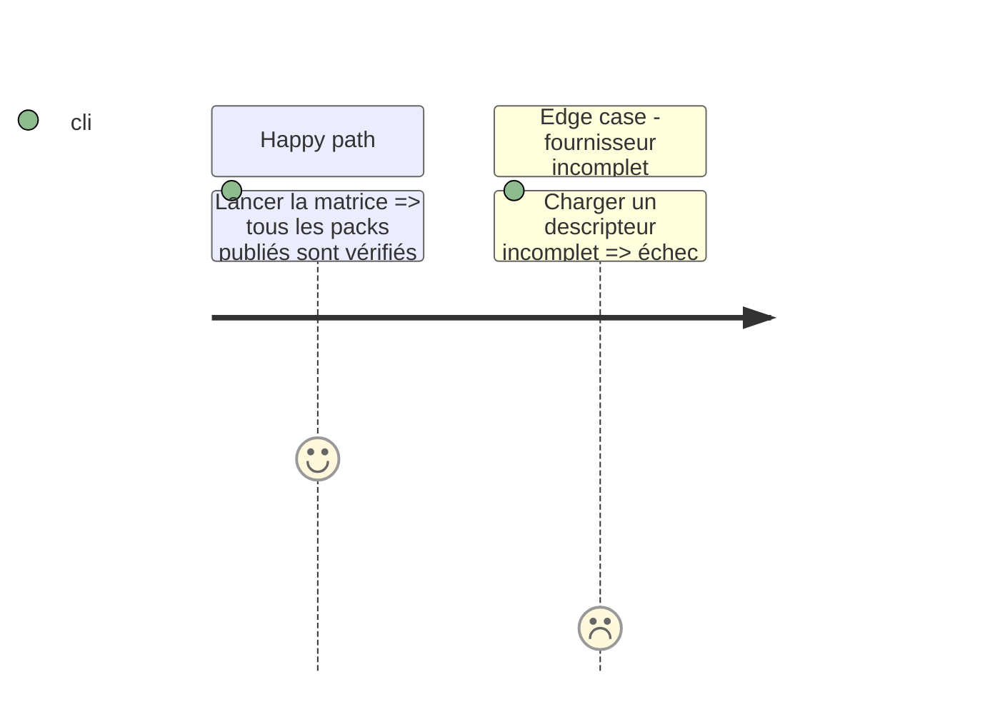

# Instruction: Matrice complète des fournisseurs publiés

## Architecture projection

> Tree of the final files. ✅ create · ✏️ modify · ❌ delete

```txt
schema-pbta/tools/cross-tool-config.ts             ✏️ table de fournisseurs explicite
schema-pbta/tools/validate-cross-tool-contract.ts  ✏️ boucle sur chaque fournisseur et pack
schema-pbta/cross-tool.config.json                 ✅ liste les trois checkouts locaux ou CI
schema-in-the-mist/cross-tool-provider.json        ✅ descripteur Mist Engine
schema-adrenaline/cross-tool-provider.json         ✅ descripteur Adrenaline
```

## User Journey



## Test Scope



## Tasks to do

### `1)` Déclarer les fournisseurs publiés

1. Ajouter un descripteur versionné à chaque dépôt de schéma.
2. Déclarer `providerVersion`, `provider`, `corpus`, `packManifest`, les capacités et `commands.validatePack` sous forme de tableau d’arguments.
3. Faire pointer `cross-tool.config.json` vers `schema-pbta`, `schema-in-the-mist`, `schema-adrenaline`, Lantern et Handbook ; aucun chemin n’est découvert implicitement.

### `2)` Parcourir la matrice

1. Charger chaque fournisseur explicitement configuré et refuser les clés inconnues, chemins absents ou protocoles incompatibles.
2. Résoudre les manifests de pack avec le glob déclaré par le fournisseur, puis exécuter sa commande sur chacun d’eux.
3. Exécuter les assertions Lantern et Handbook une fois par fournisseur et reporter fournisseur, pack, cible et hôte en cas d’échec.

## Test acceptance criteria

| Task | Acceptance criteria |
| --- | --- |
| 1 | Les trois fournisseurs publiés déclarent leurs packs, corpus, capacités et commande de validation sans chemin implicite. |
| 2 | La matrice signale précisément le fournisseur, le pack et l’hôte qui échouent ; une seule commande est verte seulement lorsque tous le sont. |
