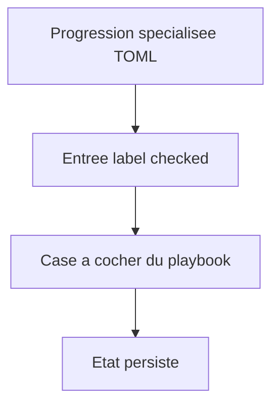
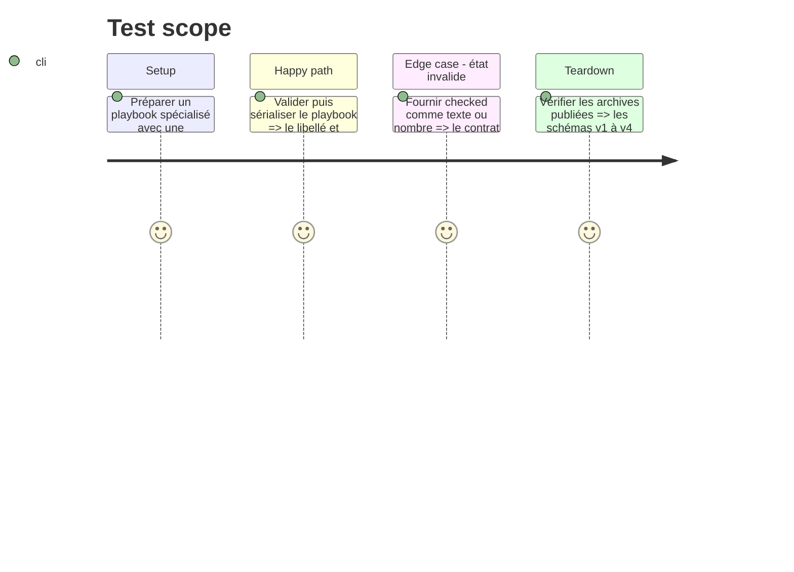

# Instruction: Progressions spécialisées cochables

## Architecture projection

```txt
src/zod/playbook.ts ✏️ Exporte l entrée générique acquise `{ label, checked }`.
src/zod/monsterhearts-playbook.ts ✏️ Applique cette entrée aux `advances` de skin.
src/zod/monster-of-the-week-playbook.ts ✏️ Applique cette entrée aux `improvements`.
src/zod/urban-shadows-playbook.ts ✏️ Applique cette entrée aux `corruption.advances`.
corpus/contract/** ✏️ Couvre les entrées cochées, non cochées et les formes invalides.
corpus/temoins et corpus/refus/** ✏️ Audite les schémas JSON générés.
examples/** ✏️ Migre les progressions spécialisées des packs concernés.
schemas/** ✏️ Régénère la ligne v5 et les schémas courants, sans toucher v1 à v4.
```

## User Journey



## Test Scope



## Tasks to do

### `1)` Unifier les acquisitions spécialisées

> Rendre cochables les progrès qui sont encore de simples chaînes.

1. Extraire et réutiliser l’entrée d’avancement générique dans les trois schémas spécialisés.
2. Migrer les exemples Monsterhearts, Urban Shadows et Monster of the Week sans changer les moves proposés ni les ressources.
3. Ajouter corpus et refus JSON/TOML, régénérer les schémas et contrôler la compatibilité des lignes publiées.

## Test acceptance criteria

| Task | Acceptance criteria |
| --- | --- |
| 1 | `advances`, `improvements` et `corruption.advances` conservent chacun un libellé et un état coché facultatif. |
| 1 | Les choix de `choiceSets` ne gagnent aucun état d acquisition. |
| 1 | Une valeur `checked` non booléenne est rejetée par le contrat et par l audit JSON. |
