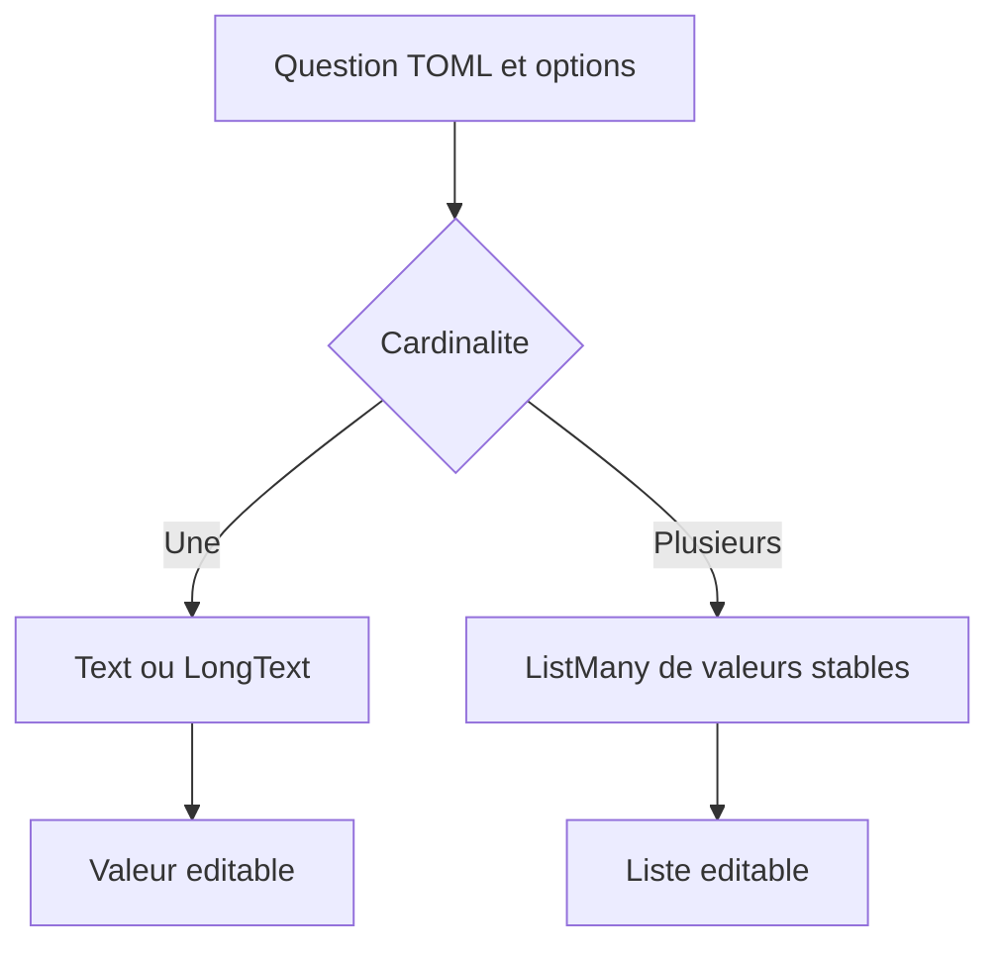
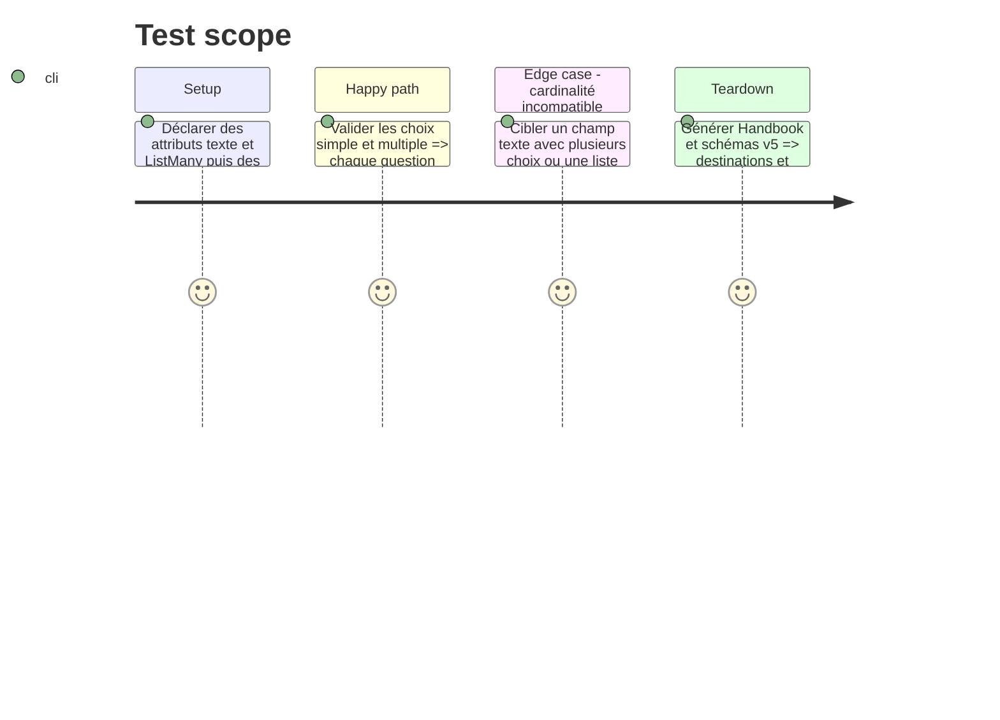

# Instruction: Résultats texte et listes de création

## Architecture projection

```txt
src/zod/playbook.ts ✏️ Décrit la cardinalité et les valeurs stables d une question de création liée à un attribut.
src/zod/urban-shadows-playbook.ts ✏️ Transforme les relations mortelles en catalogue éditorial identifié.
tools/validate-references.ts ✏️ Accepte Text et LongText pour un choix unique, ListMany pour une sélection multiple, et vérifie cibles, bornes et valeurs proposées.
tools/validate-reference-fixtures.ts ✏️ Couvre les cibles, types, cardinalités et valeurs incompatibles.
examples/salvage-run/game-definition/salvage-run.toml ✏️ Déclare les champs texte Name et Look de la fiche.
examples/salvage-run/**/the-wrench.toml ✏️ Lie les propositions Name et Look à leurs champs libres.
examples/urban-shadows/game-definition/urban-shadows.toml ✏️ Déclare la liste éditable des relations mortelles.
examples/urban-shadows/urban-shadows-playbook/the-aware.toml ✏️ Porte le catalogue décrit de relations et lie la sélection multiple à la liste des clés choisies.
tools/render-handbook-preview.ts ✏️ Rend cardinalité et cible structurées.
tools/validate-handbook-packs.ts ✏️ Vérifie le rendu de question simple et multiple.
corpus/contract/** ✏️ Prouve les formes valides et invalides.
schemas/** ✏️ Régénère les artefacts v5 seulement pour le nouveau contrat.
Lantern issue ✅ Décrit le préremplissage d une valeur ou liste choisie sans persister les options.
```

## User Journey



## Test Scope



## Tasks to do

### `1)` Étendre la destination de création

> Conserver les options éditoriales dans le TOML, mais formaliser le type du résultat initialisé.

1. Ajouter une cardinalité explicite et des options à valeur stable, avec compatibilité des chaînes existantes à choix unique.
2. Vérifier la compatibilité entre la cardinalité, le type de l attribut cible, `visibleFor`, les bornes de sélection et les valeurs proposées.
3. Migrer Name/Look de Salvage Run vers des champs libres ; pour Urban Shadows, séparer le catalogue de relations mortelles identifié de la liste éditable de leurs clés choisies.
4. Rendre les destinations dans Handbook, créer l issue Lantern et couvrir les contrôles de contrat, références, audit et compatibilité.

## Test acceptance criteria

| Task | Acceptance criteria |
| --- | --- |
| 1 | Une question unique initialise un `Text` ou `LongText`, puis la valeur peut être remplacée sans contrainte d option. |
| 1 | Une question multiple initialise un `ListMany` de valeurs stables avec les bornes demandées, puis la liste peut évoluer. |
| 1 | Name/Look de Salvage Run et les relations mortelles d Urban Shadows sont structurés sans perdre les descriptions éditoriales. |
| 1 | Les questions sans destination restent purement informatives. |
