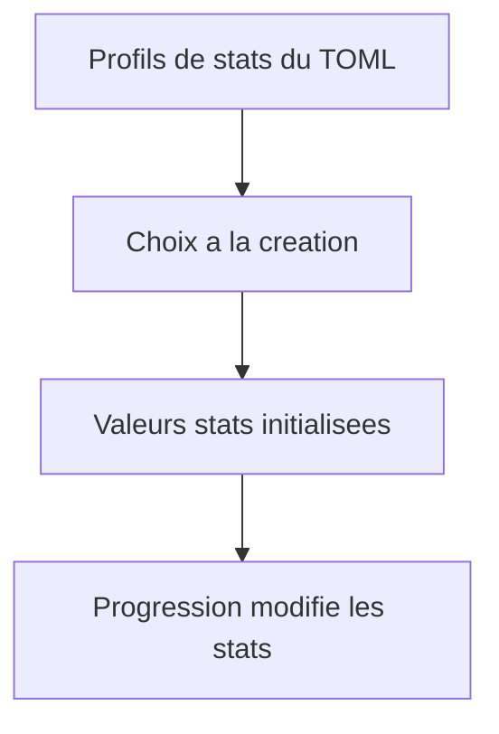
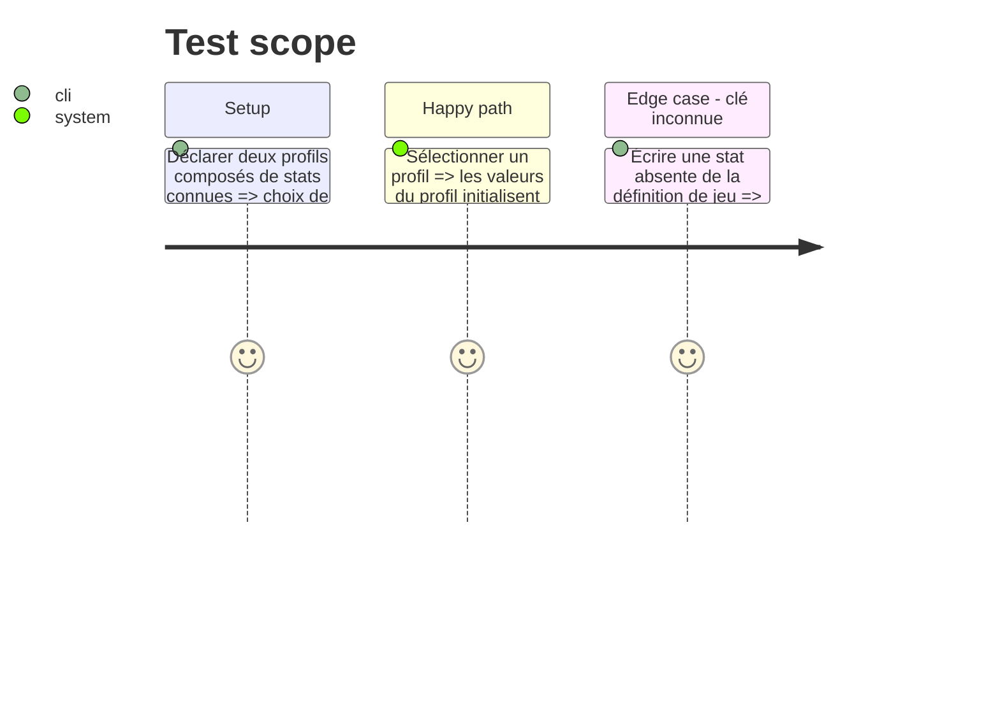

# Instruction: Répartition de stats à la création

## Architecture projection

```txt
src/zod/playbook.ts ✏️ Ajoute des profils de stats proposés à la création, distincts du texte statsDetail.
tools/validate-references.ts ✏️ Vérifie que chaque clé de profil existe dans les stats du jeu et que les valeurs sont portables.
tools/validate-reference-fixtures.ts ✏️ Couvre une clé inconnue et un profil incomplet ou invalide.
corpus/contract/** ✏️ Prouve la sélection structurée d un profil de stats.
examples/salvage-run/**/the-wrench.toml ✏️ Remplace la consigne ambiguë de choix de stats par un ensemble fini de profils originaux.
tools/render-handbook-preview.ts ✏️ Rend les profils de départ sans essayer d interpréter statsDetail.
tools/validate-handbook-packs.ts ✏️ Vérifie que le profil structuré est présent dans le rendu.
schemas/** ✏️ Régénère les schémas courants et v5, sans modifier v1 à v4.
Lantern issue ✅ Étend le flux de création pour appliquer un profil de stats choisi puis laisser les progressions modifier les valeurs.
```

## User Journey



## Test Scope



## Tasks to do

### `1)` Rendre les choix de stats lisibles par les consommateurs

> Sortir les décisions de répartition de `statsDetail` sans modifier la mécanique des statistiques pendant la partie.

1. Définir une liste de profils nommés, chacun portant une table de stats de départ ; garder `statsDetail` comme texte d accompagnement facultatif.
2. Réécrire l exemple Salvage Run avec un ensemble fini de profils explicitement assumés par ce pack original ; ne rien inférer de `statsDetail`.
3. Ajouter validations, rendu Handbook, issue Lantern et tests de non-régression de la ligne v5.

## Test acceptance criteria

| Task | Acceptance criteria |
| --- | --- |
| 1 | Un playbook peut proposer plusieurs profils nommés dont les clés de stats sont déclarées par le jeu. |
| 1 | Le choix d un profil initialise les stats sans conserver les autres profils dans l état du personnage. |
| 1 | `statsDetail` continue de documenter une règle mais n est jamais interprété comme une valeur mécanique. |
