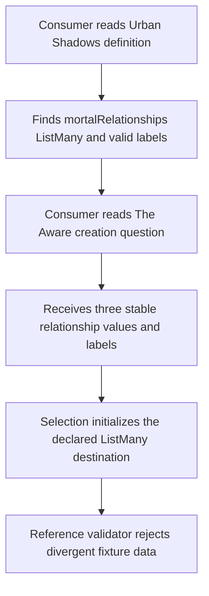
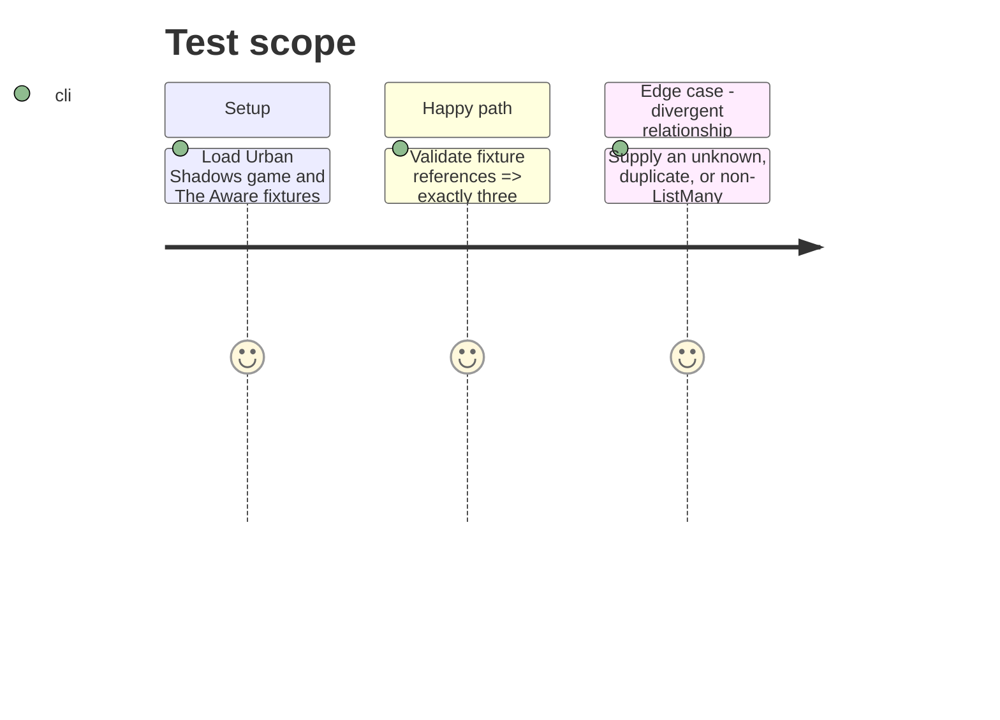

# Instruction: Canonical relationship source and semantic validation

## Architecture projection

> Tree of the final files. ✅ create · ✏️ modify · ❌ delete

```txt
.
├── examples/urban-shadows/game-definition/urban-shadows.toml ✏️ Declare `mortalRelationships` as the ListMany destination and its canonical relationship labels.
├── examples/urban-shadows/urban-shadows-playbook/the-aware.toml ✏️ Keep the three editorial relationships, stable values, structured creation options, exact `3..3` bounds, and destination aligned with the game fixture.
├── tools/validate-references.ts ✏️ Enforce the Urban Shadows creation destination, multi-select type, bounds, and vocabulary alignment across the game and specialised playbook fixtures.
└── tools/validate-reference-fixtures.ts ✏️ Add focused rejected fixture coverage for invalid relationship creation semantics.
```

## User Journey



## Test Scope



## Tasks to do

### `1)` Establish the canonical Urban Shadows relationship vocabulary

> Put the destination key and allowed relationship labels in the game-definition fixture, while The Aware owns the stable keys and binds them to that vocabulary through its editorial and creation data.

1. Add the three valid mortal-relationship labels to the `mortalRelationships` ListMany attribute without changing its stable key or type.
2. Retain exactly the three editorial entries with stable keys, labels, and descriptions in The Aware.
3. Keep the structured creation options mapped to those stable keys, target `mortalRelationships`, and require exactly three selections.

### `2)` Prove the specialised relationship data cannot drift

> Extend reference validation so an accepted Urban Shadows playbook has a visible ListMany destination and matching canonical relationship vocabulary.

1. Add specialised cross-reference checks only where the existing generic creation validation cannot establish the required relationship correspondence.
2. Add temporary rejected fixtures covering a relationship value or label that diverges from the canonical source; retain the existing generic wrong-destination-type coverage.
3. Preserve generic creation-question behavior for other games and existing fixtures.

## Test acceptance criteria

| Task | Acceptance criteria |
| --- | --- |
| 1 | The Urban Shadows game definition exposes `mortalRelationships` as a `ListMany` attribute with the three valid relationship labels. |
| 1 | The Aware offers exactly `younger-sibling`, `loyal-significant-other`, and `struggling-best-friend`, each with a label and optional description, through structured options. |
| 1 | The creation question targets `mortalRelationships` and its inclusive selection bounds are exactly `min = 3`, `max = 3`. |
| 2 | Reference validation rejects a relationship creation fixture whose destination, values, or labels do not match the canonical Urban Shadows source. |
| 2 | Existing single-choice and other-game creation fixtures retain their current validation behavior. |
