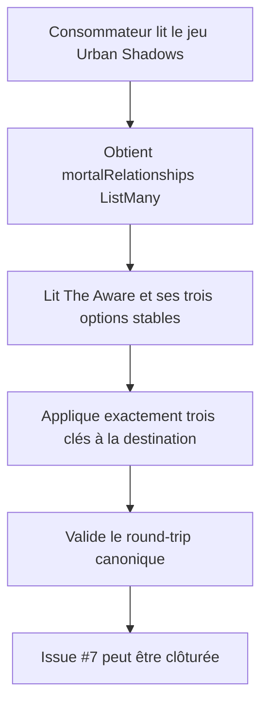
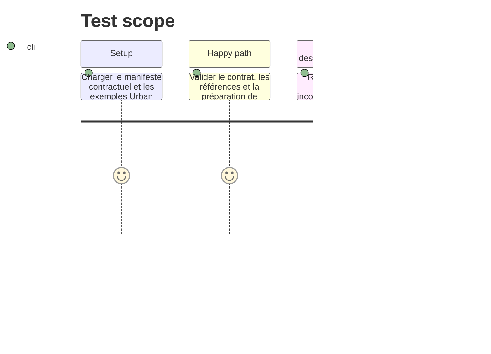

# Instruction: Vérifier le contrat publié et clôturer l’issue

## Architecture projection

> Tree of the final files. ✅ create · ✏️ modify · ❌ delete

```txt
.
├── examples/urban-shadows/game-definition/urban-shadows.toml ✏️ Conserve l’attribut de personnage `mortalRelationships` de type `ListMany` comme destination autoritaire.
├── examples/urban-shadows/urban-shadows-playbook/the-aware.toml ✏️ Conserve le catalogue des trois relations, leurs clés stables, la question liée et la sélection `3..3`.
├── corpus/contract/cases.json ✏️ Conserve le témoin spécialisé Urban Shadows dans le manifeste de round-trip.
├── corpus/contract/valid/urban-shadows-playbook-complete.toml ✏️ Conserve le témoin TOML canonique qui porte la création liée.
├── tools/validate-contract.ts ✏️ Valide l’acceptation et le round-trip TOML des cas du manifeste.
├── tools/validate-references.ts ✏️ Vérifie la destination, la cardinalité, les options stables et le type `ListMany`.
└── aidd_docs/tasks/2026_09/2026_09_18_urban_shadows_creation_relationship_destination/ ✅ Crée la traçabilité de l’issue et ce plan de clôture.
```

## User Journey



## Test Scope



## Tasks to do

### `1)` Réconcilier la livraison v5 avec l’issue #7

> Établir que le contrat déjà publié est la seule source de vérité consommable par Lantern, puis clôturer l’issue avec les liens de preuve.

1. Contrôler dans la définition Urban Shadows que `mortalRelationships` est l’attribut `ListMany` autoritaire.
2. Contrôler dans le témoin The Aware les trois relations éditoriales, leurs valeurs stables, la destination et les bornes de sélection exactes.
3. Exécuter les validateurs de contrat, de références et de release pour démontrer le round-trip et la reproductibilité.
4. Ajouter à l’issue le lien de la release v5.0.0, ses assets et ces preuves, puis la clôturer sans modification du contrat.

## Test acceptance criteria

| Task | Acceptance criteria |
| ---- | ------------------- |
| 1 | Un consommateur peut obtenir la clé `mortalRelationships` et constater qu’elle désigne un `ListMany` Urban Shadows. |
| 1 | Le témoin spécialisé fournit exactement les clés `younger-sibling`, `loyal-significant-other` et `struggling-best-friend`, avec leurs libellés et descriptions. |
| 1 | La question de création cible `mortalRelationships`, accepte exactement trois choix et ne nécessite aucune interprétation locale par Lantern. |
| 1 | Le manifeste contractuel, les références et le paquet reproductible valident la livraison v5.0.0 avant la clôture de l’issue. |
