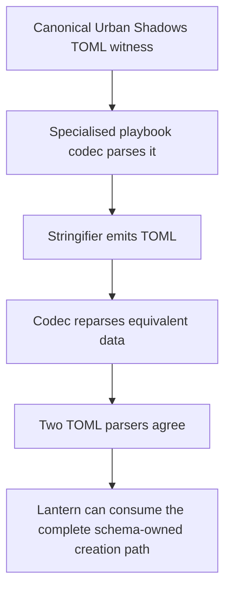
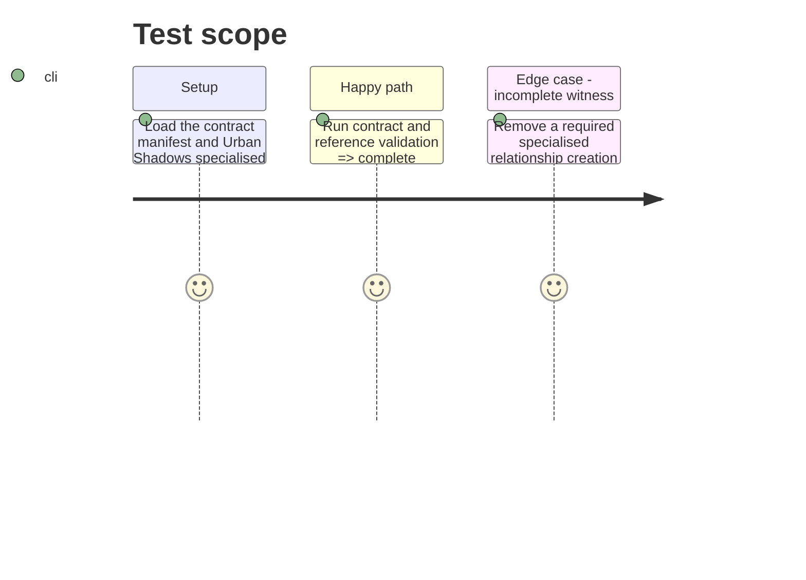

# Instruction: Contract witness and completion gates

## Architecture projection

> Tree of the final files. ✅ create · ✏️ modify · ❌ delete

```txt
.
├── corpus/contract/valid/urban-shadows-playbook-complete.toml ✏️ Carry the complete specialised relationship catalogue, selected values, structured creation question, bounds, and destination in the canonical TOML witness.
└── aidd_docs/tasks/2026_09/2026_09_18_urban_shadows_creation_relationship_destination/ ✅ Records issue #7's implementation plan and backlog link.
```

## User Journey



## Test Scope



## Tasks to do

### `1)` Make the specialised contract witness complete

> Replace the partial Urban Shadows witness with a complete, original TOML document that exercises every issue #7 field.

1. Add the selected ListMany values, editorial mortal relationships, and structured creation question to the existing specialised witness.
2. Preserve the existing manifest target and accepted-case registration rather than adding a parallel source of truth.
3. Confirm that TOML encoding preserves stable values, display labels, descriptions, selection bounds, and the destination key.

### `2)` Run the repository completion gates

> Verify schema, fixture, contract, and cross-reference evidence together before handing the package to Lantern.

1. Run the focused contract and reference-validation commands while iterating.
2. Run `npm run check` after all fixture and validator changes are complete.
3. Record any release or downstream Lantern work separately; this repository's completion is the published, versioned schema contract and its proof.

## Test acceptance criteria

| Task | Acceptance criteria |
| --- | --- |
| 1 | The registered Urban Shadows specialised witness round-trips the three editorial relationships, selected stable values, structured options, `3..3` bounds, and `mortalRelationships` destination. |
| 1 | No second Urban Shadows contract fixture or duplicate manifest case is needed to prove the creation path. |
| 2 | Contract validation, reference validation and their focused fixture suites pass with the new relationship semantics. |
| 2 | `npm run check` passes, including generation, contract, references, audit and Handbook validation gates. |
