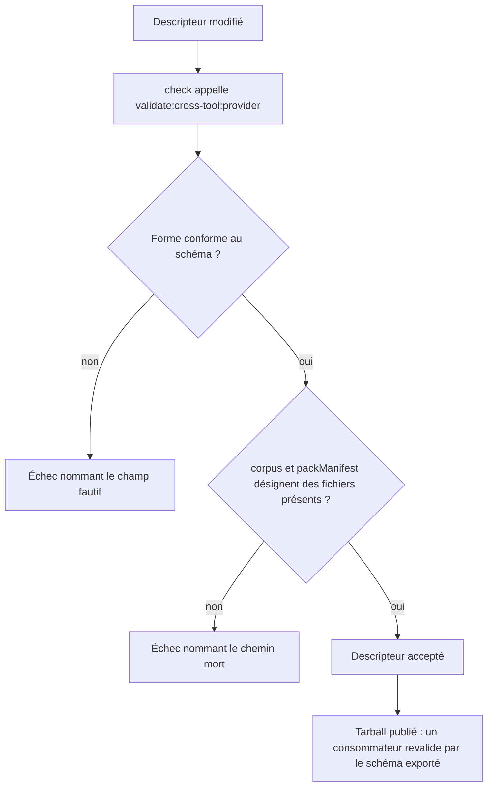

<!-- Fill or omit these sections; never add, rename, or reorder one. -->

# Instruction: Typer et publier le descripteur inter-dépôts

## Architecture projection

> Tree of the final files. ✅ create · ✏️ modify · ❌ delete

```txt
schema-pbta/
├── src/cross-tool-provider.ts                    ✅ schéma Zod agnostique du fournisseur du descripteur
├── src/index.ts                                  ✏️ exporte le schéma et son type
├── tools/validate-cross-tool-provider.ts         ✅ valide le descripteur de ce dépôt et résout ses chemins
├── tools/validate-package.ts                     ✏️ le consommateur du tarball valide un descripteur par le schéma publié
└── package.json                                  ✏️ ajoute validate:cross-tool:provider à la chaîne check
```

## User Journey



## Tasks to do

### `1)` Écrire le schéma du descripteur

> Donner une forme vérifiable aux champs que trois dépôts écrivent à la main : sept chez pbta, six chez mist et adrenaline, qui n'ont pas `contractVersion`.

1. Créer `src/cross-tool-provider.ts` sur le patron de `src/pack-manifest.ts` : `z.strictObject` — l'idiome du dépôt, qui fait échouer une clé mal orthographiée au lieu de l'ignorer — avec `providerVersion: z.literal(1)`, `provider` chaîne non vide, `corpus` et `packManifest` chemins relatifs POSIX.
2. Contraindre `packManifest` à la forme `<répertoire>/*/<fichier>` que l'orchestrateur découpe déjà, plutôt que de laisser l'assertion dans l'outil.
3. Laisser `contractVersion` **optionnel** : entier positif quand il est écrit. Mist et adrenaline ne le portent pas, et un schéma partagé qui rejette deux fournisseurs sur trois dès sa naissance ne peut pas servir à les valider. La phase 3 enregistre leur absence comme écart connu ; ce plan ne rend jamais le champ obligatoire pour tous.
4. Typer `capabilities` comme un enregistrement d'hôte vers une liste de jetons non vide, sans restreindre le vocabulaire — aucun hôte ne le publie encore.
5. Typer `commands.validatePack` comme un tableau de chaînes non vide dont le premier élément est l'exécutable.
6. Exporter le schéma et son type depuis `src/index.ts`, à côté de `packManifestSchema`.

### `2)` Valider le descripteur de ce dépôt

> Faire de la conformité une condition de `check`, et prouver que les chemins déclarés existent.

1. Créer `tools/validate-cross-tool-provider.ts` : parser `cross-tool-provider.json` par le schéma, puis résoudre `corpus` et le répertoire de `packManifest` sur le disque.
2. Figer dans l'outil deux témoins littéraux reprenant la forme des descripteurs de mist et d'adrenaline, et vérifier que le schéma les accepte. Sans eux, l'acceptation des descripteurs étrangers ne se vérifie qu'avec des checkouts frères présents, donc jamais en intégration continue de ce dépôt seul.
3. Vérifier que `provider` égale le `name` de `package.json`, et que `contractVersion` est **présent** et égal à `PBTA_CONTRACT_VERSION` : le champ est optionnel dans le schéma partagé, obligatoire pour ce dépôt-ci, qui a le droit d'être strict sur lui-même.
4. Vérifier que le glob `packManifest` apparie au moins un manifeste.
5. Ajouter `validate:cross-tool:provider` aux scripts et à la chaîne `check`, avant `validate:cross-tool:pins`.
6. Prouver par mutations du descripteur : `providerVersion` à 2, `contractVersion` faux, `contractVersion` **retiré** — le schéma partagé l'admet, l'auto-validateur doit le refuser ici —, `corpus` pointant un fichier absent, `packManifest` sans `/*/`, `commands.validatePack` vide, `capabilities` avec une liste vide. Chaque mutation produit un échec distinct qui nomme son champ.

### `3)` Rendre le schéma utile au consommateur

> Un schéma publié qu'aucun consommateur ne peut atteindre ne vaut pas mieux qu'un commentaire.

1. Étendre le contrôle consommateur de `tools/validate-package.ts`, qui importe et applique déjà `packManifestSchema` : importer le nouveau schéma de la même façon et lui faire passer le `cross-tool-provider.json` résolu par `import.meta.resolve`.
2. Vérifier qu'un descripteur mutilé est bien rejeté côté consommateur, et non seulement côté dépôt.

## Test acceptance criteria

| Task | Acceptance criteria |
| ---- | ------------------- |
| 1 | Le schéma accepte sans modification les descripteurs des trois fournisseurs tels qu'ils existent aujourd'hui, y compris ceux dépourvus de `contractVersion`, et cette acceptation se vérifie sans checkout frère grâce aux témoins figés ; son type est exporté par le point d'entrée public. |
| 2 | `npm run check` échoue avec un message nommant le champ dès que le descripteur de ce dépôt s'écarte de sa forme ou désigne un chemin absent ; sept mutations produisent sept échecs distincts. |
| 3 | Un consommateur installé depuis le tarball valide le descripteur par le schéma exporté et rejette un descripteur mutilé. |
