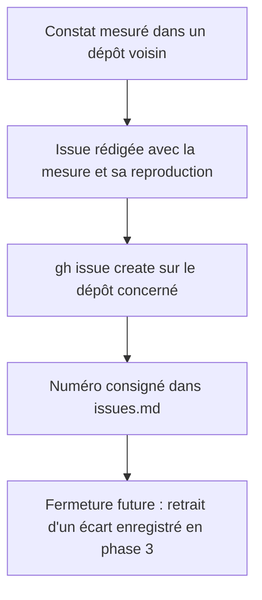

<!-- Fill or omit these sections; never add, rename, or reorder one. -->

# Instruction: Ouvrir les issues chez les dépôts voisins

## Architecture projection

> Tree of the final files. ✅ create · ✏️ modify · ❌ delete

```txt
schema-pbta/
└── aidd_docs/tasks/2026_09/2026_09_20_cross-tool-descriptor-enforcement/
    └── issues.md                                 ✅ trace les numéros d'issue ouverts, seule empreinte locale du travail

<!-- schema-in-the-mist, schema-adrenaline, lantern et handbook ne reçoivent aucun geste de fichier :
     chacun reçoit une issue, celle de handbook restant distincte du bump #36. -->
```

## User Journey



## Tasks to do

### `1)` Ouvrir l'issue de schema-adrenaline

> Le descripteur désigne un manifeste de corpus qui n'existe pas, et rien ne le détecte.

1. Rapporter la mesure : `cross-tool-provider.json` déclare `corpus: "corpus/contract/cases.json"` alors que le manifeste est à `corpus/cases.json` ; `corpus/contract/` ne contient que `valid/` et `invalid/`.
2. Expliquer pourquoi la porte reste verte : l'orchestrateur de schema-pbta ne lit pas ce champ, et la phase 3 le rendra bloquant.
3. Demander aussi `contractVersion: 2` dans le descripteur, cohérent avec `ADRENALINE_CONTRACT_VERSION`, et signaler que `files` ne publie ni `handbook/` ni `cross-tool-provider.json` — un consommateur installé depuis la release ne voit aucun pack.
4. Ouvrir sur `RebelliousSmile/schema-adrenaline`, label `bug`.

### `2)` Ouvrir l'issue de schema-in-the-mist

> Le descripteur est muet sur sa version de contrat, et la release ne publie pas ce qu'elle décrit.

1. Demander `contractVersion: 1` dans le descripteur, cohérent avec `CONTRACT_VERSION`.
2. Signaler que `files` ne publie ni `handbook/` ni `cross-tool-provider.json`, alors que le descripteur annonce `handbook/*/pack.json` : le consommateur du tarball ne peut atteindre aucun pack.
3. Signaler les deux `.tgz` suivis par git à la racine (`1.2.0`, `1.3.1`), point d'hygiène distinct des deux précédents.
4. Ouvrir sur `RebelliousSmile/schema-in-the-mist`, label `enhancement`.

### `3)` Ouvrir l'issue de Lantern

> Trois descripteurs déclarent des capacités que l'hôte ne publie nulle part.

1. Rapporter la mesure : les trois fournisseurs déclarent `capabilities.lantern` (`edit:pbta`, `edit:mist`, `edit:adrenaline`) et aucune de ces chaînes n'apparaît dans `src/` ni `tools/`.
2. Demander une surface de capacités lisible par un outil, sur le modèle de `handbook/src/games/capabilities.ts`, pour qu'un pack puisse être refusé avant tout essai de rendu.
3. Ouvrir sur `RebelliousSmile/lantern`, label `enhancement`.

### `4)` Ouvrir l'issue de Handbook

> Même constat que Lantern, donc même traitement : une issue dédiée, pas un commentaire greffé sur un sujet étranger.

1. Rapporter que Handbook publie déjà sa surface en TypeScript (`GAME_PLUGIN_SUPPORT`, `PORTABLE_GAME_PLUGIN_SUPPORT` dans `src/games/capabilities.ts`), donc `capabilities.handbook` des trois descripteurs est le seul champ de capacité aujourd'hui vérifiable.
2. Demander que cette surface soit exposée en donnée lisible par un outil, ou qu'`assert-pbta-contract.mjs` confronte lui-même le descripteur à `GAME_PLUGIN_SUPPORT` — Handbook seul connaît sa surface, la vérification lui revient.
3. Ne pas greffer ce sujet sur #36, qui porte le bump de dépendance vers la v5.5.0 : deux contrats distincts, deux issues.
4. Ouvrir sur `RebelliousSmile/obsidian-handbook`, label `enhancement`.

### `5)` Consigner les numéros

> Une issue ouverte et non tracée est une dépendance invisible pour la phase 3.

1. Écrire `issues.md` : un tableau dépôt, numéro, URL, constat en une ligne, et l'écart de la liste enregistrée de la phase 3 que sa fermeture obligera à retirer.

## Test acceptance criteria

| Task | Acceptance criteria |
| ---- | ------------------- |
| 1 | Une issue ouverte sur schema-adrenaline cite le chemin mort, le chemin réel et la raison du silence actuel. |
| 2 | Une issue ouverte sur schema-in-the-mist distingue les trois demandes, dont l'hygiène des `.tgz`, sans les mélanger. |
| 3 | Une issue ouverte sur Lantern nomme les trois chaînes non publiées et la mesure qui l'établit. |
| 4 | Une issue ouverte sur Handbook, distincte de #36, relie la surface publiée par `src/games/capabilities.ts` au champ `capabilities.handbook` des descripteurs. |
| 5 | `git status` ne montre aucune modification dans schema-in-the-mist, schema-adrenaline, lantern et handbook ; `issues.md` liste chaque numéro ouvert. |
