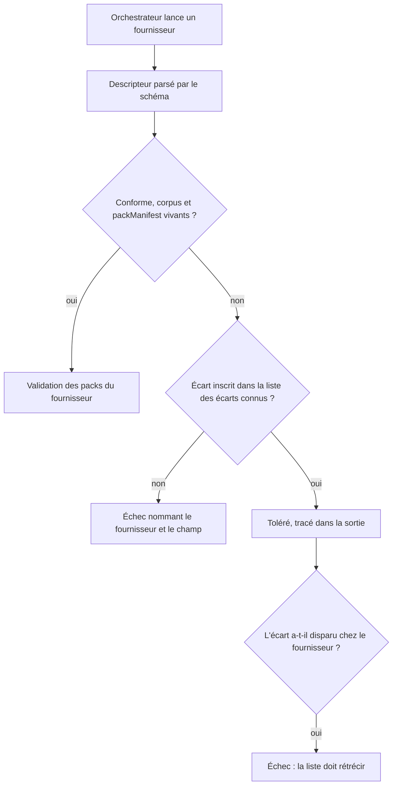

<!-- Fill or omit these sections; never add, rename, or reorder one. -->

# Instruction: Faire respecter le descripteur chez tous les fournisseurs

## Architecture projection

> Tree of the final files. ✅ create · ✏️ modify · ❌ delete

```txt
schema-pbta/
├── tools/validate-cross-tool-contract.ts         ✏️ parse chaque descripteur par le schéma et enregistre les écarts connus
├── cross-tool.config.json                        ✏️ avance les pins quand un voisin a réparé, tâche terminale et conditionnelle
├── CHANGELOG.md                                  ✏️ entrées Added du cycle
├── CLAUDE.md                                     ✏️ note ce que la porte bloque désormais et ce qu'elle tolère encore
└── aidd_docs/tasks/2026_09/2026_09_20_cross-tool-descriptor-enforcement/issues.md   ✏️ état des issues ouvertes en phase 2
```

## User Journey



## Tasks to do

### `1)` Parser le descripteur au lieu de le deviner

> L'orchestrateur porte aujourd'hui des assertions manuelles pour trois champs et ignore les trois autres.

1. Remplacer les assertions de forme de `validate-cross-tool-contract.ts` par un `crossToolProviderSchema.parse`, en préfixant tout échec du nom du fournisseur : avec trois descripteurs, un message qui dit `corpus introuvable` sans dire lequel ne se diagnostique pas.
2. Supprimer les **assertions** de forme sur `packManifest` — la forme `<répertoire>/*/<fichier>` est désormais garantie par le schéma — tout en gardant le découpage lui-même, dont l'orchestrateur a besoin pour parcourir les répertoires de packs.
3. Résoudre `corpus` sur le disque de chaque fournisseur et échouer s'il est absent — c'est le champ qui laissait passer le chemin mort d'adrenaline.
4. Rapporter `contractVersion` dans la sortie de chaque fournisseur, pour qu'un échec dise contre quelle version du contrat il a été mesuré.

### `2)` Enregistrer les écarts au lieu d'attendre les voisins

> Durcir sans recours rendrait la porte rouge sur deux dépôts que ce plan n'a pas le droit de corriger. `validate-pack-coverage.ts` a déjà résolu ce problème ici : il épingle son anomalie dans une liste qui ne peut pas survivre à sa réparation.

1. Déclarer une liste d'écarts connus, chaque entrée nommant le fournisseur, le champ et l'issue de la phase 2 qui le suit : `schema-adrenaline:corpus`, `schema-adrenaline:contractVersion`, `schema-in-the-mist:contractVersion`.
2. Tolérer exactement ces écarts et aucun autre : un quatrième écart, ou le même écart chez un fournisseur non listé, échoue.
3. Faire échouer **aussi** l'écart réparé : si le fournisseur ne présente plus l'écart inscrit, la liste doit rétrécir, sinon la porte tombe. C'est ce qui empêche la liste de devenir un cimetière.
4. Afficher les écarts tolérés à chaque exécution, pour qu'ils restent visibles dans les journaux de CI plutôt que silencieux.

### `3)` Prouver que la porte refuse ce qu'elle laissait passer

> Une règle non éprouvée est une intention.

1. Muter chaque descripteur de fournisseur à tour de rôle dans un checkout jetable : `corpus` mort chez un fournisseur non listé, `packManifest` malformé, `providerVersion` inconnu, `commands.validatePack` vide.
2. Muter la liste elle-même : retirer une entrée encore valable, et ajouter une entrée pour un écart déjà réparé.
3. Vérifier que chaque mutation produit un échec distinct nommant le fournisseur fautif, et qu'aucune n'est silencieuse.
4. Consigner les mutations et leurs échecs dans le document de vérification du dossier de tâche.

### `4)` Clore le cycle

> Ce que la porte vérifie désormais doit être lisible sans lire le code.

1. Ajouter les entrées `Added` au `CHANGELOG.md`.
2. Noter dans le `CLAUDE.md` du dépôt que `corpus` et la forme du descripteur sont désormais bloquants, que `contractVersion` est toléré absent chez deux fournisseurs par liste enregistrée, et que `capabilities` reste déclaratif faute de surface publiée par Lantern.
3. Mettre `issues.md` à jour avec l'état des issues.

### `5)` Avancer les pins, quand et si les voisins réparent

> Tâche d'entretien, sans rapport avec le durcissement : elle ne le précède pas et ne le bloque pas.

1. Quand une issue de la phase 2 est close et son correctif poussé, relever le SHA complet et le porter dans `cross-tool.config.json`.
2. Retirer l'écart correspondant de la liste — la tâche 2.3 rend ce retrait obligatoire, il ne peut pas être oublié.
3. Rejouer la répétition depuis des clones neufs aux nouveaux pins, hors de toute arborescence locale.

## Test acceptance criteria

| Task | Acceptance criteria |
| ---- | ------------------- |
| 1 | L'orchestrateur refuse un descripteur non conforme en nommant le fournisseur et le champ, et rapporte la version de contrat de chaque fournisseur mesuré. |
| 2 | La porte reste verte aux pins actuels alors que trois écarts subsistent, et chaque écart toléré apparaît dans la sortie. |
| 3 | Six mutations produisent six échecs distincts, dont deux portent sur la liste d'écarts elle-même ; aucune ne laisse la porte verte. |
| 4 | Le changelog et la mémoire du dépôt disent ce que la porte bloque et ce qu'elle tolère encore, écart par écart. |
| 5 | Un pin avancé sur un correctif fusionné laisse la chaîne verte seulement si l'écart correspondant a été retiré de la liste. |
