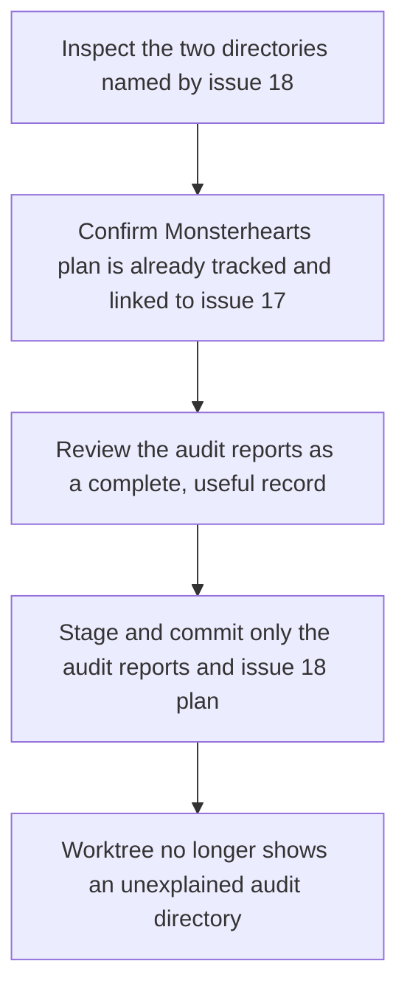
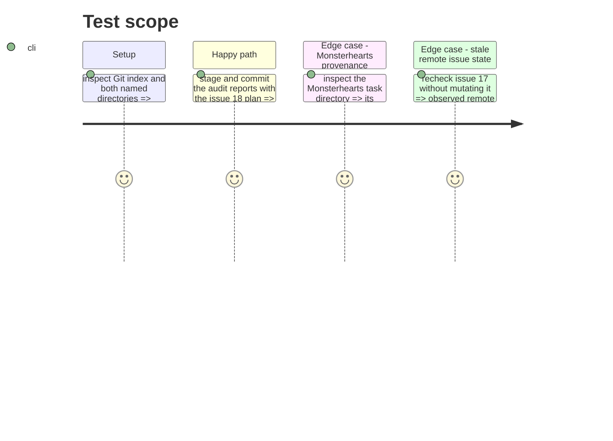

# Instruction: Reconcile and version the audit

## Architecture projection

> Tree of the final files. ✅ create · ✏️ modify · ❌ delete

```txt
schema-pbta/
├── aidd_docs/tasks/2026_09/2026_09_20_audit/
│   ├── architecture.md ✅ version the architecture pillar report
│   ├── code-quality.md ✅ version the code-quality pillar report
│   ├── dependencies.md ✅ version the dependency pillar report
│   ├── performance.md ✅ version the performance pillar report
│   ├── report.md ✅ redact its copied personal path and version the merged audit report
│   ├── security.md ✅ redact its copied personal path and version the security pillar report
│   ├── tests.md ✅ version the test pillar report
│   └── ui.md ✅ version the UI pillar report
└── aidd_docs/tasks/2026_09/2026_09_21_aidd_artifact_cleanup/
    ├── backlog-link.json ✅ retain the source-issue link
    ├── plan.md ✅ retain the reconciliation plan
    └── phase-1.md ✅ retain this execution instruction
```

## User Journey



## Test Scope



## Tasks to do

### `1)` Confirm artifact ownership before changing the index

> Establish the current provenance and the exact allowlist for this cleanup.

1. Inspect `git status --short`, `git ls-files`, and both directories named in #18.
2. Confirm the Monsterhearts folder remains tracked and its existing `backlog-link.json` names #17; do not edit or restage it.
3. Confirm that all eight files in the audit folder are reports from the same 20 September audit and contain no credentials or unrelated local data.
4. Replace the copied absolute personal path in `report.md` and `security.md` with the already documented repository-relative Lantern path, while preserving the audit finding that a public absolute path must be removed.
5. Recheck #17 read-only and note any mismatch between its observed remote status and the issue text; do not close, reopen, or otherwise mutate it.

### `2)` Version the retained audit record

> Commit the useful audit as an intentional repository artifact and prove the cleanup is narrowly scoped.

1. Stage exactly the eight audit reports and the three #18 planning files.
2. Review the staged diff to confirm it introduces no generated schemas, package changes, Monsterhearts contract changes, consumer layout semantics, credentials, or personal absolute paths.
3. Commit the reviewed allowlist with a message that identifies the AIDD audit cleanup.
4. Verify that Git tracks every audit report, `git status --short` has no untracked `2026_09_20_audit` directory, the audit reports no longer contain the personal absolute-path pattern, and the Monsterhearts task files retain their pre-existing tracked state.

## Test acceptance criteria

| Task | Acceptance criteria |
| ---- | ------------------- |
| 1 | The cleanup allowlist contains the eight 20 September audit reports; `report.md` and `security.md` retain the security finding without exposing the copied personal absolute path, and the Monsterhearts #17 plan is demonstrated to be pre-existing tracked content and is not altered. |
| 2 | All eight audit reports are tracked in the cleanup commit, no untracked audit directory remains, the audit directory contains no personal absolute-path pattern, and the staged change contains neither a release publication nor any contract or presentation-layout change. |
