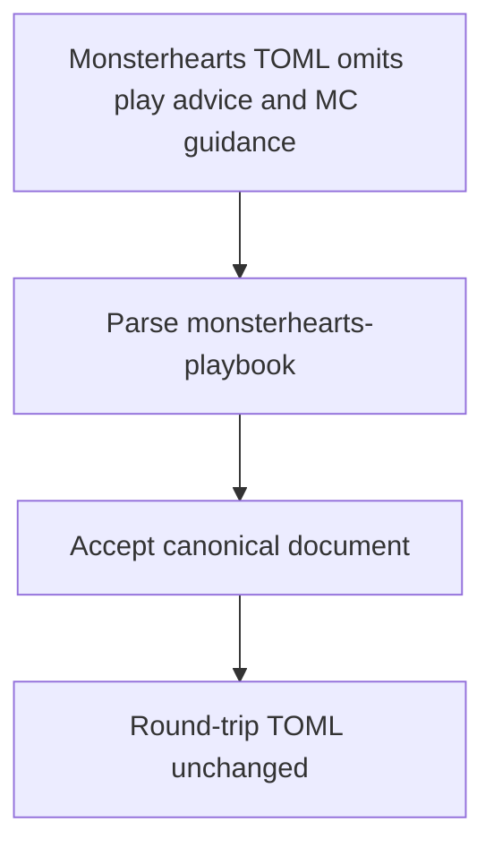
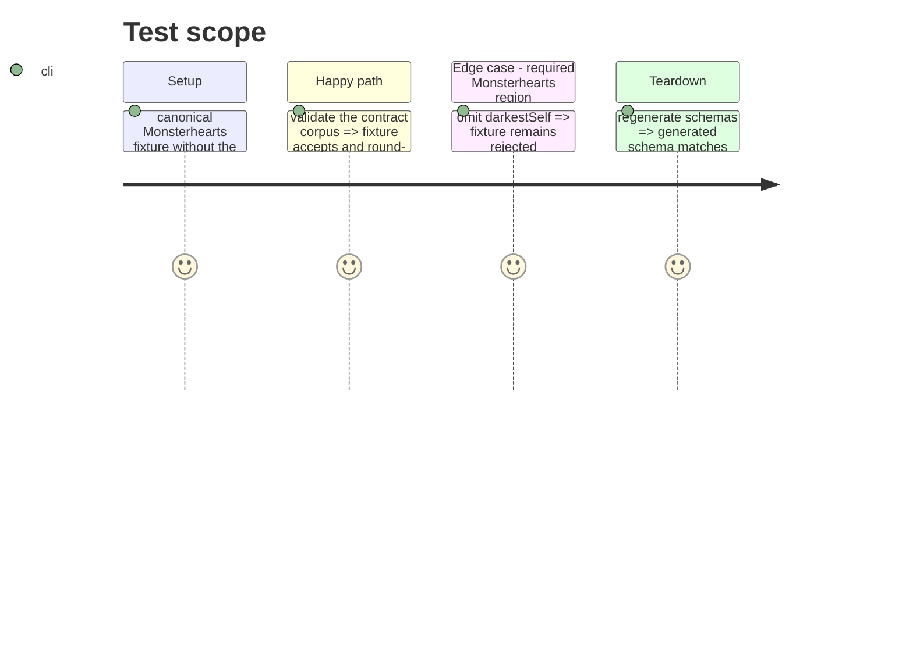

# Instruction: Narrow the Monsterhearts data contract

## Architecture projection

> Tree of the final files. ✅ create · ✏️ modify · ❌ delete

```txt
schema-pbta/
├── src/zod/monsterhearts-playbook.ts ✏️ omit non-Monsterhearts editorial regions
├── corpus/contract/cases.json ✏️ register the regression witness
├── corpus/contract/valid/monsterhearts-playbook-without-advice.toml ✅ prove the canonical minimal editorial set accepts
├── corpus/contract/{valid,invalid}/monsterhearts-playbook-*.toml ✏️ remove the two non-canonical regions from Monsterhearts contract fixtures
├── corpus/temoins/monsterhearts/monsterhearts-playbook/playbook-complete.json ✏️ align the accepted reference witness
├── corpus/refus/monsterhearts/monsterhearts-playbook/*.json ✏️ keep rejection witnesses focused on their intended invalid fields
├── examples/monsterhearts/monsterhearts-playbook/*.toml ✏️ make every Monsterhearts example omit the two non-canonical regions
├── schemas/monsterhearts/monsterhearts-playbook.schema.json ✏️ regenerated public schema
└── schemas/v5/monsterhearts/monsterhearts-playbook.schema.json ✏️ regenerated versioned schema
```

## User Journey



## Test Scope



## Tasks to do

### `1)` Specialise the editorial schema

> Require only opening, identity, progression, darkest self and sex move for Monsterhearts.

1. Derive the specialised editorial object from the generic schema while omitting `playAdvice`.
2. Do not add `mcGuidance` to that specialised object.
3. Keep every other Monsterhearts field and strict-object behavior unchanged.

### `2)` Prove the narrowed contract

> Add a portable, accepted witness that omits both disputed regions.

1. Create the valid TOML witness with all remaining required fields.
2. Register it in the contract manifest as an accepted `monsterhearts-playbook` case.
3. Remove the two disputed sections from every Monsterhearts contract fixture, example and reference witness, preserving the reason each rejection fixture rejects.
4. Regenerate both public Monsterhearts schema paths.

## Test acceptance criteria

| Task | Acceptance criteria |
| ---- | ------------------- |
| 1 | A Monsterhearts playbook omitting `playAdvice` and `mcGuidance` parses successfully. |
| 2 | The corpus, examples and reference fixtures validate without either disputed region; a document missing `darkestSelf` still rejects for that reason. |
