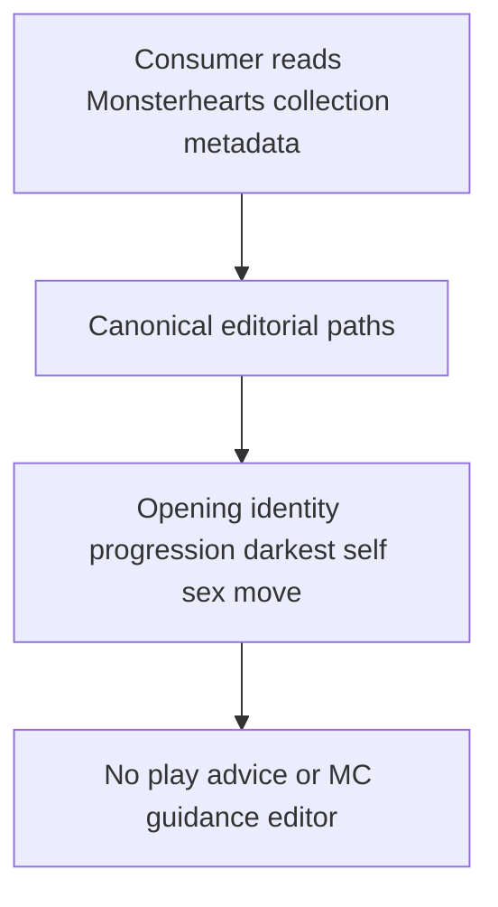
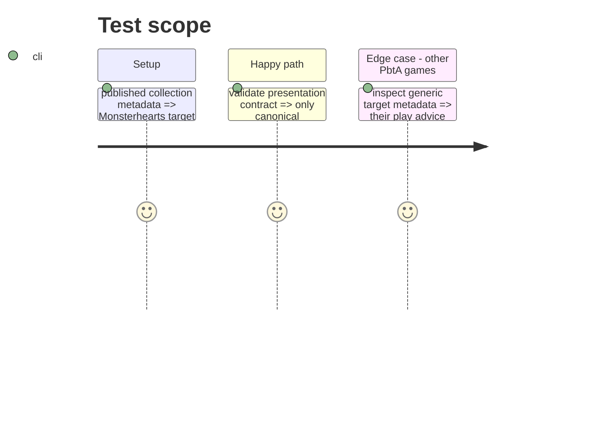

# Instruction: Align presentation metadata

## Architecture projection

> Tree of the final files. ✅ create · ✏️ modify · ❌ delete

```txt
schema-pbta/
└── src/presentation/collections.ts ✏️ stop publishing editors for non-Monsterhearts editorial paths
```

## User Journey



## Test Scope



## Tasks to do

### `1)` Split shared and Monsterhearts editorial collections

> Preserve generic metadata while making the Monsterhearts list truthful.

1. Exclude `editorial.playAdvice.paragraphs` from the collection set expanded to Monsterhearts.
2. Remove the Monsterhearts-only `editorial.mcGuidance.paragraphs` collection entry.
3. Retain all canonical Monsterhearts collections, including darkest self and sex move.

### `2)` Verify the published metadata

> Ensure consumers can no longer offer editors for non-contract regions.

1. Run the presentation-contract validation.
2. Add or adjust an assertion if the current suite does not distinguish target-specific editorial paths.

## Test acceptance criteria

| Task | Acceptance criteria |
| ---- | ------------------- |
| 1 | Monsterhearts metadata names no `playAdvice` or `mcGuidance` path. |
| 2 | Other playbook targets retain their existing editorial metadata and presentation validation passes. |
