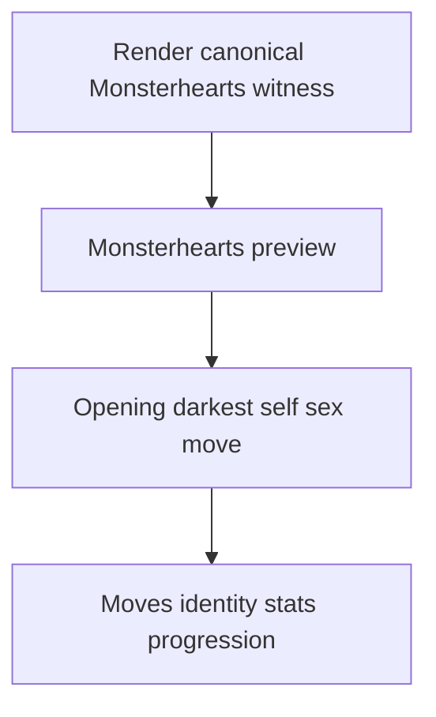
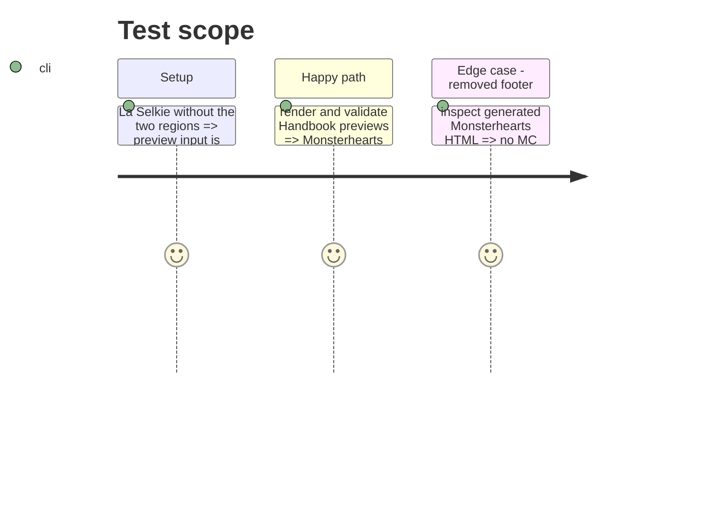

# Instruction: Align preview and validation surfaces

## Architecture projection

> Tree of the final files. ✅ create · ✏️ modify · ❌ delete

```txt
schema-pbta/
├── tools/render-handbook-preview.ts ✏️ render only canonical Monsterhearts regions
├── tools/validate-handbook-packs.ts ✏️ stop requiring absent regions in the preview surface
└── handbook/monsterhearts/preview/index.html ✏️ regenerate the representative preview
```

## User Journey



## Test Scope



## Wireframe

```txt
┌───────────────────────────────────────────────────────────┐
│ (1) Playbook identity                                      │
├───────────────────┬───────────────────┬───────────────────┤
│ (2) Opening       │ (3) Darkest self  │ (4) Sex move      │
├───────────────────┼───────────────────┼───────────────────┤
│ (5) Moves         │ (6) Identity and  │ (7) Progression   │
│                   │ stats             │ and advances      │
└───────────────────┴───────────────────┴───────────────────┘
```

1. Identity: name, description and selected variant.
2. Opening: canonical introductory fiction.
3. Darkest self: canonical Monsterhearts escalation region.
4. Sex move: canonical intimacy region.
5. Moves: selected or available playbook actions.
6. Identity and stats: creation information and stat choices.
7. Progression: continuation copy and advancement entries.

## Tasks to do

### `1)` Remove preview dependencies on absent editorial sections

> Render the Monsterhearts page from only the specialised contract’s required regions.

1. Stop reading `playAdvice` and `mcGuidance` in the Monsterhearts preview renderer.
2. Remove their panel and MC footer while retaining the canonical region order.
3. Regenerate the Monsterhearts preview HTML from its canonical fixture.

### `2)` Make preview validation match the contract

> Accept the canonical minimal Monsterhearts editorial surface while retaining meaningful checks.

1. Update the expected Monsterhearts editorial-region list in the Handbook-pack validator.
2. Verify generated HTML contains all retained regions and no removed-region dependency.
3. Run the Handbook render and validation commands alongside the contract suite.

## Test acceptance criteria

| Task | Acceptance criteria |
| ---- | ------------------- |
| 1 | Monsterhearts preview generation succeeds when play advice and MC guidance are absent. |
| 2 | Validator accepts the regenerated preview and still rejects a missing canonical Monsterhearts region. |
