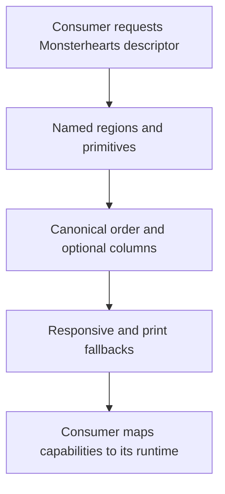
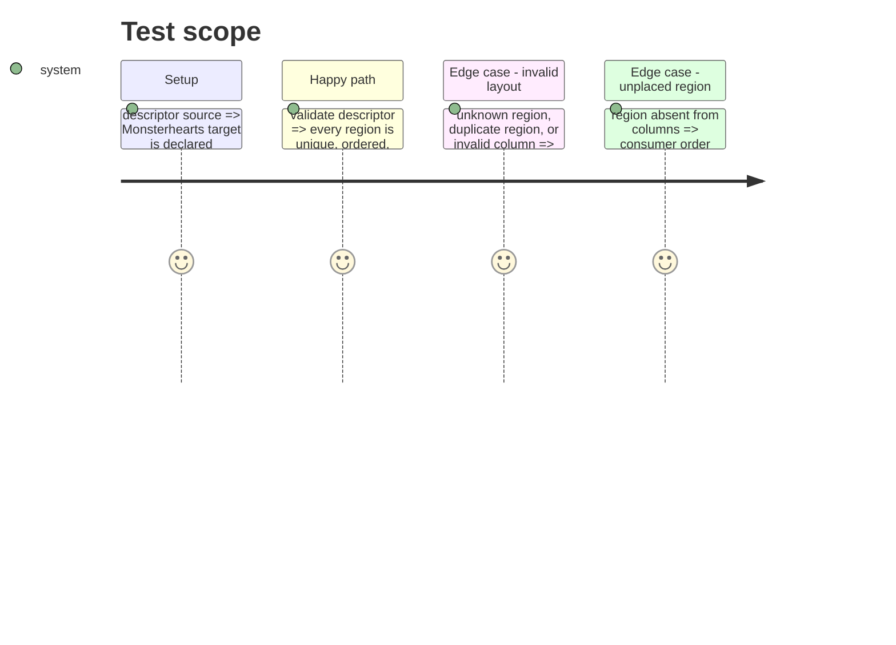

# Instruction: Define and validate the presentation semantics

## Architecture projection

```txt
.
├── src/presentation/
│   ├── monsterhearts-playbook.ts ✅ typed regions, primitive roles, order, columns, fallbacks and variants
│   └── index.ts ✏️ export the public descriptor
├── corpus/presentation/
│   ├── valid/monsterhearts-playbook-layout.json ✅ valid layout witness
│   └── invalid/monsterhearts-layout-*.json ✅ malformed layout witnesses
└── tools/validate-presentation-contract.ts ✏️ assert semantic invariants and rejection cases
```

## User Journey



## Test Scope



## Tasks to do

### `1)` Model the complete Monsterhearts sheet

> Publish data-independent named regions and compact renderer capabilities for a recognisable Monsterhearts playbook.

1. Define identity, stat profile, moves, Strings/ascendants, harm/conditions, gear, advances, and editorial regions in canonical order.
2. Give every region one stable primitive role and bind responsive, print, token, asset, and `drowned-lake` presentation semantics to the descriptor.
3. Keep TOML field values and all markup out of the descriptor.

### `2)` Validate the layout grammar

> Make optional column layouts safe for all consumers.

1. Validate ordered columns against the descriptor’s known regions.
2. Reject unknown regions, duplicate placement, empty or malformed columns, and invalid breakpoint declarations.
3. Prove unplaced regions remain valid and follow canonical order.

## Test acceptance criteria

| Task | Acceptance criteria |
| --- | --- |
| 1 | A consumer receives enough named, ordered capabilities and presentation metadata to compose a complete Monsterhearts sheet without inferring game semantics from TOML. |
| 2 | Valid and invalid corpus fixtures demonstrate every column-placement rule, including canonical fallback for unplaced regions. |
