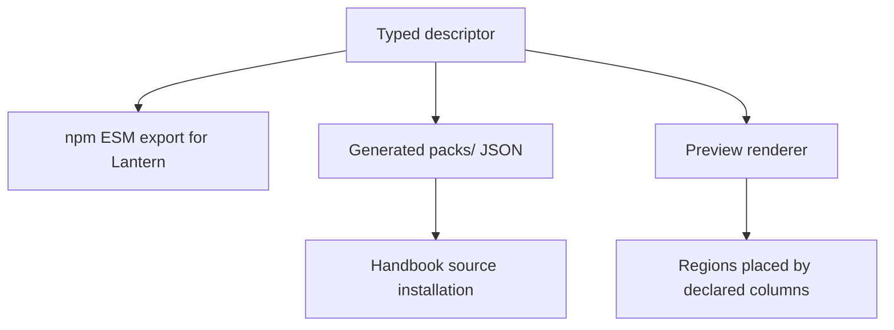
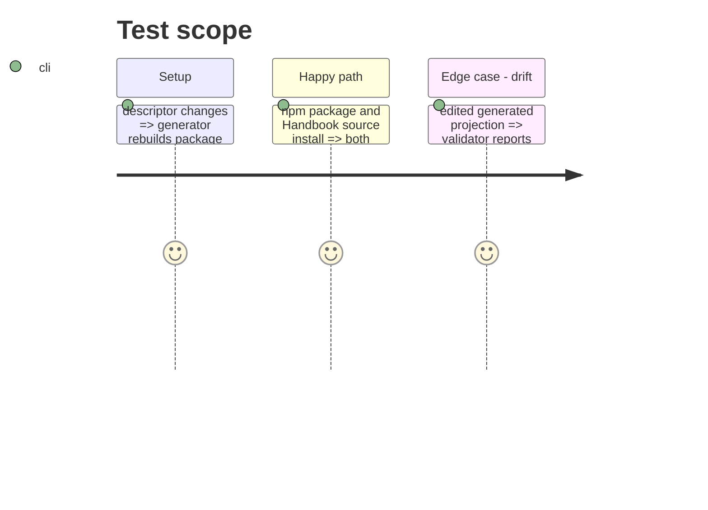

# Instruction: Publish one declaration to npm and Handbook source

## Architecture projection

```txt
.
├── packs/monsterhearts/
│   ├── presentation-contract.json ✅ generated installable projection of the typed descriptor
│   └── pack-contract.json ✏️ advertise the presentation artifact and host capability
├── tools/gen-presentation-contracts.ts ✅ generate pack projections from the typed source
├── tools/render-handbook-preview.ts ✏️ compose Monsterhearts preview by descriptor regions and columns
├── tools/validate-pack-manifest.ts ✏️ validate the projected artifact against the exported source
├── tools/validate-handbook-install.ts ✏️ verify Handbook source carries the same artifact
├── tools/validate-package.ts ✏️ prove the npm tarball exports the descriptor and artifact
└── README.md ✏️ document the public presentation API and consumer boundary
```

## User Journey



## Test Scope



## Tasks to do

### `1)` Project the source descriptor

> Publish the same presentation semantics without duplicating them.

1. Generate a stable JSON artifact beneath the already published `packs/` package path.
2. Export the typed descriptor and lookup from the root ESM API.
3. Advertise the artifact in the producer pack contract and validate its target, version, and capability requirements.

### `2)` Consume it in producer-owned source artifacts

> Prove source Handbook material does not recreate Monsterhearts placement rules.

1. Make the preview renderer enumerate descriptor regions and ordered columns rather than hardcoding their placement.
2. Verify the Handbook install source contains the generated artifact and that npm resolution reaches it.
3. Document that consumers map the published primitive vocabulary through their own runtime adapter and may not add semantic fallbacks.

## Test acceptance criteria

| Task | Acceptance criteria |
| --- | --- |
| 1 | Lantern can import the descriptor while Handbook can read the identical generated JSON from the same schema source. |
| 2 | The Monsterhearts preview contains all declared regions in declared layout order, and no consumer-facing artifact embeds local layout semantics. |
