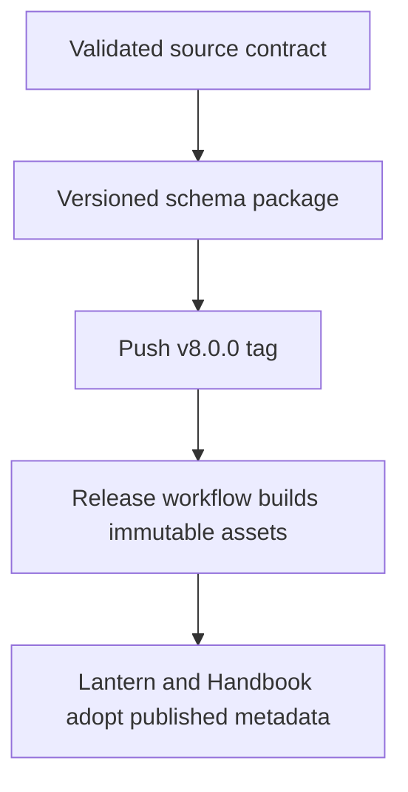
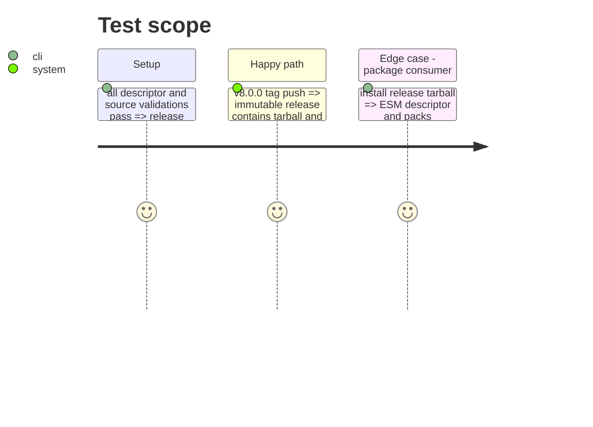

# Instruction: Version, release, and prove consumer delivery

## Architecture projection

```txt
.
├── src/contract-version.ts ✏️ advance the presentation contract major and immutable tag
├── package.json ✏️ publish the new package and schema-major path
├── cross-tool-provider.json ✏️ advertise the matching producer contract version
├── schemas/v8/ ✅ generated current versioned schemas
├── handbook.json ✏️ advance the Monsterhearts source-pack version
└── aidd_docs/tasks/2026_09/2026_09_21_monsterhearts_presentation_layout/ ✏️ record implementation evidence
```

## User Journey



## Test Scope



## Tasks to do

### `1)` Version the public contract

> Treat layout semantics as producer-owned contract data rather than an unversioned theme tweak.

1. Advance package, contract, provider, schema and Handbook pack versions together.
2. Generate the v8 schema line and retain all older immutable lines.

### `2)` Release the contract before adoption

> Publish the exact versioned package through the tag workflow.

1. Run the complete validation suite, commit and merge the implementation.
2. Create and push `v8.0.0`, wait for its workflow, and inspect the immutable release assets.
3. Record that Handbook implementation remains consumer-owned under issue #44.

## Test acceptance criteria

| Task | Acceptance criteria |
| --- | --- |
| 1 | Package, provider, generated schemas and source pack declare the same major version while historical schema lines remain unchanged. |
| 2 | The release archive installs with both the ESM descriptor and pack JSON, and GitHub publishes its tarball/checksum before any consumer adoption. |
