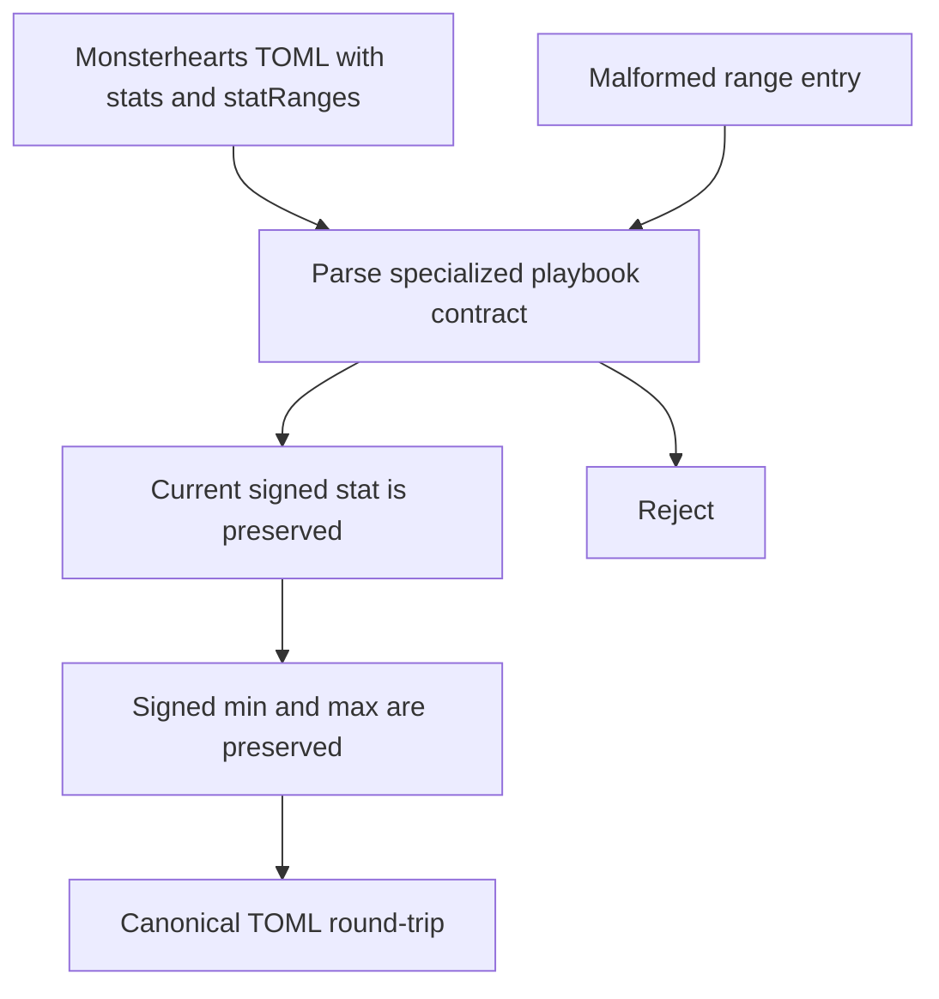
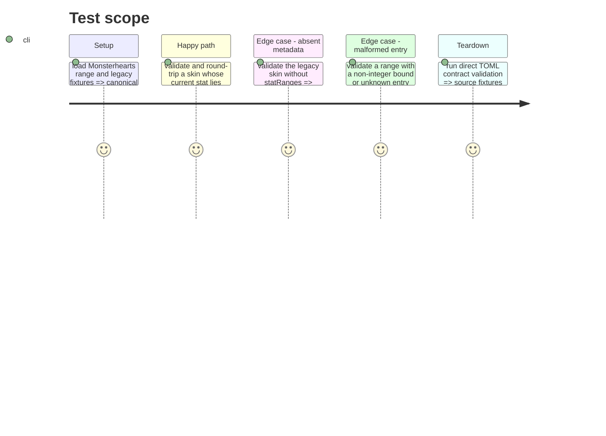

# Instruction: Add the Monsterhearts range contract and corpus

## Architecture projection

> Tree of the final files. ✅ create · ✏️ modify · ❌ delete

```txt
schema-pbta/
├── src/zod/monsterhearts-playbook.ts ✏️ add the optional strict `statRanges` record
├── corpus/contract/cases.json ✏️ register range acceptance and rejection witnesses
├── corpus/contract/valid/monsterhearts-playbook-complete.toml ✏️ provide representative signed bounds
├── corpus/contract/valid/monsterhearts-playbook-without-advice.toml ✏️ remain a backward-compatible witness without ranges
├── corpus/contract/invalid/monsterhearts-playbook-stat-range-non-integer.toml ✅ reject a non-integer range bound
├── corpus/contract/invalid/monsterhearts-playbook-stat-range-unknown-field.toml ✅ reject an unknown field inside a range entry
├── corpus/temoins/monsterhearts/monsterhearts-playbook/playbook-complete.json ✏️ cover accepted range metadata in the JSON audit witness
├── corpus/refus/monsterhearts/monsterhearts-playbook/stat-range-borne-invalide.json ✅ reject a non-integer range bound through the audit corpus
├── corpus/refus/monsterhearts/monsterhearts-playbook/stat-range-champ-invalide.json ✅ reject an unknown range-entry field through the audit corpus
└── examples/monsterhearts/monsterhearts-playbook/the-eclipse.toml ✏️ show portable range metadata in the representative skin
```

## User Journey



## Test Scope



## Tasks to do

### `1)` Specialize signed stat-range metadata

> Add bounded display metadata without changing the semantics of `stats`.

1. Define a strict Monsterhearts range entry with required signed 32-bit `min` and `max` fields.
2. Add optional `statRanges` as a keyed record of those entries only to `monsterheartsPlaybookSchema`.
3. Preserve the shared `stats` record unchanged: do not compare, clamp, normalize, or derive its current value from either bound.

### `2)` Prove acceptance, rejection, and portability

> Make the contract behavior observable in every existing corpus surface.

1. Add signed, deliberately out-of-range current values to an accepted Monsterhearts fixture and verify TOML round-trip equality.
2. Keep an existing accepted Monsterhearts fixture without `statRanges` to prove backward compatibility.
3. Add separate contract and JSON-audit rejection witnesses for a non-integer bound and for a strict-object unknown range-entry field.
4. Update the representative Monsterhearts example and reference witness with original range values.
5. Run direct contract validation; defer validators that consume generated JSON Schema to the v7 delivery phase.

## Test acceptance criteria

| Task | Acceptance criteria |
| ---- | ------------------- |
| 1 | A Monsterhearts playbook accepts optional signed `{ min, max }` entries, while its `stats` values remain signed integers independent of those bounds. |
| 2 | A skin without `statRanges` still parses; a current stat outside its range round-trips unchanged; independently malformed bounds and extra range-entry fields reject in the direct contract corpus. The equivalent audit witnesses are ready for generated-schema validation in phase 3. |
