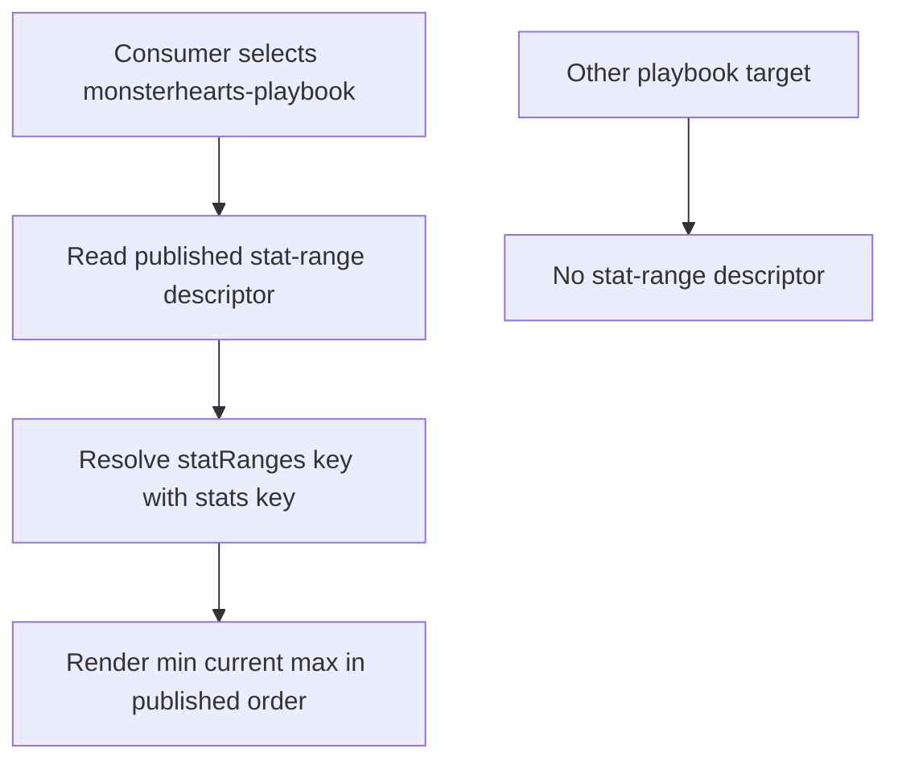
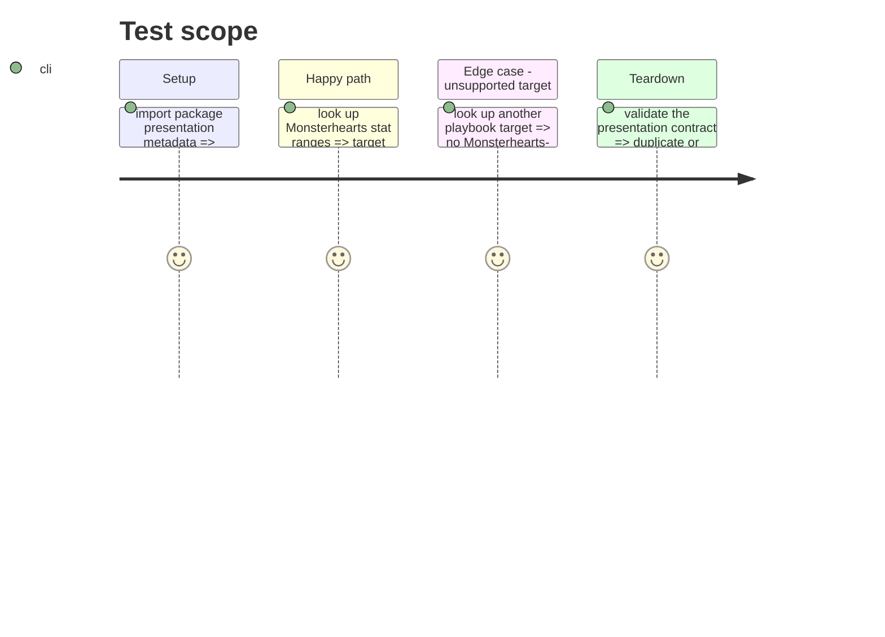

# Instruction: Publish stat-range presentation semantics

## Architecture projection

> Tree of the final files. ✅ create · ✏️ modify · ❌ delete

```txt
schema-pbta/
├── src/presentation/stat-ranges.ts ✅ publish the Monsterhearts keyed range-group descriptor and lookup
├── src/presentation/index.ts ✏️ export the descriptor API
├── src/index.ts ✏️ expose the descriptor API from the package root
└── tools/validate-presentation-contract.ts ✏️ assert the target, paths, field order, and descriptor uniqueness
```

## User Journey



## Test Scope



## Tasks to do

### `1)` Introduce a dedicated keyed-group descriptor

> Publish structure, not a Lantern implementation or local fallback.

1. Define an exported presentation type and registry whose Monsterhearts entry names the `stats` current-value path, `statRanges` keyed bounds path, `min` and `max` fields, and the canonical `min → current → max` display order.
2. Provide a lookup constrained by the specialized playbook target, returning no descriptor for targets that do not publish this group.
3. Keep the descriptor independent of collection cardinality, ordering, and item-editor vocabulary.

### `2)` Validate and document the consumer contract

> Ensure consumer-facing metadata cannot silently drift from the data contract.

1. Extend presentation validation with uniqueness, valid-path, target-specific, and exact three-value-order assertions.
2. Export the new values and types through both presentation and package-root barrels.
3. Preserve the absence semantics: this descriptor describes supplied values and does not establish a consumer-local default range.

## Test acceptance criteria

| Task | Acceptance criteria |
| ---- | ------------------- |
| 1 | The package exposes exactly one Monsterhearts stat-range descriptor mapping each stat key to `min`, current, and `max` fields in that order. |
| 2 | Presentation validation rejects malformed or duplicated descriptors, and no non-Monsterhearts target advertises this Monsterhearts-specific display group. |
