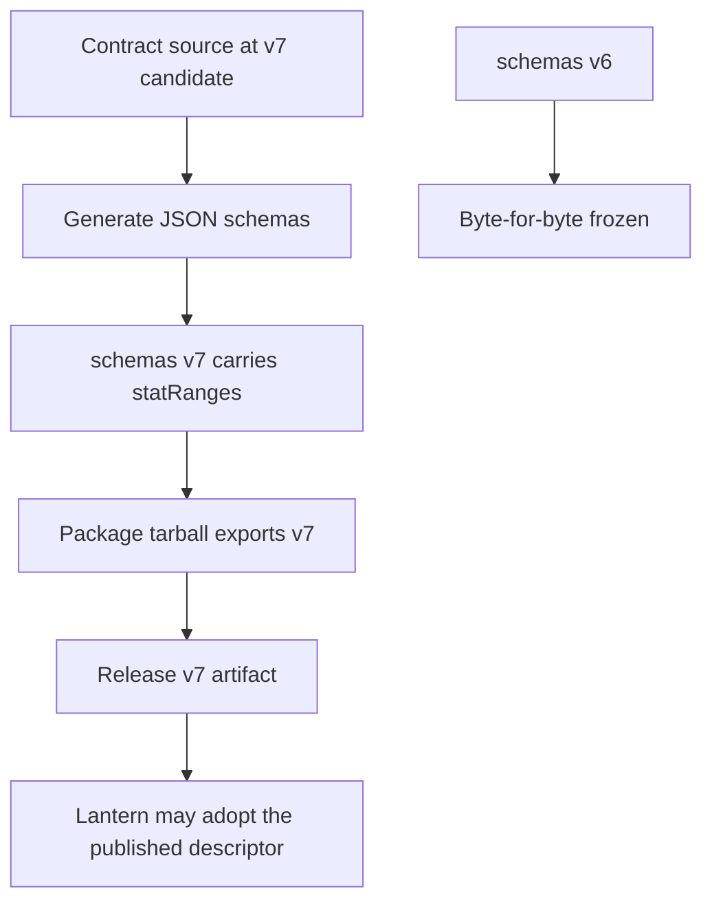
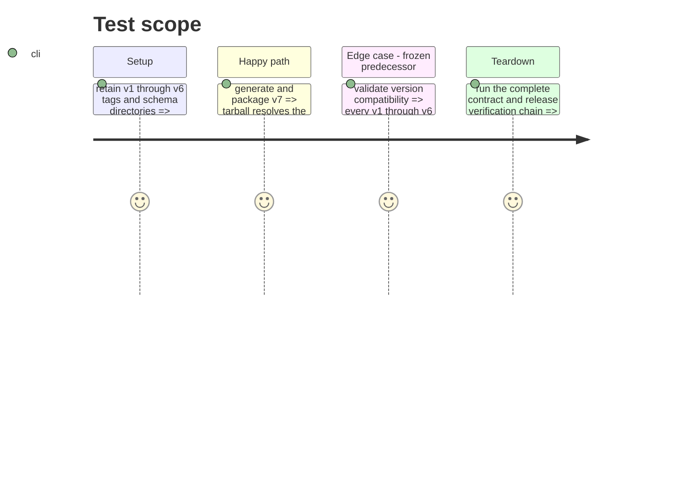

# Instruction: Prepare the immutable v7 contract line

## Architecture projection

> Tree of the final files. ✅ create · ✏️ modify · ❌ delete

```txt
schema-pbta/
├── src/contract-version.ts ✏️ declare v7.0.0 as the candidate contract identifier
├── package.json ✏️ publish package and v7 schema export metadata
├── cross-tool-provider.json ✏️ advertise contract version 7
├── packs/*/pack-contract.json ✏️ align every published pack manifest with contract version 7
├── tools/validate-version-compat.ts ✏️ freeze v6 alongside v1–v5 and admit v7 as the candidate baseline
├── tools/validate-package.ts ✏️ assert v7 exports, identifiers, tarball behavior, and contract-version propagation
├── README.md ✏️ describe the v7 candidate/release adoption boundary accurately
├── schemas/v7/**/*.schema.json ✅ generate the v7 public schema line
└── schemas/**/*.schema.json ✏️ refresh every generated working-schema mirror with v7 identifiers
```

## User Journey



## Test Scope



## Tasks to do

### `1)` Advance the versioned schema boundary

> Move the changed contract out of frozen v6 into a release-ready v7 candidate.

1. Set the package, contract version, schema tag, provider descriptor, and all pack manifests to the v7 candidate major.
2. Export and include `schemas/v7` from the package without removing archived schema lines.
3. Update package-install assertions to resolve v7 paths and verify the presentation API from the packed artifact.
4. Amend compatibility validation so v1 through v6 compare against immutable tags while v7 is permitted to be the unpublished candidate baseline.

### `2)` Generate and verify the delivery boundary

> Make the new contract usable only through its published schema package.

1. Regenerate all v7 schemas and the working-schema mirror from the updated Zod sources.
2. Update release-adoption documentation to distinguish the existing v6 tag/release-asset gap from the new v7 candidate.
3. Run generation, typecheck, contract, presentation, examples, references, reference fixtures, audit, version, package, release, Handbook, pack, and cross-tool validation gates; this is where the phase-1 JSON audit witnesses become executable against generated v7 schemas.
4. Hand off Lantern’s row rendering and double-click affordance only after a v7 release artifact exists; do not implement those consumer-owned behaviors here.

## Test acceptance criteria

| Task | Acceptance criteria |
| ---- | ------------------- |
| 1 | `schemas/v6` remains byte-for-byte identical to `v6.0.0`; the package and provider consistently identify v7 and export its schema line. |
| 2 | Generated v7 schemas include `statRanges`; the packed package exposes the v7 Monsterhearts contract and presentation API; all release gates pass before any Lantern adoption. |
