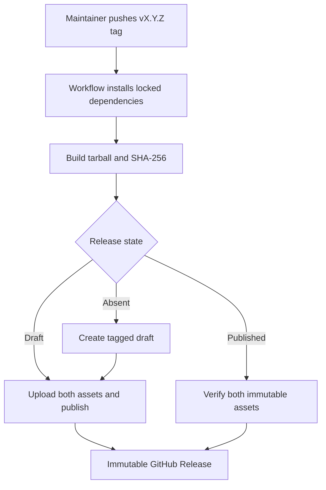
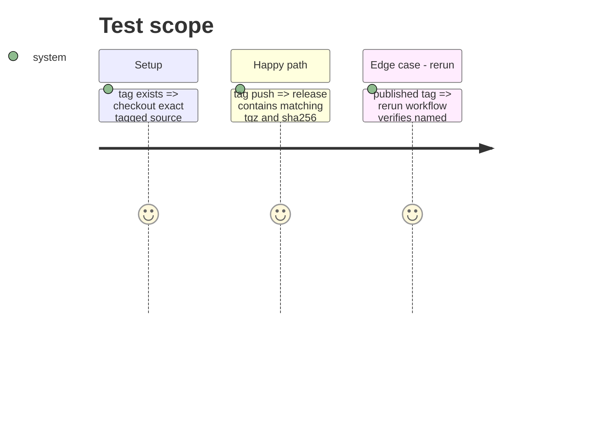

# Instruction: Automate a safe tag release

## Architecture projection

```txt
.
└── .github/
    └── workflows/
        └── release.yml ✅ tag-triggered release publication workflow
└── tools/
    └── validate-package.ts ✏️ validate a supplied release archive as well as a fresh package
```

## User Journey



## Test Scope



## Tasks to do

### `1)` Define the tag release workflow

> Build exactly the source selected by a semantic-version tag and publish its prepared package assets.

1. Add a GitHub Actions workflow for `vX.Y.Z` tag pushes with write permission for releases.
2. Let the package validator accept a supplied archive, then install and validate that exact archive in the workflow.
3. Create a draft only when the tag has no release; otherwise adopt the existing release.

### `2)` Make retries idempotent

> Preserve immutable releases while making a rerun a successful proof rather than a collision.

1. Upload with clobber only while the adopted release remains a draft.
2. Publish the draft after both assets upload.
3. On an already published release, assert both expected asset names and immutable state.

## Test acceptance criteria

| Task | Acceptance criteria |
| --- | --- |
| 1 | A push of `vX.Y.Z` builds and validates the tag’s `schema-pbta-X.Y.Z.tgz` and matching `.sha256`, then attaches both to that tag’s release. |
| 2 | Rerunning the same completed tag validates the published assets and finishes successfully without attempting to replace them. |
