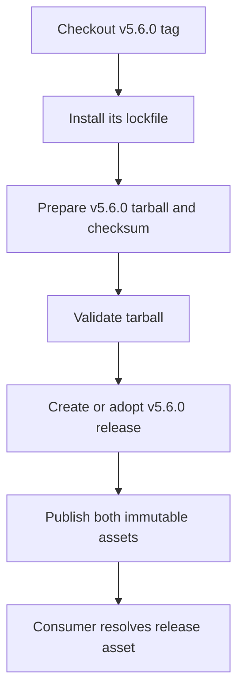
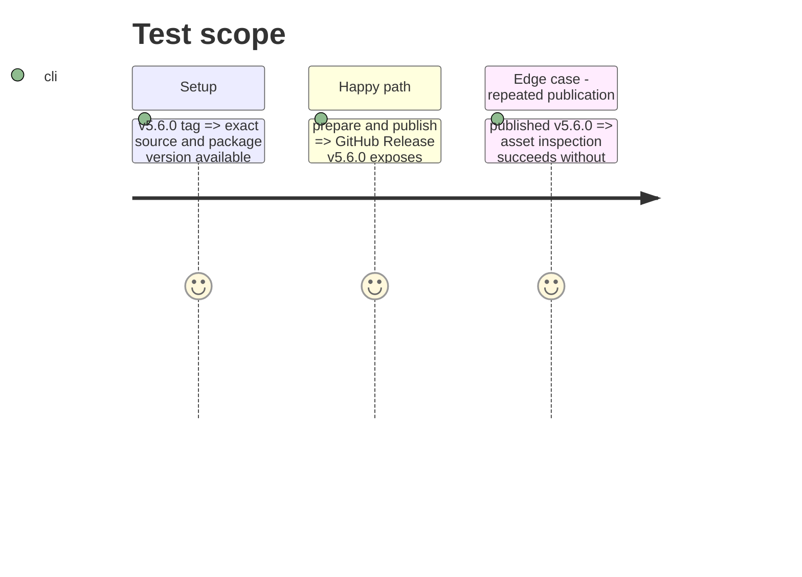

# Instruction: Backfill and verify v5.6.0

## Architecture projection

```txt
.
└── README.md ✏️ document the latest immutable release URL after publication
```

## User Journey



## Test Scope



## Tasks to do

### `1)` Reproduce the missed v5.6.0 package

> Build assets from the immutable v5.6.0 tag, never from current main.

1. Checkout the exact tag in an isolated temporary worktree.
2. Install its lockfile, prepare its release tarball/checksum, and validate the tarball.

### `2)` Publish and document the backfill

> Make v5.6.0 reachable to consumers and point installation documentation at an immutable release.

1. Create or adopt the `v5.6.0` release, upload both verified assets, and publish it.
2. Verify the release is immutable and rerunnable by named assets.
3. Update the README’s canonical release reference if v5.6.0 becomes the selected baseline.

## Test acceptance criteria

| Task | Acceptance criteria |
| --- | --- |
| 1 | The archive’s package metadata is version 5.6.0 and its checksum describes the archive built from tag v5.6.0. |
| 2 | GitHub Release v5.6.0 is published with both named assets, and a consumer can use its immutable download URL. |
