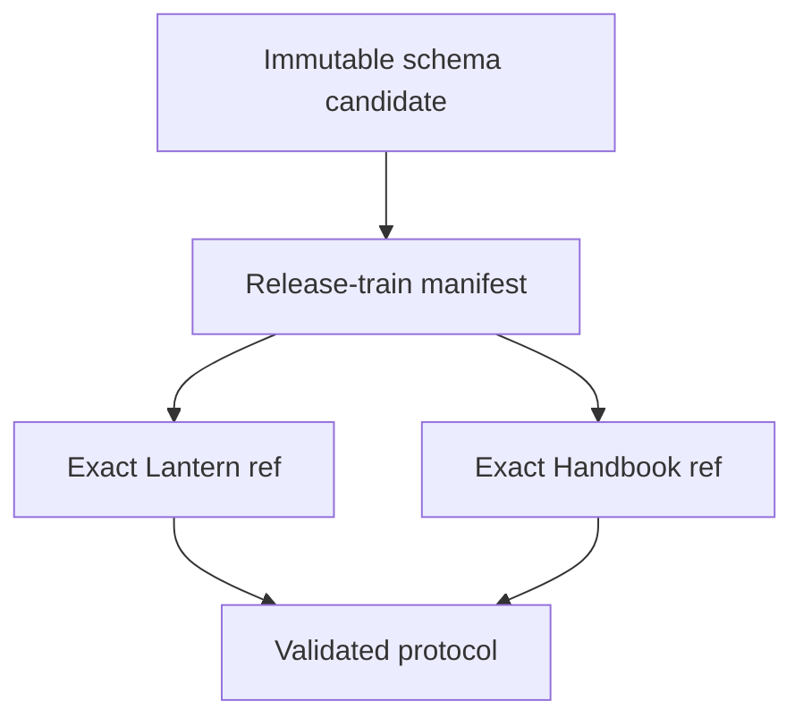
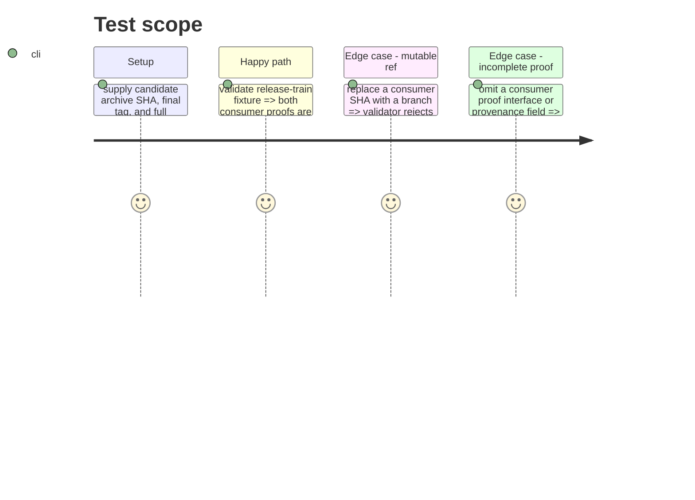

# Instruction: Define the release-train protocol and validator

## Architecture projection

> Tree of the final files. ✅ create · ✏️ modify · ❌ delete

```txt
.
├── tools/release-train-config.ts ✅ parse immutable candidate/final artifact identity, consumer refs, and canonical proof interface
├── tools/validate-release-train.ts ✅ reject mutable refs, incomplete provenance, missing consumers, or duplicate participant roles
├── cross-tool.release-train.fixture.json ✅ valid train fixture naming a candidate archive/SHA and both consumer refs
├── tools/checkout-cross-tool.mjs ✏️ materialize an explicit train configuration without changing daily pin behaviour
├── tools/validate-cross-tool-pins.ts ✏️ assert daily and release-train paths remain distinct and immutable
└── .codex/rules/00-architecture/0-cross-repo-contract-flow.md ✏️ require candidate adoption evidence before final release promotion
```

## User Journey



## Test Scope



## Tasks to do

### `1)` Publish an immutable train contract

1. Define a small machine-readable train input containing the candidate release URL, final release tag, one final-version archive SHA-256, provider commit, and full Lantern and Handbook SHAs.
2. Define one canonical, argument-safe consumer proof interface (for example `npm run release-train:assert -- <manifest>`); reject arbitrary command arrays, mutable names, mismatched artifact identity, missing consumer roles, duplicate roles, and unrecognised proof interfaces before checkout.
3. Preserve the current daily `cross-tool.config.json` contract gate unchanged and document the new promotion rule beside it.

## Test acceptance criteria

| Task | Acceptance criteria |
| --- | --- |
| 1 | A release train names one final archive SHA, its staging candidate and final tag, plus exactly one canonical proof interface from each consumer; invalid provenance fails before any consumer command runs. |
