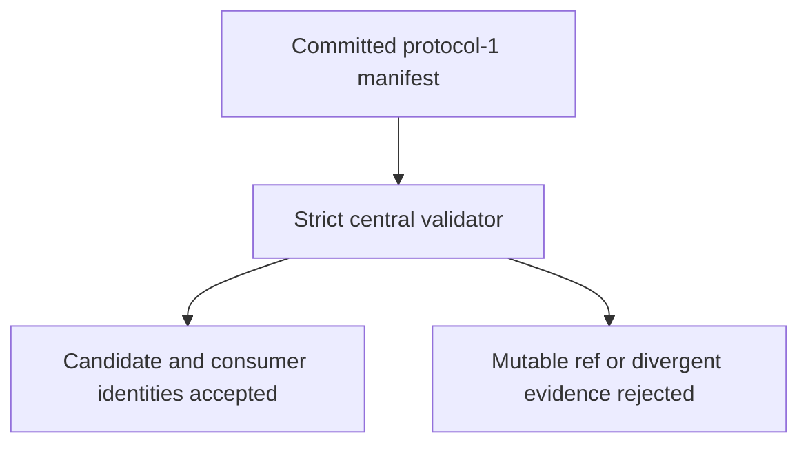
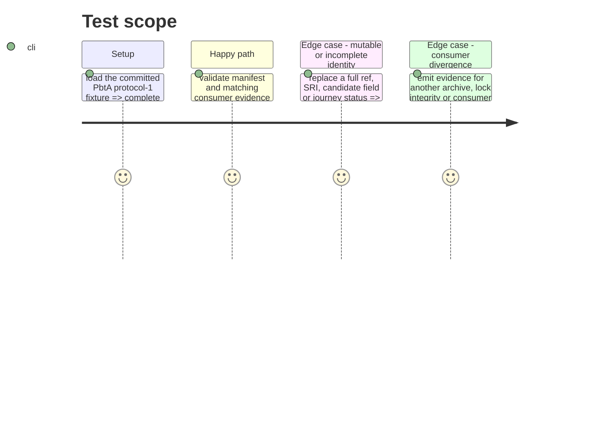

# Instruction: Define and validate protocol-1

## Architecture projection

> Tree of the final files. ✅ create · ✏️ modify · ❌ delete

```txt
.
├── tools/release-train-config.ts ✏️ parse the provider-neutral protocol-1 manifest and evidence envelopes
├── tools/validate-release-train.ts ✏️ fixture-test immutable identity, evidence equality and rejection cases
├── cross-tool.release-train.fixture.json ✏️ provide a protocol-1 PbtA candidate and both immutable consumers
├── docs/compatibility.md ✏️ state the envelope, ownership boundary and frozen-lock requirements
├── README.md ✏️ link the release-train contract without conflating it with daily CI
└── ❌ none — the daily cross-tool gate remains intact
```

## User Journey



## Test Scope



## Tasks to do

### `1)` Specify the canonical envelope

> Replace the PbtA-specific parser surface with a versioned envelope that an orchestrator can compare without provider-specific behavior.

1. Require `protocol: 1`, a complete candidate (`provider`, URL, SHA-256, SHA-512 SRI, version, staging/final tags and provider commit), and exactly Lantern and Handbook full refs.
2. Require each evidence file to repeat the complete candidate, identify one resolved consumer, attest the committed lock/version/integrity, and report an opaque passed journey with named checks.
3. Reject unknown fields, mutable refs, unsafe URLs, command fields, duplicate/missing roles, archive/version mismatch and any divergent evidence field.

### `2)` Preserve the delivery boundary in fixtures and documentation

> Make the invariant executable and understandable before consumers adopt it.

1. Rework the fixture and validator’s positive and negative cases to the canonical envelope.
2. Document candidate-adoption commits, three-entry Lantern lock normalization, detached execution, and byte-identical promotion.
3. State that peer-provider migrations may adopt the envelope later but do not block the first PbtA train.

## Test acceptance criteria

| Task | Acceptance criteria |
| --- | --- |
| 1 | A malformed manifest or evidence cannot be mistaken for the candidate/consumer identities declared by protocol-1. |
| 2 | The fixture and documentation distinguish daily compatibility from immutable release promotion and prohibit consumer mutation by the runner. |
