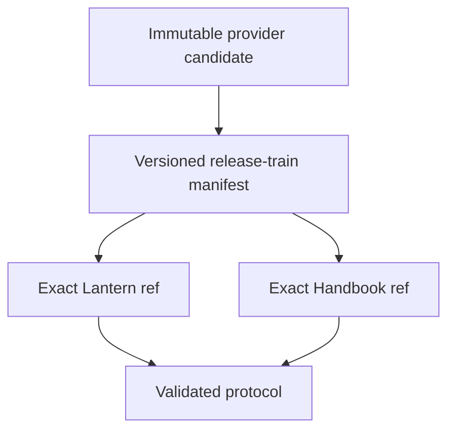

# Instruction: Define the release-train protocol and validator

## Architecture projection

> Tree of the final files. ✅ create · ✏️ modify · ❌ delete

```txt
.
├── tools/release-train-config.ts ✏️ replace PbtA-specific candidate/role assumptions with the protocol-versioned common envelope
├── tools/validate-release-train.ts ✏️ reject mutable refs, incomplete provenance, foreign candidates, and evidence not matching one declared consumer
├── cross-tool.release-train.fixture.json ✏️ provide generic manifest/evidence fixtures for PbtA, Mist, and Adrenaline candidates
├── tools/checkout-cross-tool.mjs ✏️ materialize an explicit train configuration without changing daily pin behaviour
├── tools/validate-cross-tool-pins.ts ✏️ assert daily and release-train paths remain distinct and immutable
└── .codex/rules/00-architecture/0-cross-repo-contract-flow.md ✏️ require candidate adoption evidence before final release promotion
```

## User Journey



## Test Scope


## Tasks to do

### `1)` Publish an immutable train contract

1. Define a protocol-versioned provider-neutral manifest containing provider/package identity, candidate URL, SHA-256, SRI, version/tags, provider commit, and full Lantern and Handbook SHAs.
2. Define the matching evidence envelope: same complete candidate, one resolved consumer, lock/integrity attestation and opaque executed journey. Reject mutable names, foreign or mismatched candidates, absent consumer membership, duplicate evidence, missing required fields and arbitrary command declarations.
3. Preserve the current daily `cross-tool.config.json` contract gate unchanged and document the new promotion rule beside it.

## Test acceptance criteria

| Task | Acceptance criteria |
| --- | --- |
| 1 | A release train names one complete provider candidate and one evidence envelope per declared consumer; invalid provenance fails before any consumer command runs. |
