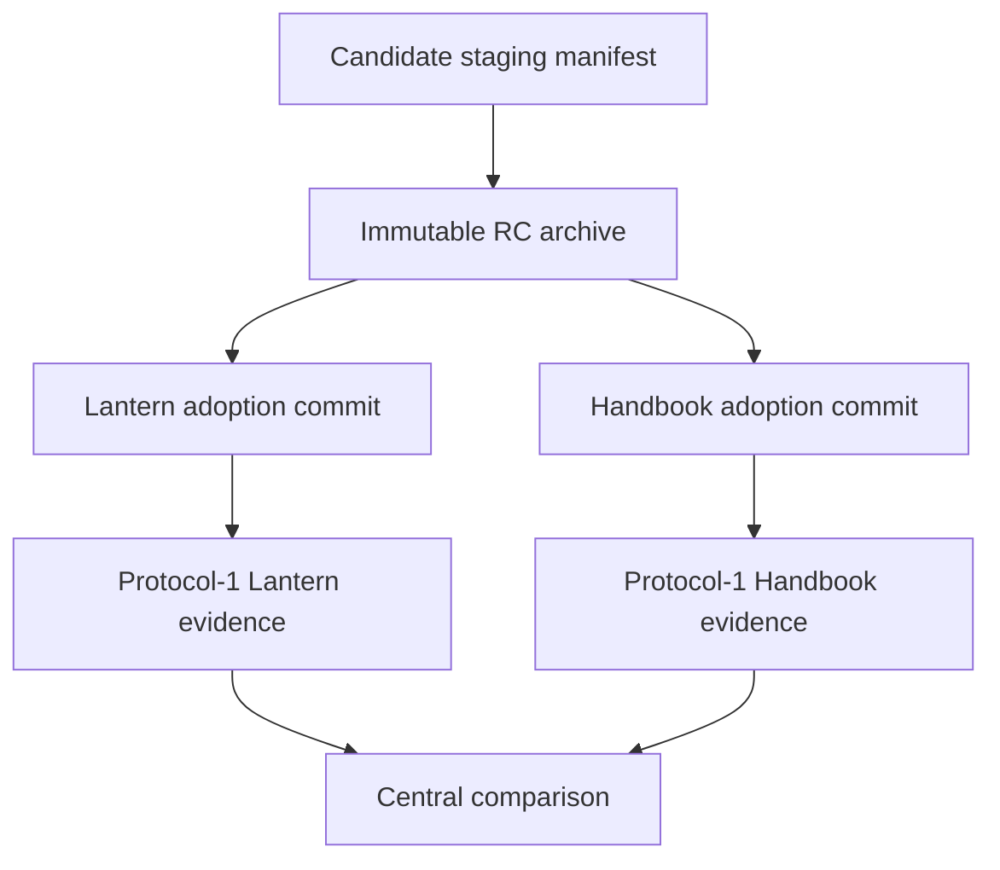
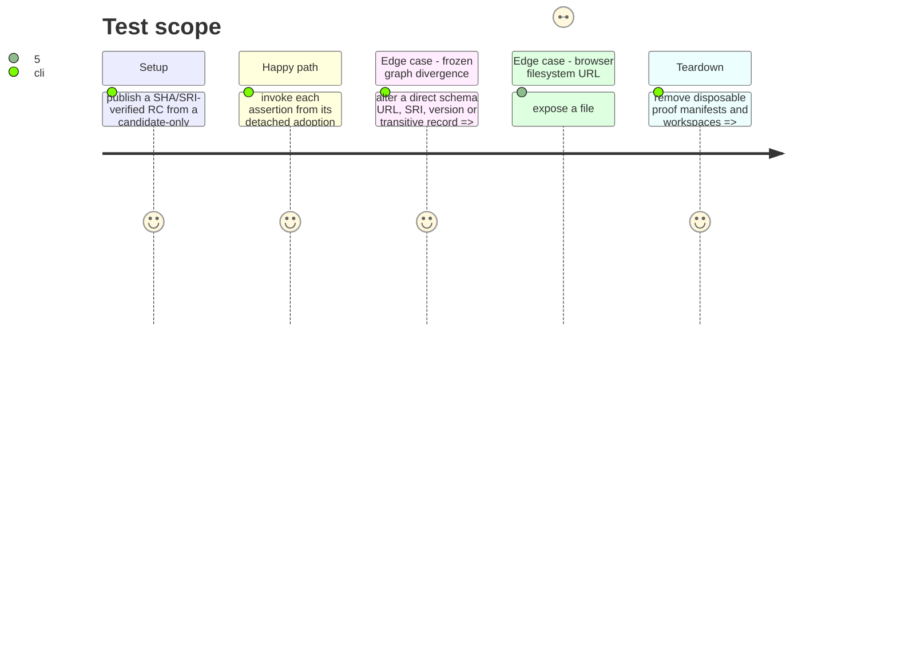

# Instruction: Stage the candidate and deliver consumer-owned protocol adapters

## Architecture projection

> Tree of the final files. ✅ create · ✏️ modify · ❌ delete

```txt
.
├── RebelliousSmile/lantern#34 ↗️ adapt the frozen-lock and Vite proof to protocol-1 evidence
├── RebelliousSmile/lantern#33 ↗️ bundle the thorn-heart SVG so the Vite journey never serves file:
├── RebelliousSmile/obsidian-handbook#56 ↗️ adapt package/source-pack install and render proof to protocol-1 evidence
├── cross-tool.release-train.fixture.json ✏️ replace placeholders with the two committed adoption SHAs
└── ❌ none — consumer adapters, manifests and lockfiles remain owned by their repositories
```

## User Journey



## Test Scope



## Tasks to do

### `1)` Stage the immutable candidate

> Materialize the RC before any consumer adoption commit exists.

1. Add a candidate-only protocol-1 staging manifest containing provider identity, final-version archive URL, SHA-256, SRI, version, tags and provider commit; it contains no consumers.
2. Make the stage workflow validate only this candidate manifest, build once, verify both digests and publish the immutable RC asset.
3. Keep the final train manifest separate and reject its use for staging.

### `2)` Adapt Lantern under consumer ownership

> Complete Lantern #34 and #33 without moving Vite, lock or runtime decisions into schema-pbta.

1. Accept the common manifest and select the Lantern entry only when its repository/ref equal detached `HEAD`.
2. Normalize only the existing direct PbtA, Mist and Adrenaline archive lock records to stable URL/SRI; reject version or transitive changes before clean frozen install.
3. Emit the evidence file after the Vite journey confirms bundled Monsterhearts base and drowned-lake resources, including the thorn-heart browser URL.

### `3)` Adapt Handbook under consumer ownership

> Complete Handbook #56 while retaining its existing package, source-pack and render coverage.

1. Accept the common manifest and select the Handbook entry only when its repository/ref equal detached `HEAD`.
2. Prove the committed frozen lock resolves the candidate URL, SRI and version before installation.
3. Emit the common evidence file only after the provider manifest, declared assets and actual install/render journey pass.

### `4)` Register immutable adoption refs

> Make the train consume consumer commits, not worktrees or branches.

1. Replace fixture placeholders with full adoption commit SHAs and canonical repository identities.
2. Confirm each adapter creates no persistent file in its detached checkout and refuses a mismatched candidate or evidence path.

## Test acceptance criteria

| Task | Acceptance criteria |
| --- | --- |
| 1 | The immutable RC exists with the declared SHA-256/SRI before any consumer adoption ref is required. |
| 2 | Lantern’s frozen graph and Vite output prove the staged candidate without a `file:` asset URL or a local semantic fallback. |
| 3 | Handbook’s frozen graph, source-pack installation and render path prove the same staged candidate. |
| 4 | The final central manifest names only commits whose consumer-owned proof produces matching protocol-1 evidence. |
