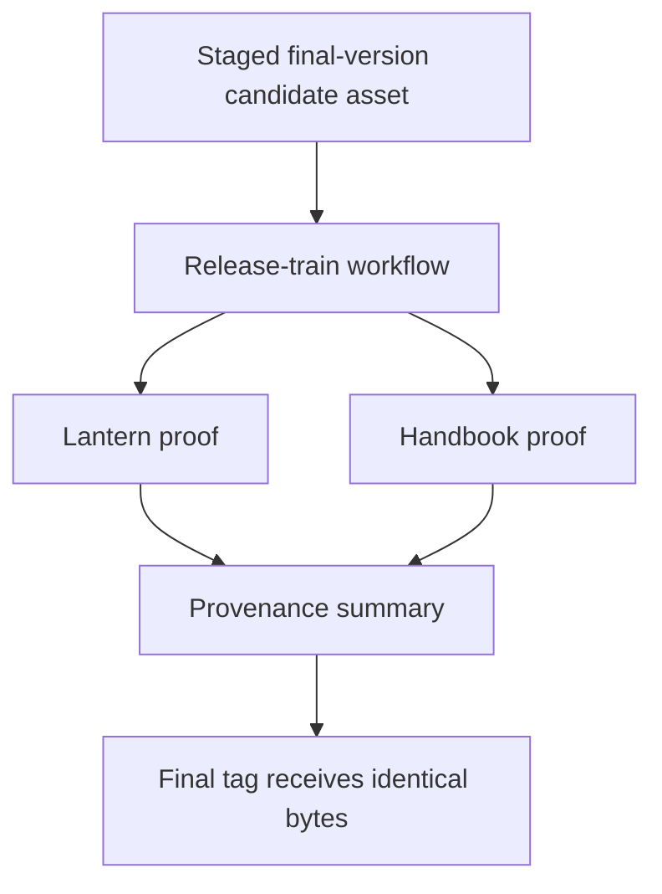
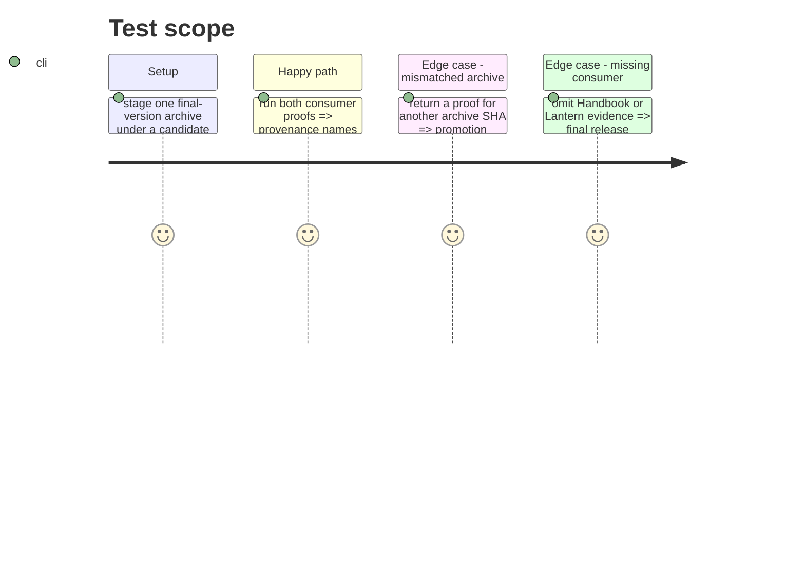

# Instruction: Orchestrate candidate validation and promotion

## Architecture projection

> Tree of the final files. ✅ create · ✏️ modify · ❌ delete

```txt
.
├── tools/run-release-train.ts ✅ materialize consumer SHAs, install the staged final archive, run canonical proofs, and write provenance summary
├── tools/validate-release-train.ts ✏️ validate emitted proof evidence against the supplied candidate identity
├── .github/workflows/release-train.yml ✅ dispatchable candidate-validation workflow with immutable inputs and required statuses
├── .github/workflows/release.yml ✏️ stage one final-version archive under a candidate, require successful evidence, then attach the same SHA-verified bytes to the final tag
├── tools/prepare-release.ts ✏️ produce one final-version tarball SHA for staging and final-release handoff
└── docs/compatibility.md ✏️ distinguish the daily pin gate, candidate train, and final consumer pins
```

## User Journey



## Test Scope



## Tasks to do

### `1)` Make train results promotion gates

1. The producer supplies a staged final-version archive URL, SHA-256 and npm SHA-512 SRI. Each consumer first creates a dedicated candidate-adoption branch, pins that URL, regenerates and verifies its active lockfile SRI, then commits the frozen graph. Add a runner that checks out only the resulting supplied SHAs in disposable detached workspaces, verifies the archive's SHA-256 and SRI, lets each frozen active lock materialize that exact candidate URL, then invokes only the canonical proof interface and records structured provenance. Never overlay it with a no-save install or edit a published consumer checkout.
2. Add a dedicated CI workflow for candidate runs; keep it separate from push/PR daily checks so release inputs are explicit.
3. Make the final-release workflow refuse publication and issue closing without passing Lantern and Handbook evidence for the candidate SHA, then verify the bytes attached to the final tag have that same SHA without rebuilding.

## Test acceptance criteria

| Task | Acceptance criteria |
| --- | --- |
| 1 | A candidate is promotable only when both consumer proofs identify the staged final archive SHA and exact consumer commits; missing, mismatched, or rebuilt final bytes block publication. |
