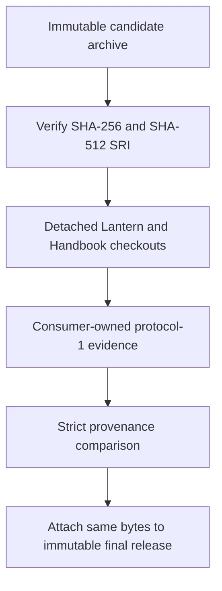
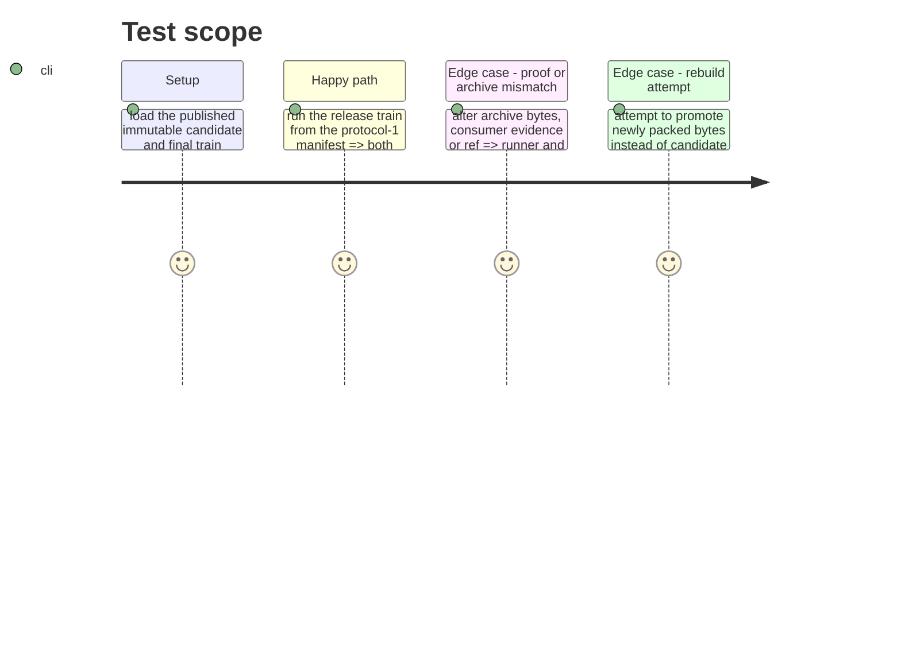

# Instruction: Run and gate the immutable PbtA promotion

## Architecture projection

> Tree of the final files. ✅ create · ✏️ modify · ❌ delete

```txt
.
├── tools/run-release-train.ts ✏️ materialize detached consumers, compare evidence and write provenance
├── tools/checkout-cross-tool.mjs ✏️ checkout only manifest-declared immutable consumer refs in a disposable workspace
├── .github/workflows/release-train.yml ✏️ dispatch and archive a protocol-1 train provenance record
├── .github/workflows/release.yml ✏️ block promotion until the matching train passes and publish the same staged bytes
├── cross-tool.release-train.fixture.json ✏️ become the executable immutable PbtA train manifest
└── ❌ none — do not remove or repurpose the daily CI gate
```

## User Journey



## Test Scope



## Tasks to do

### `1)` Materialize and compare the train

> Turn the validated envelope and adoption SHAs into one isolated, reproducible execution.

1. Download the candidate without redirects and verify both declared digests before any consumer work.
2. Clone each canonical consumer repository at its full manifest ref into a disposable workspace, install only from the frozen committed graph, and invoke the fixed assertion interface.
3. Read evidence files, compare every candidate and consumer identity plus lock/journey attestation, and write a provenance artifact.

### `2)` Gate final promotion

> Make GitHub Actions require the same successful train that consumers proved.

1. Keep the release-train workflow separate from daily CI and publish its provenance artifact.
2. Require a successful matching final train manifest, provider commit, manifest digest and candidate archive digests before promotion.
3. Download the already staged candidate asset and attach those verified bytes and checksum to the immutable final tag without a second package build.

### `3)` Execute the first convergent PbtA train

> Produce the evidence that closes #23.

1. Run the candidate workflow from its immutable provider commit and recorded consumer adoption commits.
2. Verify Lantern’s Monsterhearts Vite journey and Handbook’s source-pack/render journey against the same archive.
3. Promote only after the provenance and final release asset digest match, then record the successful run in the issue and plan verification evidence.

## Test acceptance criteria

| Task | Acceptance criteria |
| --- | --- |
| 1 | A train produces one provenance record only when both immutable consumer proofs match every protocol-1 identity and lock attestation. |
| 2 | A final release cannot be created from a missing, divergent or rebuilt archive, nor from an unrelated train run. |
| 3 | One published PbtA release is demonstrably the archive installed and exercised by both consumer journeys. |
