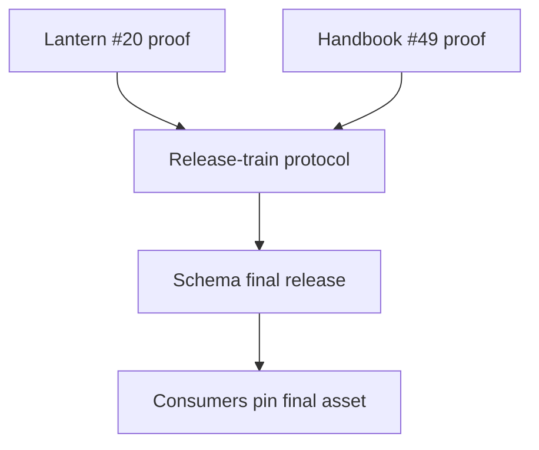
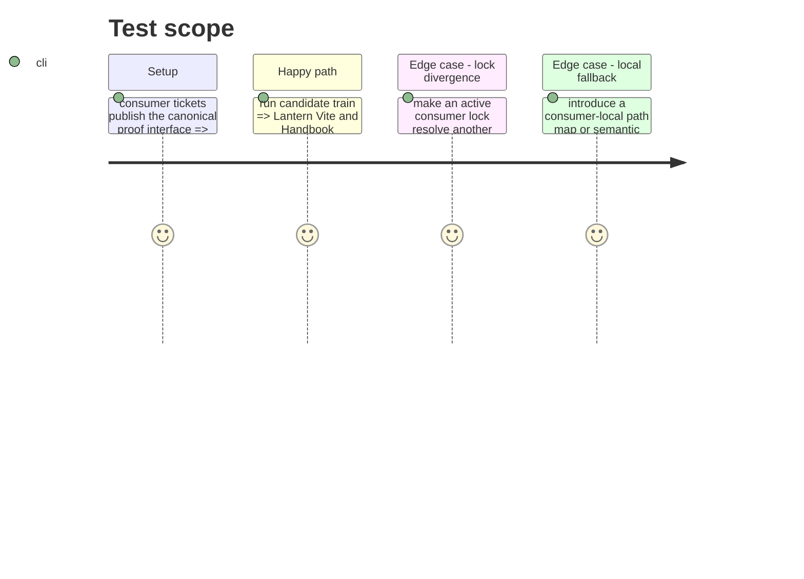

# Instruction: Require consumer adoption evidence

## Architecture projection

> Tree of the final files. ✅ create · ✏️ modify · ❌ delete

```txt
.
├── docs/compatibility.md ✏️ link consumer proof protocol and exact final-pin policy
├── cross-tool.release-train.fixture.json ✏️ name real consumer proof command contracts once their issues land
├── aidd_docs/tasks/2026_09/2026_09_22_cross_repo_release_train/ ✏️ record linked consumer issue and release-train verification evidence
├── RebelliousSmile/lantern#20 ↗️ consumer-owned active-lockfile, Vite, and variant proof
├── RebelliousSmile/obsidian-handbook#49 ↗️ closed consumer-owned package-pin, source-pack, and render proof
└── RebelliousSmile/obsidian-handbook#52 ✅ canonical manifest/evidence adapter for the #49 proof (Handbook v2.26.0)
├── RebelliousSmile/schema-in-the-mist#23 ↗️ peer-provider rollout for its own candidate archives
└── RebelliousSmile/schema-adrenaline#21 ↗️ peer-provider rollout for its own candidate archives
```

## User Journey



## Test Scope



## Tasks to do

### `1)` Integrate consumer-owned proofs

1. Track Lantern #20 as the remaining host prerequisite. Lantern's consumer-owned generator accepts three explicit URL/SRI pairs — `schema-pbta`, `schema-in-the-mist`, and `schema-adrenaline` — and may normalize only those direct archive/importer records in its active pnpm lock. It must reject a version or transitive-dependency change, then commit the candidate URL and SRI-bearing frozen graph on a dedicated adoption branch. Lantern then runs its clean frozen install, Vite build and evidence proof before providing that immutable commit to the train; #49 supplies Handbook's proof foundation and #52 (Handbook v2.26.0) supplies its canonical manifest/evidence interface. Do not replace their adapters or renderers from schema-pbta.
2. Register their implementations of the canonical proof interface in the train fixture after the consumer tickets provide them.
3. Verify the first complete Monsterhearts train against Lantern #19, including base and drowned-lake resources; after byte-identical promotion, pin both consumers to the final immutable release.
4. Keep Mist #23 and Adrenaline #21 linked as independent provider rollouts. Their archive and dependency-lock migrations must preserve the daily shared cross-tool gate, but are not acceptance criteria or blockers for the schema-pbta candidate train.

## Test acceptance criteria

| Task | Acceptance criteria |
| --- | --- |
| 1 | The first Monsterhearts promotion proves both consumers use the selected release and no consumer needs a local semantic or resource-path fallback. |
