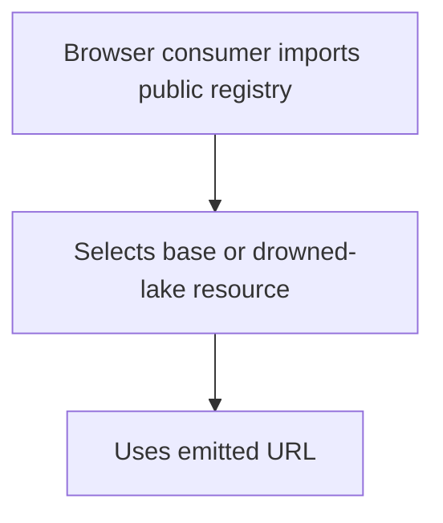
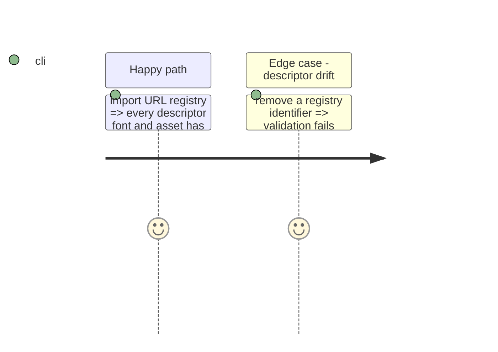

# Instruction: Export static appearance asset URLs

## Architecture projection

```txt
src/presentation/monsterhearts-appearance-assets.ts ✅ public `PBTA_MONSTERHEARTS_APPEARANCE_ASSET_URLS` registry with literal asset references
src/presentation/index.ts ✏️ re-export the registry
src/index.ts ✏️ re-export the registry from the package entry point
tools/validate-presentation-appearance.ts ✏️ assert registry identifiers and URL coverage agree with the descriptor
```

## User Journey



## Test Scope



## Tasks to do

### `1)` Add the browser resource registry

1. Add literal URL declarations for both fonts and both logical asset IDs, without interpolated paths or helper indirection.
2. Publish a frozen, typed registry with base asset URLs and the `drowned-lake` asset override keyed by the same identifiers as the appearance descriptor.
3. Re-export the typed API publicly and validate its font, asset, and variant-ID coverage against the descriptor.

## Test acceptance criteria

| Task | Acceptance criteria |
| --- | --- |
| 1 | Every declared font and logical asset, including the drowned-lake override, has a public statically analyzable URL with descriptor-aligned IDs; no URL is added to TOML. |
