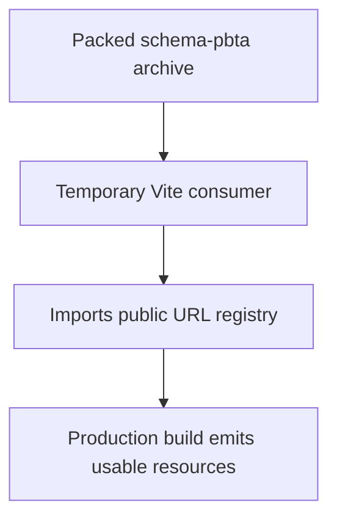
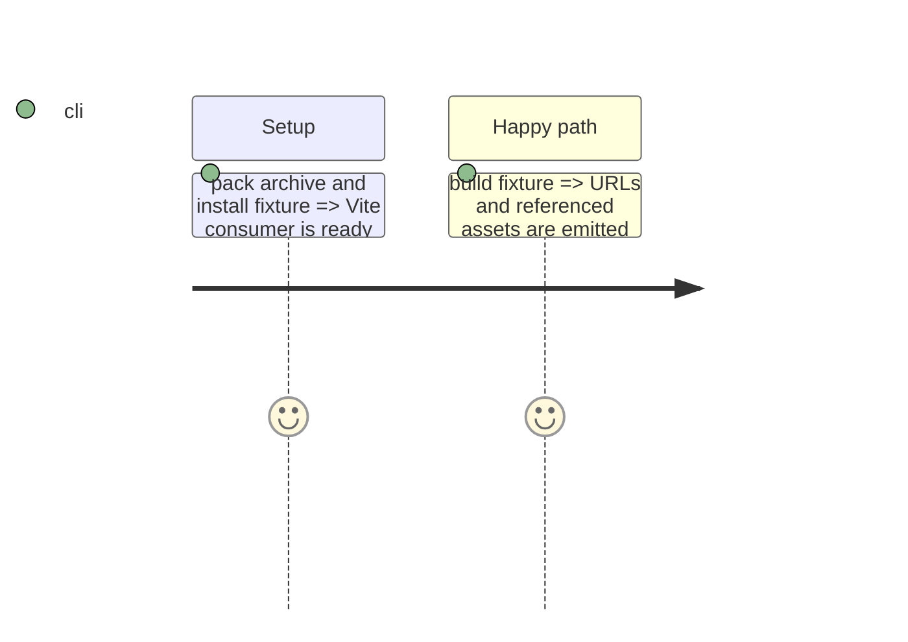

# Instruction: Prove archive consumption with Vite

## Architecture projection

```txt
package.json ✏️ add the locked Vite test tool and validation command
package-lock.json ✏️ lock the Vite test tool
tools/validate-package.ts ✏️ build a temporary Vite fixture against the packed archive and assert emitted resource URLs
```

## User Journey



## Test Scope



## Tasks to do

### `1)` Add the packed Vite fixture

1. Install Vite only as a locked development validation tool; invoke its local CLI against a temporary consumer so the released tarball remains the sole schema dependency.
2. Have the archive validator generate and production-build a minimal Vite consumer importing and using every public registry URL, with `assetsInlineLimit: 0` so fonts and SVGs must be emitted as files.
3. Assert the build output contains each named font/SVG and that the emitted entry bundle references usable built URLs rather than source-tree or `handbook/` paths.

## Test acceptance criteria

| Task | Acceptance criteria |
| --- | --- |
| 1 | A Vite production build from the installed tarball succeeds, emits each registry font/SVG as a file, and contains no `handbook/` source path. |
