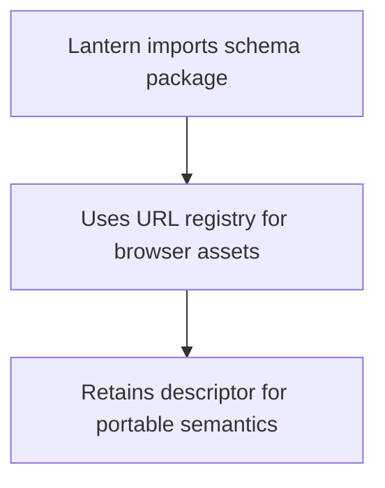
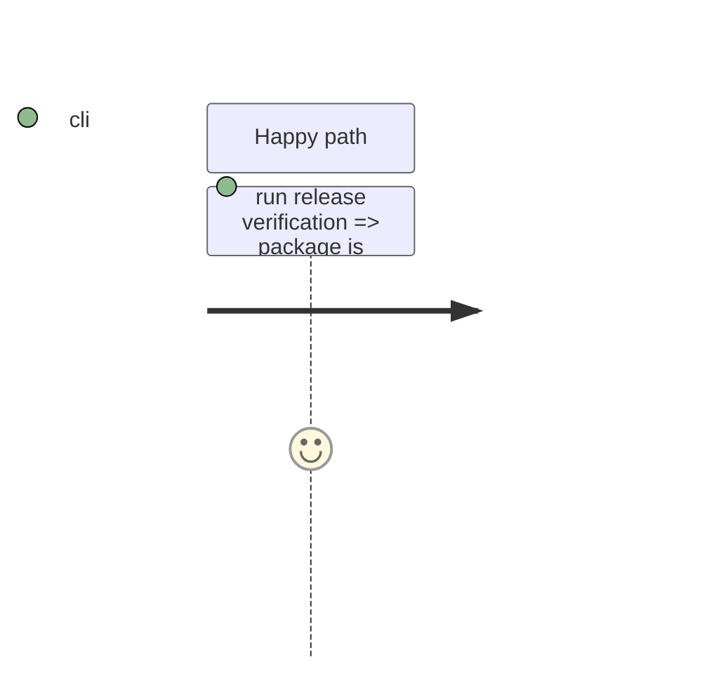

# Instruction: Document, publish, and close the correction

## Architecture projection

```txt
README.md ✏️ distinguish portable descriptor paths from browser URL API usage
CHANGELOG.md ✏️ record the browser URL API in the v8.4.1 patch-release notes
package.json ✏️ patch the release version
package-lock.json ✏️ synchronize package version
GitHub release v8.4.1 ✅ attach the immutable tarball and SHA-256 checksum
GitHub issue #21 ✏️ close only after the published release is reachable
```

## User Journey



## Test Scope



## Tasks to do

### `1)` Ship the documented patch release

1. Document the browser API, its relation to package-relative descriptor paths, and its presentation-only boundary; add the corresponding v8.4.1 Keep a Changelog entry.
2. Bump to v8.4.1; run the full project, Vite archive, and reproducible package checks; commit the completed phases and implementation plan.
3. Merge the validated branch, push the tag, publish the tarball and SHA-256 checksum as GitHub release v8.4.1, verify the release asset is reachable, then close #21 with the release reference.

## Test acceptance criteria

| Task | Acceptance criteria |
| --- | --- |
| 1 | Consumers can identify the correct browser API; v8.4.1 has a reproducible, reachable archive and checksum; #21 closes only after that publication. |
