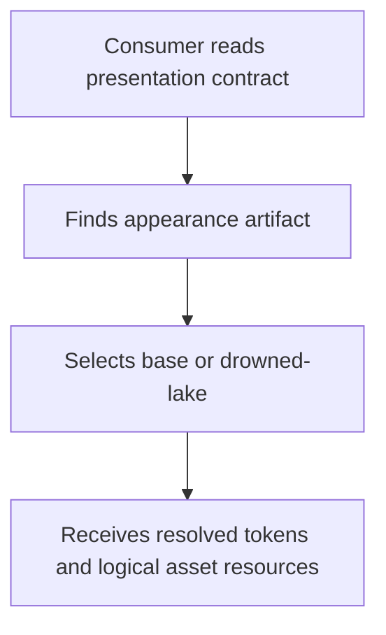
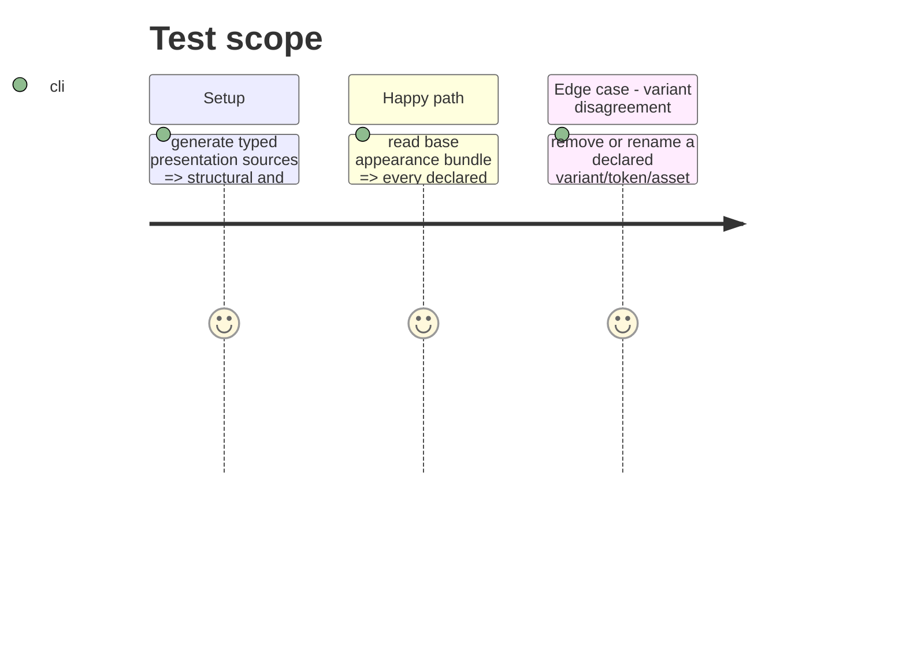

# Instruction: Define and generate the appearance contract

## Architecture projection

> Tree of the final files. ✅ create · ✏️ modify · ❌ delete

```txt
.
├── src/presentation/monsterhearts-appearance.ts ✅ typed canonical base and drowned-lake appearance data, including resolved token maps and logical asset mappings
├── src/presentation/monsterhearts-playbook.ts ✏️ advertise the generated appearance artifact while retaining only presentation-only variant metadata
├── src/presentation/index.ts ✏️ expose the consumer-neutral appearance contract/resolver through the public ESM API
├── tools/gen-presentation-contracts.ts ✏️ generate both structural and appearance JSON artifacts from typed sources
├── packs/monsterhearts/appearance-contract.json ✅ generated public appearance artifact
├── packs/monsterhearts/presentation-contract.json ✏️ generated structural artifact including its appearance-bundle linkage
├── packs/monsterhearts/pack-contract.json ✏️ advertise the appearance artifact from the pack manifest
├── src/pack-manifest.ts ✏️ validate the manifest declaration for the appearance artifact
└── tools/validate-presentation-contract.ts ✏️ reject structural/appearance drift, unresolved variants, and token or asset identifier mismatches
```

## User Journey



## Test Scope



## Tasks to do

### `1)` Model a public appearance contract

> Define consumer-neutral, variant-resolved presentation data without embedding renderer implementation or document data.

1. Add a strict typed schema/source for `base` and `drowned-lake`, with resolved values for every token declared by the layout contract and logical mappings for every declared asset ID.
2. Include variant-specific token overrides and resource declarations needed to load the existing fonts, SVGs, and styles from package-relative paths.
3. Link the structural descriptor and pack manifest to the appearance artifact; retain the existing fixed, presentation-only variant list.

### `2)` Generate and validate both projections

> Make JSON consumers receive generated artifacts from the same producer-owned sources as ESM consumers.

1. Extend the presentation generator to emit the appearance JSON next to `presentation-contract.json`.
2. Extend presentation and manifest validation to compare declared token IDs, asset IDs, and ordered variant IDs across typed source, structural JSON, appearance JSON, and manifest declarations.
3. Make validation fail when a variant cannot resolve its effective token values or an artifact linkage is missing.

## Test acceptance criteria

| Task | Acceptance criteria |
| --- | --- |
| 1 | The public structural contract names the appearance bundle, and both `base` and `drowned-lake` resolve all layout-declared tokens and assets without adding a TOML field. |
| 2 | Generated JSON artifacts equal their typed sources; validation rejects identifier drift, a missing artifact, and an unresolved variant. |
