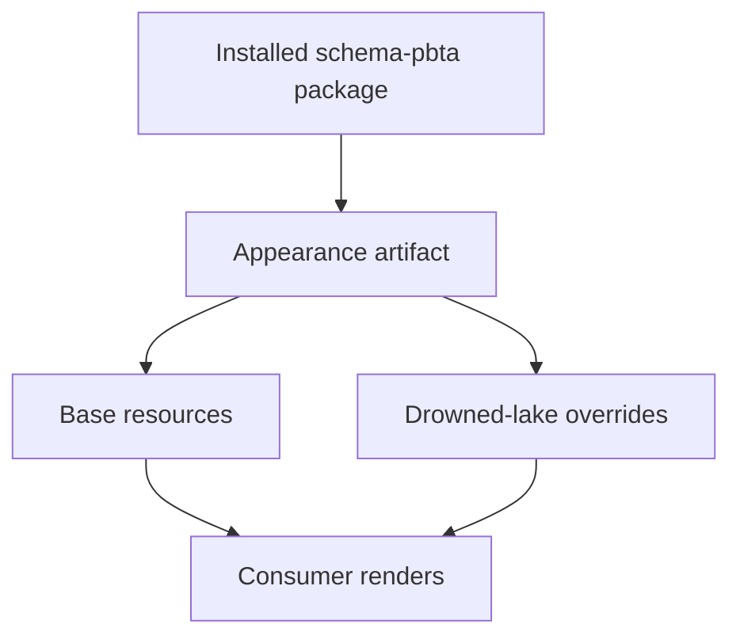
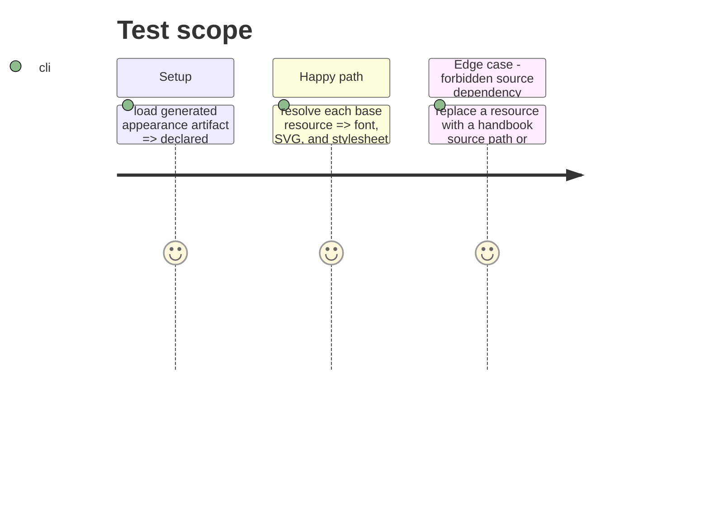

# Instruction: Publish redistributable appearance resources

## Architecture projection

> Tree of the final files. ✅ create · ✏️ modify · ❌ delete

```txt
.
├── packs/monsterhearts/assets/fonts/im-fell-english-latin-400-normal.woff2 ✅ package-owned redistributable base font
├── packs/monsterhearts/assets/fonts/averia-serif-libre-latin-700-normal.woff2 ✅ package-owned redistributable display font
├── packs/monsterhearts/assets/fonts/OFL-Averia-1.1.txt ✅ accompanying font licence notice
├── packs/monsterhearts/assets/fonts/OFL-1.1.txt ✅ accompanying font licence notice
├── packs/monsterhearts/assets/images/thorn-heart.svg ✅ original base logical asset
├── packs/monsterhearts/assets/variants/drowned-lake/zine-lake.svg ✅ original drowned-lake logical asset
├── packs/monsterhearts/assets/styles/callouts.css ✅ published shared Monsterhearts presentation stylesheet
├── packs/monsterhearts/styles/base.css ✅ published base appearance stylesheet
├── packs/monsterhearts/styles/theme-tokens.css ✅ package-local dependency of the base appearance stylesheet
├── packs/monsterhearts/styles/variants/drowned-lake.css ✅ published drowned-lake appearance stylesheet
├── LICENSES/HANDBOOK-ASSETS.md ✏️ record the package publication paths and provenance without claiming official artwork
└── tools/validate-package.ts ✏️ prove the existing `./packs/*` export and `packs` package allowlist expose every declared resource after packing
```

## User Journey



## Test Scope



## Tasks to do

### `1)` Stage safe resources with their notices

> Give the npm package every original or redistributable file its appearance contract names.

1. Copy the listed original SVGs, OFL fonts and notices, plus required CSS and its transitive theme-token stylesheet into package-owned `packs/monsterhearts/` resource paths.
2. Retarget the copied base stylesheet's shared-token import to its package-local resource and validate every CSS `@import` and `url()` reference stays inside the published bundle.
3. Ensure no appearance mapping contains official book artwork or names `playbookImage`; preserve document-provided portrait handling.
4. Leave `handbook/monsterhearts/` unchanged: it is a consumer-owned source pack, not a dependency or publication target of this schema-package issue.

### `2)` Make resources public package API

> Ensure consumers can import each declared resource from an installed release, not merely find it in a checkout.

1. Confirm the existing `./packs/*` export pattern resolves the appearance artifact and all referenced resources.
2. Confirm npm’s existing `packs` allowlist carries every declared resource into the tarball.
3. Update provenance documentation for the new package paths and licensing boundary.

## Test acceptance criteria

| Task | Acceptance criteria |
| --- | --- |
| 1 | Every appearance resource, including stylesheet transitive references, exists under `packs/monsterhearts`, has allowed provenance, and no bundle mapping includes official artwork or document portrait data. |
| 2 | The existing package export map resolves the appearance artifact and every resource it names from the packed archive. |
