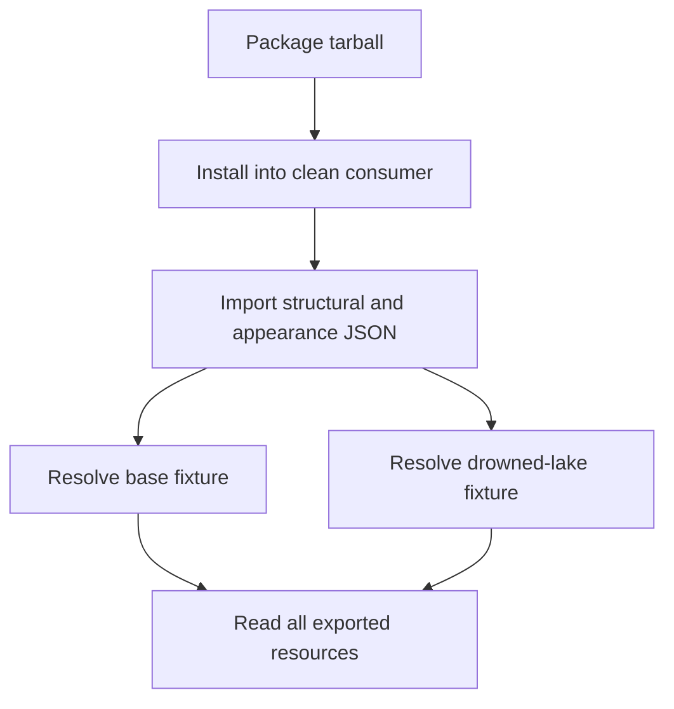
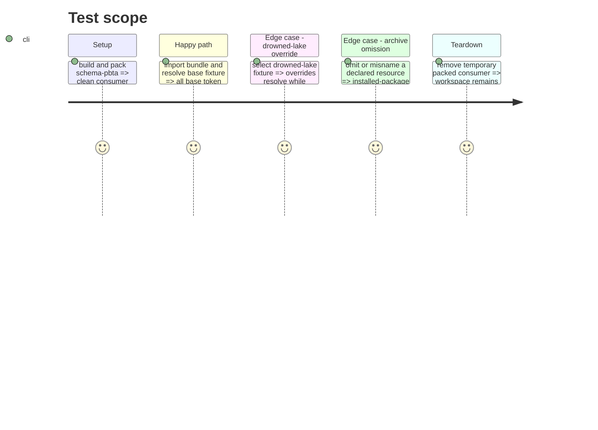

# Instruction: Enforce agreement and prove installed consumption

## Architecture projection

> Tree of the final files. ✅ create · ✏️ modify · ❌ delete

```txt
.
├── corpus/presentation/valid/monsterhearts-appearance-base.json ✅ consumer-resolution fixture for the complete base bundle
├── corpus/presentation/valid/monsterhearts-appearance-drowned-lake.json ✅ consumer-resolution fixture for the complete drowned-lake override
├── corpus/presentation/invalid/monsterhearts-appearance-*.json ✅ drift, missing-resource, and unresolved-variant fixtures
├── tools/validate-presentation-contract.ts ✏️ exercise appearance fixtures and cross-artifact agreement
├── tools/validate-package.ts ✏️ install the generated tarball and resolve/read the artifact plus every named resource through exports
├── README.md ✏️ document the public appearance artifact, resolver boundary, resource imports, and presentation-only variants
└── aidd_docs/tasks/2026_09/2026_09_22_monsterhearts_presentation_appearance_bundle/ ✏️ record verification evidence after implementation
```

## User Journey



## Test Scope



## Tasks to do

### `1)` Add consumer-level fixtures and drift checks

> Prove the bundle is sufficient for a renderer and rejects the failure modes the structural artifact cannot see alone.

1. Add base and drowned-lake fixtures that name only public artifact/resource paths and assert expected effective token/asset resolution.
2. Add invalid fixtures or direct negative assertions for identifier drift, missing resource mappings, and variants that cannot produce a complete effective token set.
3. Keep document corpus and TOML codec cases unchanged except for explicit assertions that presentation variants never appear in document data.

### `2)` Validate the packed consumer experience

> Test the release surface rather than source-tree reachability.

1. Extend tarball validation to import the appearance artifact through `import.meta.resolve`, parse it, resolve both fixtures, and read each referenced export.
2. Run the existing generation, presentation, manifest, package, and complete project checks; record results in the task evidence.
3. Document how Lantern and Handbook consume the bundle and that they must not add a Monsterhearts appearance fallback.

## Test acceptance criteria

| Task | Acceptance criteria |
| --- | --- |
| 1 | Fixtures resolve the complete base bundle and drowned-lake override using no `handbook/` source path; drift, missing assets, and unresolved variants fail validation. |
| 2 | A clean install of the packed archive imports the public appearance artifact and reads every resource it names; documentation states the producer/consumer boundary. |
