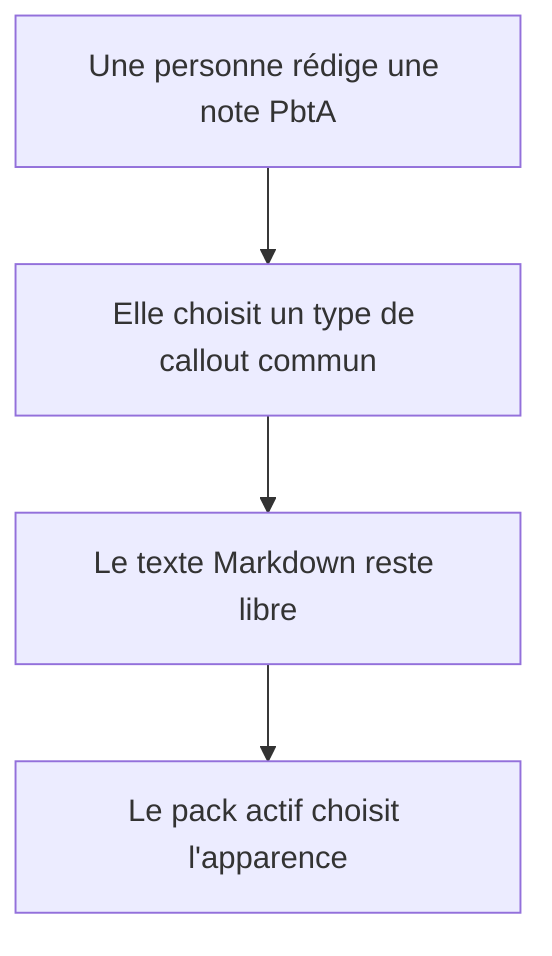
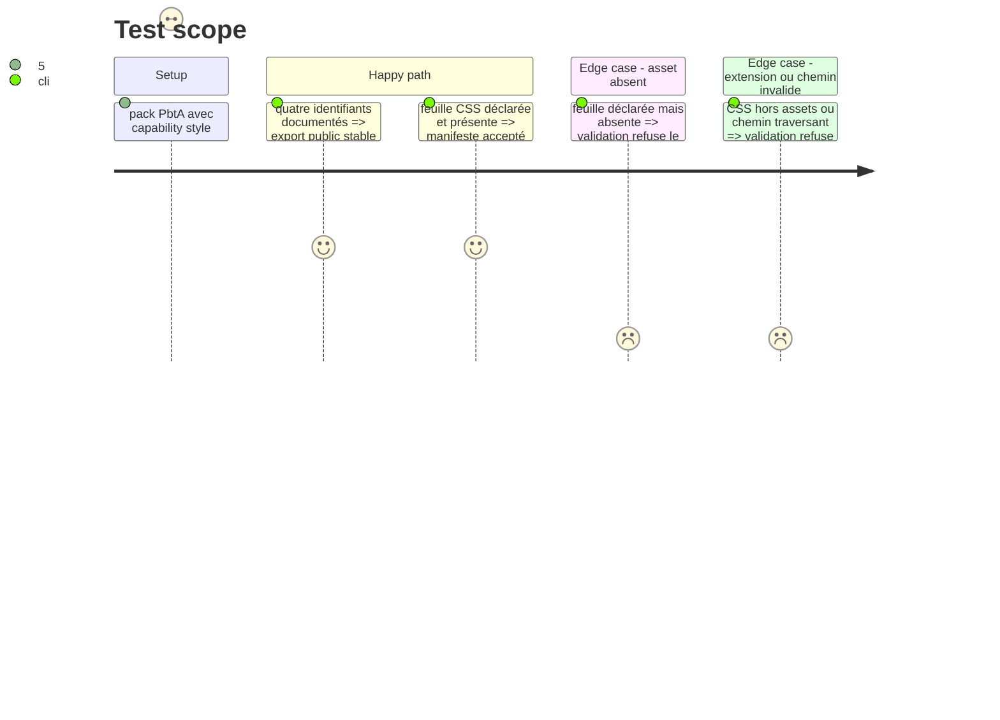

# Instruction: Publier la sémantique de présentation et accepter les feuilles des packs

## Architecture projection

> Tree of the final files. ✅ create · ✏️ modify · ❌ delete

```txt
schema-pbta/
├── src/presentation/callouts.ts ✅ catalogue et types des quatre intentions visuelles
├── src/presentation/index.ts ✏️ export du catalogue
├── src/index.ts ✏️ export public pour Handbook
├── handbook/shared/callout-contract.md ✅ syntaxe, contenu libre, portée et exemples non canoniques
├── tools/validate-handbook-packs.ts ✏️ autoriser et valider assets.stylesheets, chemin, extension et existence
├── tools/validate-handbook-catalog-fixtures.ts ✏️ prouver les cas CSS valide, absent et non sûr
├── tools/validate-handbook-install.ts ✏️ retirer les hypothèses de cinq packs et vérifier les CSS installées
├── handbook/README.md ✏️ documenter les feuilles CSS installables et leur versionnement
└── README.md ✏️ pointer vers le contrat de présentation

Delete: none.
```

## User Journey



## Test Scope



## Tasks to do

### `1)` Fixer le vocabulaire commun

> Exposer les quatre types sans introduire de nouvelle donnée mécanique.

1. Définir les identifiants, libellés et modèles d'insertion dans la présentation publiée, avec `style:pbta` comme capacité commune ; Handbook garde le choix des icônes et le rendu Obsidian.
2. Documenter `> [!pbta-clock]`, `> [!pbta-move]`, `> [!pbta-npc-reaction]` et `> [!pbta-playbook-change]`, y compris une horloge Monsterhearts décrite comme outil facultatif de MC.
3. Préciser que les listes, cases cochées et liens à l'intérieur d'un callout sont du Markdown normal et ne synchronisent aucun document.

### `2)` Ouvrir le chemin des styles de pack

> Accepter seulement les fichiers CSS déclarés que Handbook sait déjà installer.

1. Étendre le validateur local pour `assets.stylesheets` avec chemins relatifs sûrs, extension `.css`, unicité et présence du fichier ; ajouter des fixtures de réussite et de rejet ciblées.
2. Adapter le test d'installation inter dépôt à la liste actuelle du catalogue, au checkout `../obsidian-handbook` (ou `HANDBOOK_ROOT`) et aux CSS déclarées ; remplacer ses assertions figées sur cinq packs et `schema-pbta` v1.0.0 par des assertions sur le contrat courant.
3. Conserver dans Handbook la validation de sélecteurs limitée à `body.brumes--<id>` et vérifier que le test d'installation voit les CSS déclarées.
4. Mettre à jour la documentation qui affirme encore que seuls images et polices sont copiées.
5. Publier une version compatible de `schema-pbta` avant l'adoption du catalogue par Handbook, selon la politique de version du dépôt.

## Test acceptance criteria

| Task | Acceptance criteria |
| --- | --- |
| 1 | Les quatre identifiants sont exportés et décrits comme des callouts visuels facultatifs ; aucun schéma de jeu ni document TOML ne change. |
| 2 | Le validateur accepte une CSS déclarée, refuse une référence absente ou non sûre, et le test inter dépôt couvre les six packs actuels ainsi que les CSS installées sans ancien pin de version. |
