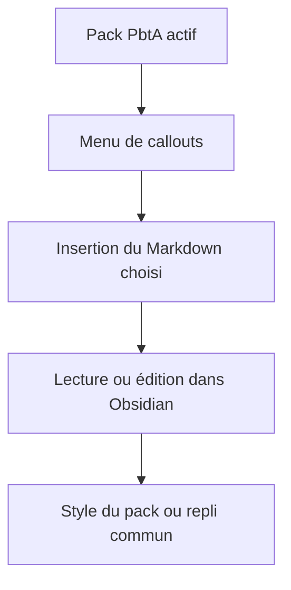
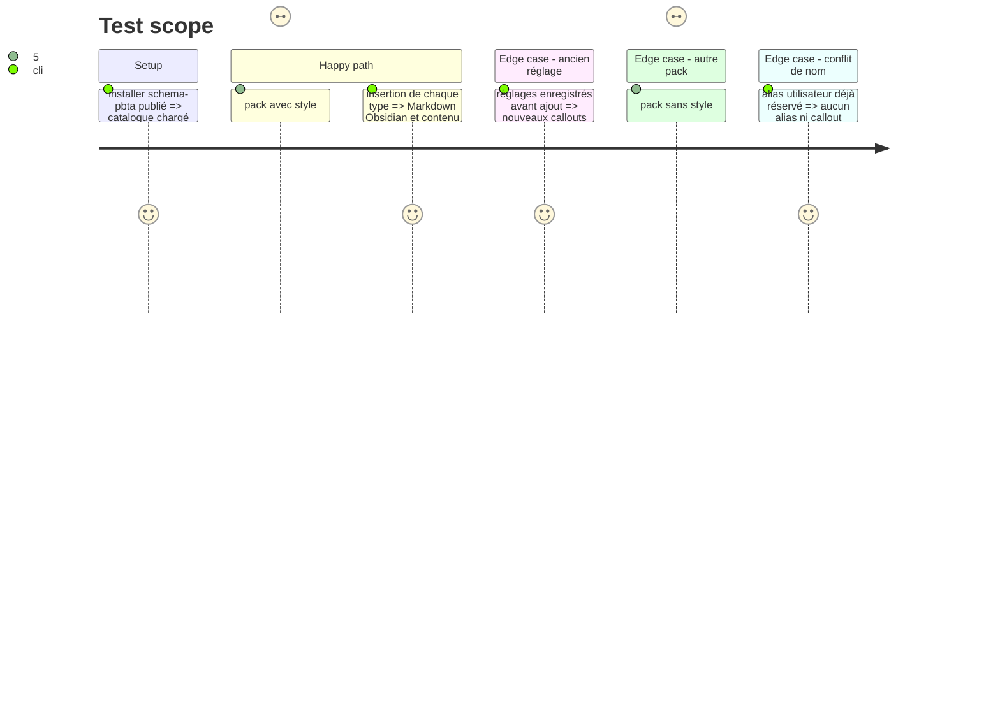

# Instruction: Ajouter les callouts au catalogue et au rendu Handbook

## Architecture projection

> Tree of the final files. ✅ create · ✏️ modify · ❌ delete

```txt
obsidian-handbook/
├── package.json ✏️ adopter une version publiée de schema-pbta contenant le catalogue
├── pnpm-lock.yaml ✏️ figer cette version
├── src/features/callouts/nativeCallouts.ts ✏️ construire les quatre entrées PbtA depuis le catalogue publié
├── src/features/callouts/migrateAliases.ts ✏️ compléter les réglages existants sans toucher aux alias personnalisés
├── src/styles/pbta/_callouts.scss ✅ style commun et repli des quatre types par styleKey
├── src/styles/pbta/index.scss ✏️ inclure le style commun
├── tools/assertCallouts.harness.mts ✏️ couvrir disponibilité, insertion et migration
└── README.md ✏️ expliquer la syntaxe Markdown et la portée par pack

Delete: none.
```

## User Journey



## Test Scope



## Wireframe

```txt
┌──────────────────────────────────────────────┐
│ (1) Note de partie                            │
├──────────────────────────────────────────────┤
│ (2) Contenu narratif                          │
│ ┌──────────────────────────────────────────┐ │
│ │ (3) Horloge                              │ │
│ └──────────────────────────────────────────┘ │
│ ┌──────────────────────────────────────────┐ │
│ │ (4) Move / réaction de PNJ               │ │
│ └──────────────────────────────────────────┘ │
│ ┌──────────────────────────────────────────┐ │
│ │ (5) Modification de livret               │ │
│ └──────────────────────────────────────────┘ │
└──────────────────────────────────────────────┘
1. Note : contexte du jeu actif.
2. Contenu : texte de la partie autour des encarts.
3. Horloge : titre et contenu de suivi de la MC.
4. Move / réaction : encarts lisibles dans le fil de la note.
5. Livret : encart de progression, de lien ou d'autre changement raconté.
```

## Tasks to do

### `1)` Rendre les types disponibles

> Une personne peut insérer n'importe lequel des quatre callouts dans tout pack PbtA.

1. Consommer le catalogue publié après la sortie de `schema-pbta`, en conservant les identifiants des quatre callouts PbtA déjà existants.
2. Faire apparaître les nouveaux types dans le menu et les commandes quand `style:pbta` est actif, avec un modèle `title-body` et un contenu générique qui ne suppose aucune règle de jeu.
3. Conserver les alias et callouts personnalisés lors de l'ajout des nouvelles définitions aux réglages enregistrés ; en cas de collision, garder l'alias existant et donner au nouveau callout un alias libre explicite dans le menu, sans modifier les notes déjà écrites.

### `2)` Fournir un rendu commun fiable

> Les nouveaux types restent lisibles avant ou sans CSS spécifique au jeu.

1. Ajouter un style Obsidian partagé, limité aux quatre identifiants canoniques via `data-brumes-callout-style`, pour lecture et édition, mobile, thème clair et sombre ; ne pas cibler uniquement `data-callout` car un alias peut être personnalisé.
2. Afficher une horloge comme contenu Markdown lisible, sans compteur automatique ni interprétation des cases cochées.
3. Vérifier que les anciennes formes Monsterhearts `mh-*` et les quatre callouts PbtA existants gardent leur rendu et leurs alias.

## Test acceptance criteria

| Task | Acceptance criteria |
| --- | --- |
| 1 | Les quatre nouveaux callouts sont insérables dans chacun des six packs PbtA ; ils ne sont pas proposés par un pack sans capacité PbtA ; les réglages existants sont conservés. |
| 2 | Chaque callout est lisible en lecture et en édition avec son alias par défaut ou personnalisé, et une liste ou un lien placé dans son corps reste du Markdown sans effet sur les données de jeu. |
