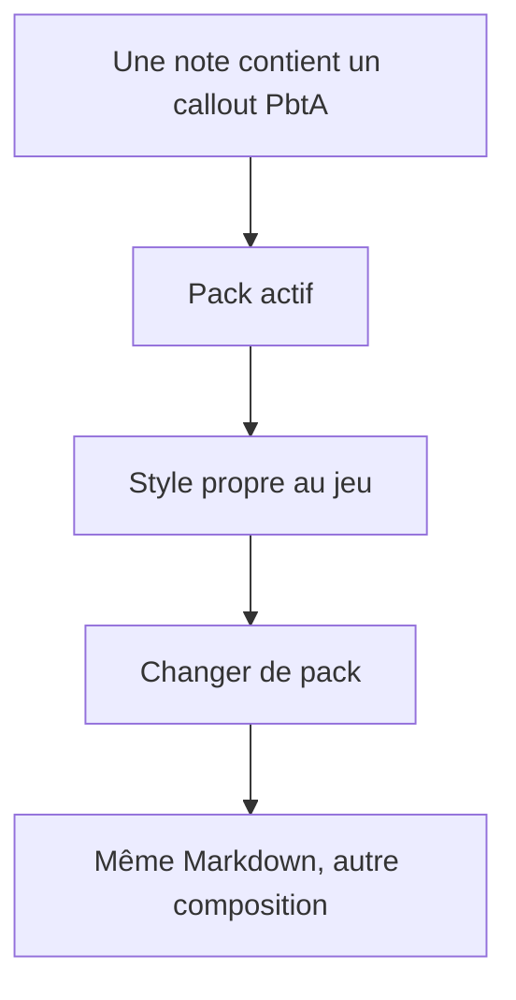
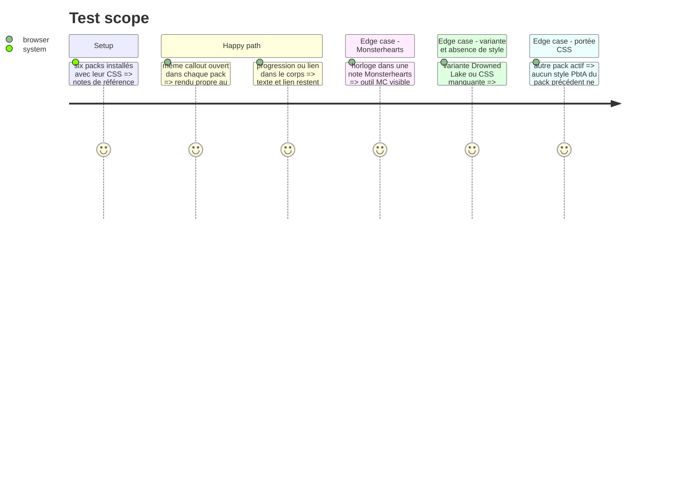

# Instruction: Définir et vérifier le design de chaque pack

## Architecture projection

> Tree of the final files. ✅ create · ✏️ modify · ❌ delete

```txt
schema-pbta/
├── handbook/{masks,monster-of-the-week,monsterhearts,urban-shadows,the-sprawl,salvage-run}/pack.json ✏️ déclarer chaque CSS et ajuster la version du pack
├── handbook/{masks,monster-of-the-week,monsterhearts,urban-shadows,the-sprawl,salvage-run}/assets/styles/callouts.css ✅ styles propres aux six packs par styleKey
├── handbook/{masks,monster-of-the-week,monsterhearts,urban-shadows,the-sprawl,salvage-run}/README.md ✏️ montrer les quatre syntaxes et l'intention visuelle du jeu
├── handbook/shared/callouts-example.md ✅ même note Markdown de référence pour les six packs
├── handbook.json ✏️ aligner chaque version modifiée avec son entrée de catalogue
├── tools/validate-handbook-packs.ts ✏️ contrôler la présence des huit types PbtA dans les CSS de chaque pack
└── handbook/shared/preview-contract.md ✏️ distinguer les callouts Markdown installables des encarts de preview HTML

Delete: none.
```

## User Journey



## Test Scope



## Wireframe

```txt
┌──────────────────────────────────────────────┐
│ (1) Note de partie                            │
├──────────────────────────────────────────────┤
│ (2) Contenu narratif                          │
│ ┌──────────────────────────────────────────┐ │
│ │ (3) Horloge                              │ │
│ └──────────────────────────────────────────┘ │
│ ┌──────────────────────────────────────────┐ │
│ │ (4) Move / réaction de PNJ               │ │
│ └──────────────────────────────────────────┘ │
│ ┌──────────────────────────────────────────┐ │
│ │ (5) Modification de livret               │ │
│ └──────────────────────────────────────────┘ │
└──────────────────────────────────────────────┘
1. Note : contexte du jeu actif.
2. Contenu : texte de la partie autour des encarts.
3. Horloge : titre et contenu de suivi de la MC.
4. Move / réaction : encarts lisibles dans le fil de la note.
5. Livret : encart de progression, de lien ou d'autre changement raconté.
```

## Tasks to do

### `1)` Donner une voix visuelle aux six packs

> Chaque pack choisit son aspect sans changer les quatre identifiants ni le Markdown de la note.

1. Créer une feuille CSS par pack, avec sélecteurs `body.brumes--<id>` acceptés par Handbook et `data-brumes-callout-style` pour reconnaître les types même avec un alias personnalisé ; styliser les quatre nouveaux types ainsi que les callouts PbtA existants.
2. Faire varier hiérarchie, composition, bordures, typographie et signes de suivi selon l'identité de chaque jeu ; préserver les états de lecture, d'édition, les liens et les cases Markdown.
3. Couvrir Monsterhearts `base` et `drowned-lake`, puis déclarer les six feuilles dans `assets.stylesheets` et aligner les versions installables.

### `2)` Vérifier la livraison réelle

> Les styles se chargent depuis les packs installés et ne changent pas les documents.

1. Faire valider chaque CSS par le chargeur Handbook et les validations de manifeste `schema-pbta` ; vérifier la couverture des quatre nouveaux types et des quatre types PbtA existants.
2. Créer une note Markdown de référence avec les huit types PbtA, une horloge à segments écrits à la main, une progression, un lien et une réaction de PNJ ; la comparer dans les six packs, en lecture et édition, sur largeur normale et étroite, puis contrôler la variante Drowned Lake et le repli si une feuille manque.
3. Confirmer par `validate-handbook-install.ts` et le chargeur Handbook que l'installation copie et charge les six feuilles déclarées ; documenter la syntaxe pour l'utilisateur.

## Test acceptance criteria

| Task | Acceptance criteria |
| --- | --- |
| 1 | Chacun des six packs donne un rendu distinct aux quatre nouveaux callouts ; les callouts PbtA existants suivent aussi son identité visuelle ; le texte de la note reste inchangé au changement de pack. |
| 2 | Les six CSS sont installées, chargées et limitées au pack actif ; Monsterhearts, sa variante et le repli partagé restent lisibles ; aucune donnée de jeu n'est créée ou modifiée. |
