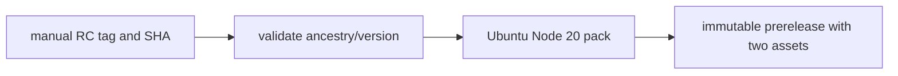
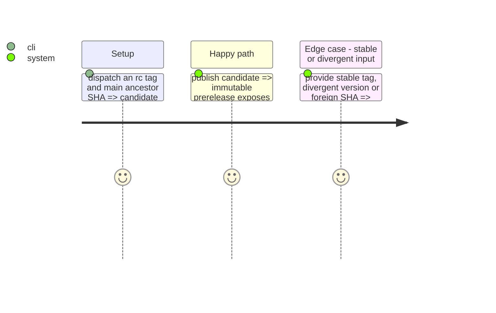

# Instruction: Isolate and validate candidate publication

## Architecture projection

```txt
.
├── .github/workflows/publish-candidate.yml ✅ manual RC-only Linux/Node 20 publication workflow
├── tools/validate-release-candidate.ts ✅ validate tag, version, SHA ancestry and prerelease invariants
├── package.json ✏️ expose the candidate validator
└── ❌ none — stable promotion workflow stays separate
```

## User Journey



## Test Scope



## Tasks to do

### `1)` Build the RC-only publisher

1. Validate the RC tag, exact package version and that the dispatched full SHA is an ancestor of `origin/main`.
2. Package under Ubuntu/Node 20, checksum, create/reuse only a prerelease, then API-verify tag, target SHA, immutability, digest and exactly two assets.
3. Keep all stable-release paths outside this workflow.

## Test acceptance criteria

| Task | Acceptance criteria |
| --- | --- |
| 1 | Only an immutable RC tarball and its SHA-256 sidecar can be published from the accepted Linux/Node 20 source. |
