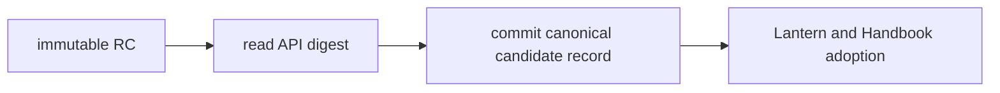
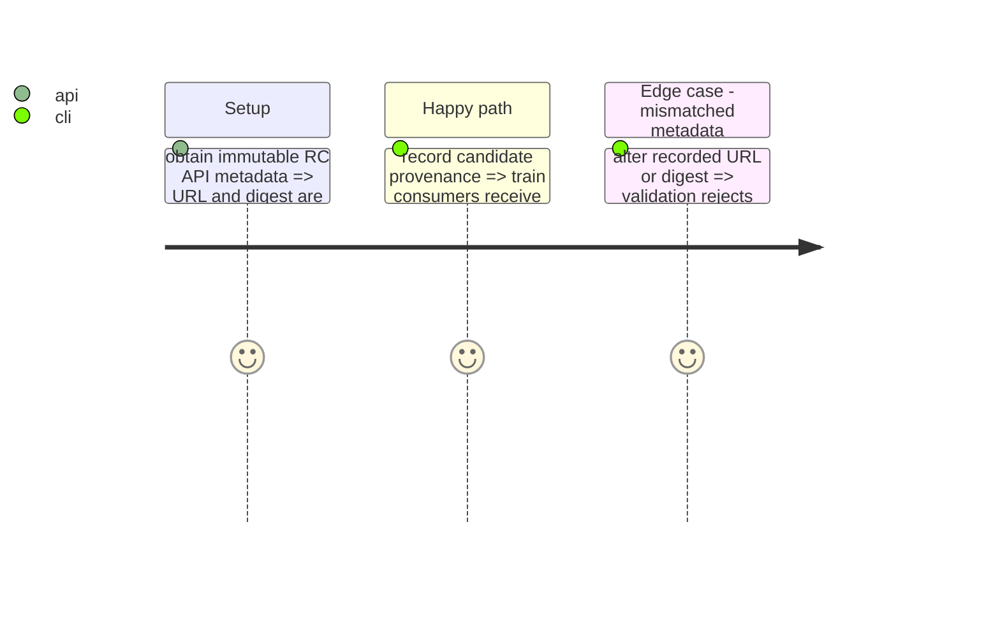

# Instruction: Record canonical candidate provenance

## Architecture projection

```txt
.
├── release-train/candidates/ ✅ committed candidate URL, SHA-256, SRI, version and source SHA after CI publication
├── docs/compatibility.md ✏️ explain candidate dispatch and final-train consumption
├── README.md ✏️ link the manual candidate workflow
└── ❌ none — consumer refs are absent until adoption commits exist
```

## User Journey



## Test Scope



## Tasks to do

### `1)` Freeze the CI-produced identity

1. Download the immutable CI asset, compute its SHA-512 SRI, and translate the API digest plus SRI into the protocol-1 candidate record.
2. Document that consumers adopt this record before the final manifest adds their SHAs.

## Test acceptance criteria

| Task | Acceptance criteria |
| --- | --- |
| 1 | Consumer adoption and the final train can only reference the archive produced and verified by candidate CI. |
